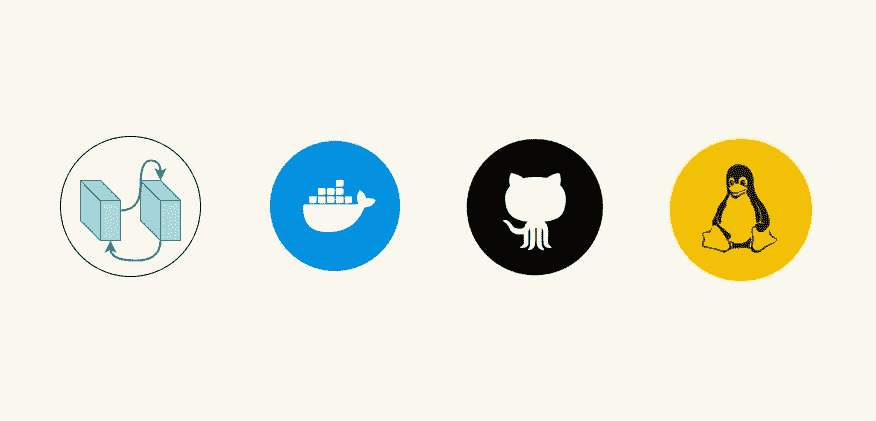
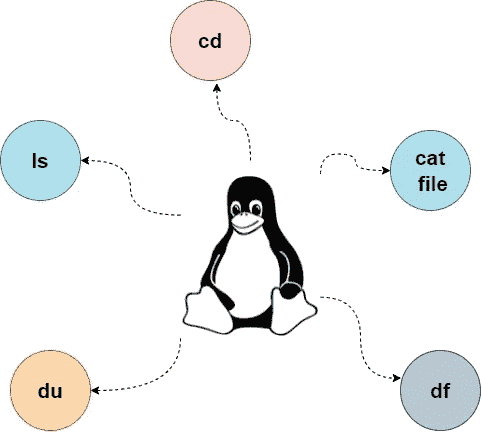

# 开发人员永不过时的 4 项技能

> 原文：<https://javascript.plainenglish.io/4-skills-that-never-gets-old-for-developers-6c90ef901fb8?source=collection_archive---------13----------------------->

提升自信的技巧

# 1.饭桶

熟练使用版本控制系统是目前对开发者要求最高的技能之一，超过一半的大型科技公司使用 VCS 来维护他们的软件和应用程序。我会推荐学习 Git，因为它是目前最苛刻和最受欢迎的 VCS 之一。一旦你熟练掌握了 Git，你也可以学习其他的 VCS，因为它涵盖了所有的基本特性。

*   如果你是一个初学编码的人，试着在构建小项目的时候学习 Git，因为它会帮助你更有效地学习。
*   学习 Git 或任何其他 VCS 将永远在你的开发者载体中帮助你。
*   每当你和一个让你脱颖而出的开发人员组织一起工作时，Git 帮助你维护你的项目历史。

# 2.Linux 操作系统

从我自己使用 Linux 的经验来说，当我从渗透测试转到构建 web 和移动应用程序时，事情比我以前使用 Linux 要简单一些。学习 Linux 会影响你如何理解操作系统的过程，而且大多数开发人员更喜欢 Linux，因为它们对开发应用程序更友好。

*   学习 Linux 可以让你对使用**命令行工具**充满信心。
*   另外，Linux 给了你以自己的方式使用事物的自由。

# 3.设计模式

我最喜欢的设计模式之一完全改变了我们构建应用程序的方式。它提供了了解如何在更短的时间内编写高效代码的便利。此外，在大型应用程序中，设计模式几乎无处不在。

*   它们是建立在经验丰富的开发人员基础上的经过充分测试的解决方案，这使得它们在您在组织下工作时更加有用。
*   当你在多个项目上工作时，学习设计模式可以使事情变得容易，因为你不必花太多时间寻找解决方案。

# 4.码头工人

Docker 是您在开发之旅中不应该错过的东西，一旦您知道如何运行容器并为不同的环境测试您的应用程序，它会让事情变得非常简单。此外，学习 Docker 可以提供在大型科技公司工作的机会，因为这是高级开发人员最需要的技能。

*   Docker 为开发人员提供了如此多的机会，您可以在特定环境下构建应用程序，并在没有系统故障的情况下测试它们。
*   此外，使用 Docker，您可以灵活地在任何地方运行应用程序，而无需安装新机器。

 [## 2022 年自学成才的开发者赚钱的 5 种方式

### 2022 年挣得比全职工作还多

javascript.plainenglish.io](/5-ways-to-make-money-as-a-self-taught-developer-in-2022-54e18603c8e0)  [## 2022 年 6 个最佳用户界面库

### 提升你的反应前端技能

javascript.plainenglish.io](/6-best-react-ui-libraries-in-2022-767989d2ee9e)  [## 6 自学成才的开发人员的 UI/UX 设计原则

### 提升你的自学程序员之旅。

javascript.plainenglish.io](/6-ui-ux-design-principles-for-self-taught-developers-c6326f6d9c0d) 

*更多内容请看*[***plain English . io***](http://plainenglish.io/)*。报名参加我们的* [***免费周报***](http://newsletter.plainenglish.io/) *。在我们的* [***社区***](https://discord.gg/GtDtUAvyhW) *获得独家获得写作机会和建议。*