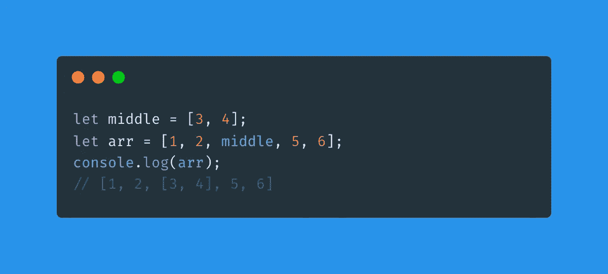
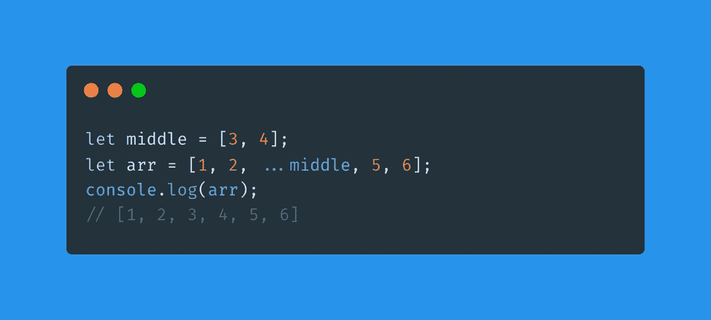
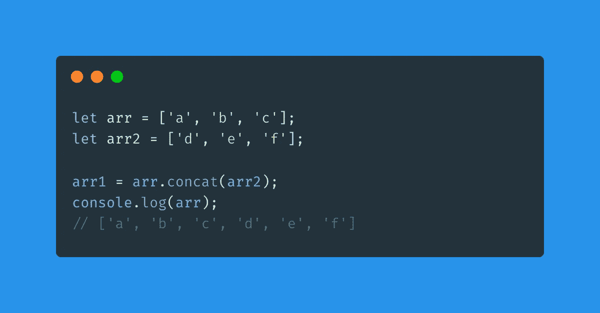
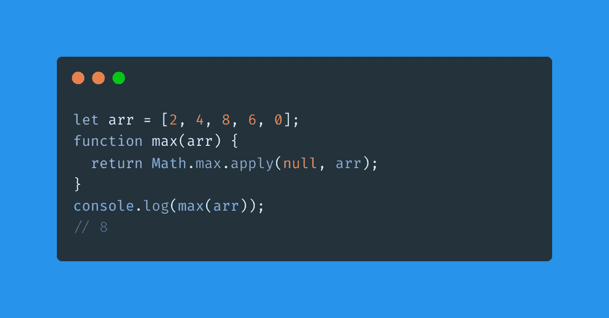

# 4 扩展运算符在 JavaScript 中的实际用途

> 原文：<https://javascript.plainenglish.io/4-spread-operator-secrets-in-javascript-92681b3baea1?source=collection_archive---------2----------------------->

## 什么是 JavaScript Spread 运算符？它允许在适当的位置扩展一个可迭代的对象，比如一个数组。

你知道 JavaScript Spread 运算符吗？它用三个点来表示——没错，Spread 运算符就是著名的“…”。它基本上允许表达式在需要多个元素的地方扩展数组的内容。

让我用一种更实际的方式展示给你看；想象下面的代码:

注意，在这个例子中，我没有使用 Spread。通过将数组放入另一个数组，我们在打印`arr`时得到了一个相当不寻常的结果。现在尝试在数组中间加上“…”，看看会发生什么，如下所示:

该操作符用于在运行时解释数组或对象的元素。在后一种情况下，中间项已经在`arr`内展开。

这是 Spread 运算符的默认用法，但是**比那个**更强大，我今天的文章要讲的就是这些秘密。

Photo by [krakenimages](https://unsplash.com/@krakenimages?utm_source=medium&utm_medium=referral) on [Unsplash](https://unsplash.com?utm_source=medium&utm_medium=referral)

# 1.复制数组并展开

你知道如何用 JavaScript 复制数组吗？初级程序员可能认为这是可行的:

但遗憾的是，生活并没有那么简单。在这种情况下，`arr2`不是`arr`的复制品，而是`arr`本身，既然两者的记忆参照，是一样的。怀疑？然后测试它:

你有没有注意到当你在 arr2 中添加一个物品时，它也出现在 arr 中？那是因为他们是一样的！正确的方法之一是使用特定的函数。

如果你编写 JavaScript 已经有一段时间了，你可能知道 slice 函数，对吗？它允许你复制数组。但是你知道我们也可以使用 Spread 来复制数组吗？

当我们展开数组时，它的项的值被复制到另一个数组中。两个数组都是独立的，所以这显然是一种复制数组的有效方法。

# 2.用 Spread 连接数组

如果我想加入两个数组呢？我们已经知道使用赋值操作符(=)不起作用。求和运算符显然也不起作用。你知道 JavaScript 中实现这一点的具体函数吗？多联:

但是您知道使用 Spread 操作符有一种更简单的方法吗？

# 3.带扩散的数学运算

您知道 JavaScript 数学函数可以与 Spread 结合使用吗？

让我们从 Math.max()开始，这个函数返回我们作为参数传递给它的一组数字中最大的一个。

在这个函数中没有办法把数组作为参数传递，但是用了一个 helper 函数，是的，虽然看起来很奇怪:

但是传播呢？

# 4.带排列的字符串到数组

如果你需要把一个字符串转换成一个字符数组呢？就像在 C 天，记得吗？这个很简单，如下图所示:

感谢阅读！在这个平台关注我，阅读更多编程内容。祝您愉快，再见！👋

*更多内容请看*[***plain English . io***](https://plainenglish.io/)*。报名参加我们的* [***免费周报***](http://newsletter.plainenglish.io/) *。关注我们关于*[***Twitter***](https://twitter.com/inPlainEngHQ)[***LinkedIn***](https://www.linkedin.com/company/inplainenglish/)*[***YouTube***](https://www.youtube.com/channel/UCtipWUghju290NWcn8jhyAw)*[***不和***](https://discord.gg/GtDtUAvyhW) *。***