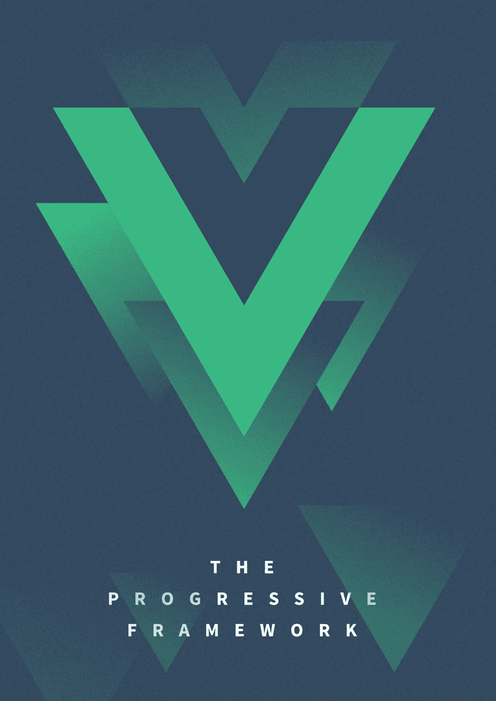
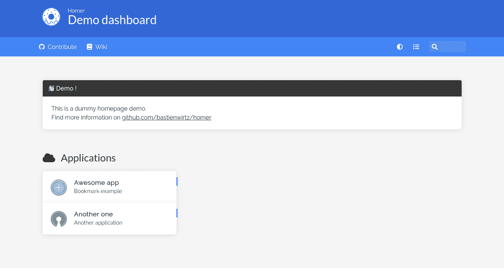
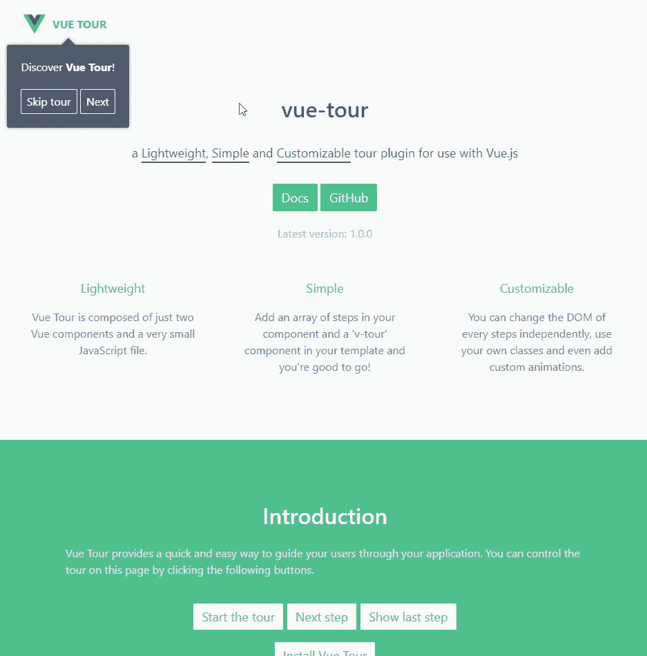
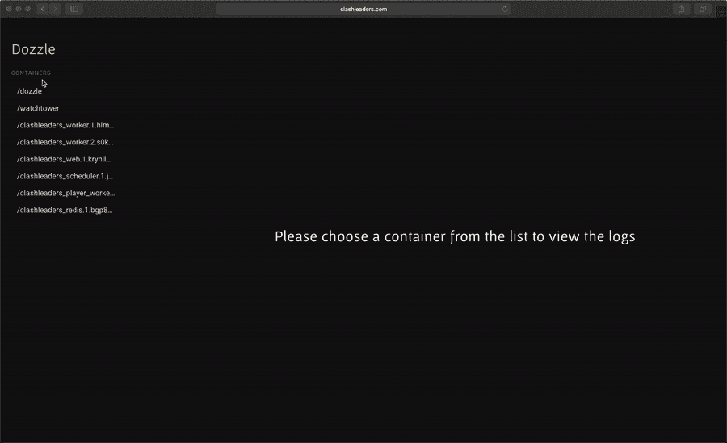

# 2022 年 4 个趋势 Vue.js 项目

> 原文：<https://javascript.plainenglish.io/4-trending-vue-js-projects-in-2022-77b308810c29?source=collection_archive---------8----------------------->

Vue.js 一月份的趋势项目

[Source](https://medium.com/the-vue-point/plans-for-the-next-iteration-of-vue-js-777ffea6fabf)

以下是 2022 年的 4 个趋势 Vue.js 项目，值得一看！

# 1.元素加

[Element Plus](https://github.com/element-plus/element-plus)

**储存库**:【https://github.com/element-plus/element-plus】T2

**星星**:13536 颗

与 Element 类似， **Element Plus** 也是 Element 团队搭建的 Vue.js UI 库。不同之处在于，它是在 Vue 3 的 Typescript 中构建的，因此构建时考虑了 Vue 3 的组合 API。虽然只是在测试版，但如果使用 Vue 3，这个继任者是必须的。

# 2.荷马

[Homer](https://github.com/bastienwirtz/homer)

**储存库**:[https://github.com/bastienwirtz/homer](https://github.com/bastienwirtz/homer)

**星星**:3996 颗

简而言之，Homer 是一个简单的“服务器主页”。由 bastienwirtz 在 Vue 中构建的仪表板可以从一个 yaml 文件进行配置。它支持亮/暗模式、不同的观看模式、搜索功能等。这是一个奇妙的仪表板，你可以在你自己的项目上快速启动。

# 3.Vue 旅游

[Vue Tour](https://github.com/pulsardev/vue-tour)

**储存库**:[https://github.com/pulsardev/vue-tour](https://github.com/pulsardev/vue-tour)

**星星**:1860 颗

**Vue Tour** 是 Vue 为 Vue 项目内置的 go-to tour 插件。它由 pulsardev 构建，号称轻量级、简单且可定制。您可以简单地通过用目标、标题、标题和内容定义一系列步骤来轻松构建您的“旅程”。如果您需要将弹出窗口挂在内容的特定一侧，您还可以配置弹出窗口的位置。

# 4.铸模补助注口

[Dozzle](https://github.com/amir20/dozzle)

**储存库**:[https://github.com/amir20/dozzle](https://github.com/amir20/dozzle)

星星:1239 颗

在这个故事中的所有项目中， **Dozzle** 是我最喜欢的！Dozzle 由 amir20 构建，是一个轻量级的 web 应用程序，用于监控正在运行的 Docker 容器的日志。就这么简单。您可以在左侧导航您的容器，并在右侧窗格实时查看日志。用户界面很简单，你可以在浏览器中查看所有日志。你可以用 regex 搜索，甚至可以分屏查看多个日志。当然，你也可以下载日志。

## 结论

作为一名软件开发人员，我总是在寻找酷的、新的、有趣的项目来尝试。如果你知道一些令人兴奋的事情，请联系我！

*更多内容请看*[***plain English . io***](http://plainenglish.io/)*。报名参加我们的* [***免费周报***](http://newsletter.plainenglish.io/) *。在我们的* [***社区***](https://discord.gg/GtDtUAvyhW) *获得独家获得写作机会和建议。*