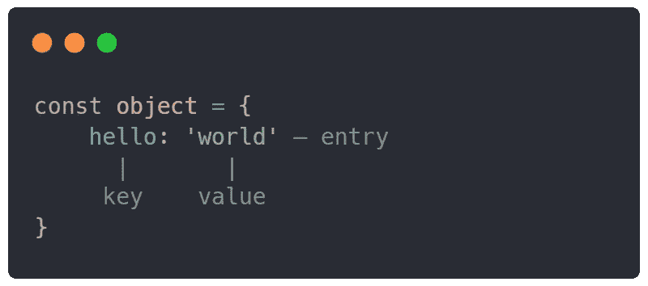
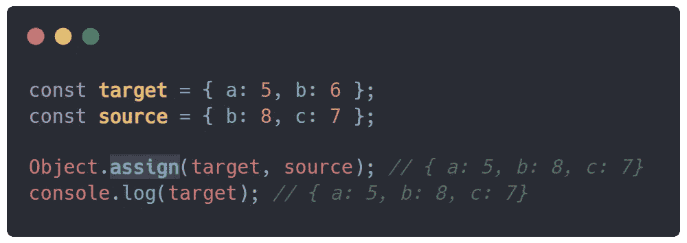
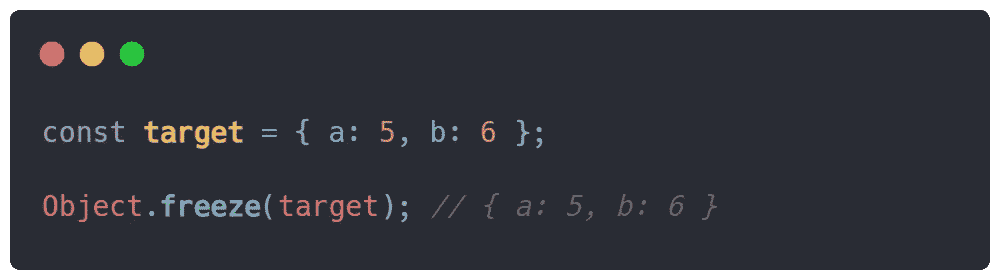
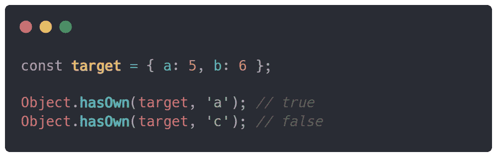

# JavaScript 中 4+个有用的对象方法

> 原文：<https://javascript.plainenglish.io/4-useful-object-methods-in-javascript-57e4e95a29ac?source=collection_archive---------8----------------------->

## Java Script 语言

4 和更多可以在 JavaScript 中使用的有用的对象方法

对象方法对于操纵或修改 JavaScript 对象非常有用。当使用对象时，这些方法可以简化您的工作，因此我列出了一些有用的 JavaScript 对象方法。

# 对象.分配()

对象方法`assign()`用于将`n`个对象的可枚举条目合并为一个。这种方法的一个很好的例子是将对象合并在一起以产生更深刻的结果。

该方法将对象的属性合并在一起，如果存在具有相同键的条目，则覆盖初始对象中的属性。小心，这个方法是可操作的，会覆盖初始对象。

## 句法

`Object.assign(target, ...sources)`

## 因素

`target` —初始对象，将被进一步合并和覆盖

`sources` —将被合并到`target`对象中的对象

## 返回值和示例

此方法返回修改后的初始对象，其中包含已经合并和覆盖的 init 条目。

an example of the assign() method

# Object.entries()

这个对象方法`entries()`用于获取一个传递的对象条目的数组，以及它们的属性——键和值。这可用于修改或操纵更复杂的对象成为另一个。

这是`Object.keys()`和`Object.values()`的父方法，返回对象中所有可用条目的键或值。

## 句法

`Object.entries(target)`

## 参数

`target` —初始对象，进一步返回它们的条目

## 返回值和示例

这个方法返回所有条目的数组，每个条目是一个键和相应值的数组。

an example of the entries() method

# Object.freeze()

该方法`freeze()`用于永久冻结一个对象，这样我们就不能再向该对象添加新条目、修改或删除它们。

需要注意的是，由于该对象现在不可更改，因此除非您复制该对象，否则无法对其进行修改。

为了检查一个对象是否被冻结，我们也可以使用一个本地方法— `Object.isFrozen()`，它返回一个布尔值。

## 句法

`Object.freeze(target)`

## 参数

`target` —初始对象，要进一步冻结

## 返回值和示例

此方法返回传递到方法中的初始对象或目标。

an example of the freeze() method

# Object.hasOwn()

这个方法`hasOwn()`用于检查一个特定的键或属性是否存在于一个对象的条目中。这是一个很好的知识，因为它在编码面试或实践中被大量使用。

## 句法

`Object.hasOwn(target, property)`

## 参数

`target` —初始对象，从这里检查条目

`property` —将在`target`对象中搜索的属性

## 返回值和示例

该方法返回一个布尔值(`true` / `false`)，无论是否在`target`对象中找到了要搜索的属性。

an example of the hasOwn() method

## 结论

这些对象方法对于快速处理 JavaScript 对象至关重要。我希望你能理解每一个方法的作用，并在你的下一个项目中明智地使用它们。

*更多内容看* [***说白了。报名参加我们的***](https://plainenglish.io/) **[***免费周报***](http://newsletter.plainenglish.io/) *。关注我们关于*[***Twitter***](https://twitter.com/inPlainEngHQ)*和*[***LinkedIn***](https://www.linkedin.com/company/inplainenglish/)*。查看我们的* [***社区不和谐***](https://discord.gg/GtDtUAvyhW) *加入我们的* [***人才集体***](https://inplainenglish.pallet.com/talent/welcome) *。***