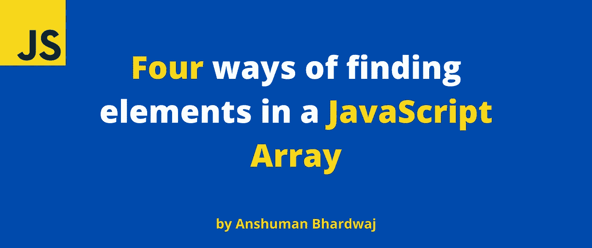

# 在 JavaScript 数组中寻找元素的 4 种方法

> 原文：<https://javascript.plainenglish.io/4-ways-of-finding-elements-in-a-javascript-array-ba66cda8997?source=collection_archive---------19----------------------->

## 寻找数组中元素的 4 种方法，以及一些用例子解释的用例。



数组是基于数据的 web 应用程序的构建块。我们可以使用数组轻松地存储和操作数据。

今天，我们将看到 4 种在数组中寻找元素的方法，以及一些用例子解释的用例。


我知道，我知道…

# 1.查找()

对于传递的回调条件，`find()`方法返回第一个返回 true 的项，否则，如果所有项对于回调条件都返回 false，则返回`undefined`。

```
const numbers = [1, 3, 4, 6, 10];numbers.find(element => element > 6); // 10numbers.find(element => element > 10); // undefined
```

# 2.findIndex()

对于传递的回调条件，`findIndex()`方法返回第一个返回 true 的项目的索引，否则，如果所有项目对于回调条件都返回 false，则返回`-1`。

```
const numbers = [1, 3, 4, 6, 10];numbers.findIndex(element => element > 6); // 4numbers.findIndex(element => element > 10); // -1
```

当您不确切知道要查找什么，但知道如何识别时，find 方法很有用。例如，您知道用户的电子邮件，但不知道完整的对象。

# 3.索引 Of()

`indexOf()`方法返回与传递的元素匹配的第一项的索引，否则返回`-1`。

```
const numbers = [1, 3, 4, 6, 10];numbers.indexOf(10); // 4numbers.indexOf(16); // -1
```

`indexOf()`使用与`===`相同的比较逻辑。因此，在 Object 数组上使用它不是一个好主意。

# 4.lastIndexOf

`lastIndexOf()`方法类似于我们上面看到的`indexOf()`，唯一的不同是它从数组的尾端开始查找。

所以，如果你知道这个元素在后半部分的概率更高，那么使用`lastIndexOf()`是个好主意。

```
const numbers = [1, 3, 4, 6, 10];numbers.lastIndexOf(10); // 4numbers.lastIndexOf(16); // -1
```

当你确切地知道你在寻找什么时,`indexOf()`方法是有用的。例如，最好将它们用于像数字或字符串这样的原始数据类型。

# 摘要

总而言之，我建议使用以下方法:

*   当你不知道你在寻找什么，但你知道它应该是什么样子的时候。
*   `findIndex()`:获取元素的索引。
*   `indexOf()`:当你确切地知道你在寻找什么，并且想要元素的索引时。
*   `lastIndexOf()`:当你知道你在找什么的时候，你知道它在最后的某个地方，并且想要元素的索引。
*   当数组项是对象时，`find()`和`findIndex()`就是要走的路。

暂时就这样了。希望这篇文章对你有帮助！如果您有任何反馈或问题，请随时在下面的评论中提出。

更多此类文章，请在 [Twitter](https://twitter.com/sun_anshuman) 上关注我

*下次见！*


# 资源

[MDN 文档](https://developer.mozilla.org/en-US/docs/Web/JavaScript/Reference/Global_Objects/Array)

*原载于 2022 年 2 月 21 日*[*https://theanshuman . dev*](https://theanshuman.dev/articles/4-ways-of-finding-elements-in-a-javascript-array-5g09)*。*

*更多内容看* [***说白了就是***](http://plainenglish.io/) *。报名参加我们的**[***免费每周简讯***](http://newsletter.plainenglish.io/) *。在我们的* [***社区不和谐***](https://discord.gg/GtDtUAvyhW) *获得独家获得写作机会和建议。**