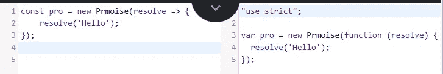

# JavaScript 中处理异步操作的 4 种方法

> 原文：<https://javascript.plainenglish.io/4-ways-to-handle-async-operations-in-javascript-266ab51d8166?source=collection_archive---------15----------------------->

## 探索 JavaScript 中处理异步操作的不同方式。

Photo by [insung yoon](https://unsplash.com/@insungyoon) on [Unsplash](https://unsplash.com/photos/w2JtIQQXoRU)

# 介绍

在同步编程中，一次可以运行一个任务，每一行代码都会阻塞下一行。另一方面，在异步编程中，读取文件或执行 API 调用等操作可以在后台启动，这大大提高了应用程序的性能。

然而，JavaScript 是一种单线程编程语言，它本质上是异步和非阻塞的，可以在不阻塞主线程的情况下执行长时间的网络请求。

但是我们如何处理 JavaScript 的异步特性呢？在这篇文章中，我们将探索四种方法。

# 复试

在异步操作中，我们需要的是在异步操作完成时得到通知。回调是最简单的机制。它是一个传递给另一个函数的函数，在异步操作完成时被调用。

JavaScript 是回调的理想环境，因为它有两个特性:

*   在 JavaScript 中，函数是**一级对象**，这意味着它们可以被赋给变量，作为参数传递，或者从另一个函数返回。
*   JavaScript 有**闭包**，其中函数可以保留它的上下文和状态，不管它何时何地被调用。

## 处理回访时的注意事项

1.最糟糕的情况之一是函数在某些条件下同步运行，而在其他条件下异步运行。看一下这个例子:

如您所见，这个示例很难调试或预测其行为。因为回调可以用于同步或异步操作，所以你必须确保你的代码没有混合同步/异步行为。

2.在异步回调中抛出错误会使错误在事件循环中跳跃，从而使程序在非零退出代码中退出。因此，要以正确的方式传播异步回调中的错误，您应该将该错误传递给链中的下一个回调，而不是抛出或返回它。

3.你可以尽可能遵循这些实践来组织你的回访。看前面的例子，将这些点匹配起来:

*   尽早从回调中返回。
*   命名您的回调，而不是使用内联样式。
*   模块化你的代码，尽可能使用可重用的组件。

## 赞成的意见

*   简单的方法。
*   不需要运输工具。

## 骗局

*   很容易陷入**回调地狱**，其中代码水平增长而不是垂直增长，这使得它容易出错并且非常难以阅读和维护。
*   嵌套回调会导致变量名的重叠。
*   硬错误处理。您很容易忘记将错误传播到下一个回调，如果您忘记传播同步操作错误，将很容易使您的应用程序崩溃。
*   您很容易陷入这样一种情况:您的代码在某些情况下可以同步运行，而在其他情况下可以异步运行。

# 承诺

**承诺**作为 ES6 标准的一部分出现在 JavaScript 中。这代表着向提供一个替代**回调**的好方法迈出了一大步。

承诺是包含异步操作结果或错误的对象。如果承诺尚未完成(履行或拒绝)，则称其为待定，如果完成(履行或拒绝)，则称其为已解决。

要接收异步操作的完成或拒绝，您必须使用承诺的`.then`方法，如下所示:

`onFulfilled`是一个回调，它将接收已完成的值，而`onRejected`是另一个回调，它将接收错误原因(如果有的话)。

## 处理承诺时需要注意的事项

1.`then`方法同步返回另一个承诺，这使我们能够链接许多承诺，并轻松地将许多异步操作聚合到许多级别。

2.如果我们不定义`onFulfilled`或`onRejected`处理程序，履行值或拒绝原因将自动传播到下一级`then`承诺。这种行为使我们能够在整个承诺链中自动传播任何错误。
此外，您可以在任何处理程序中使用与**回调**相反的`throw`语句，这将使**承诺**自动拒绝，这意味着抛出的异常将自动在整个承诺链中传播。

3.`onFulfilled`和`onRejected`处理程序保证异步运行，即使在调用`then`时**承诺**已经确定。这种行为可以保护我们免受混合同步/异步代码的不可预测行为的影响，正如我们所见，这种行为很容易陷入**回调**中。

## 赞成的意见

*   **承诺**显著提高代码可读性和可维护性，减轻**回调地狱**。
*   我们所看到的优雅的错误处理方式。
*   主流浏览器不需要 transpilers。
*   保护我们的代码免受不可预测的行为，比如**回调**。

## 骗局

*   当在顺序操作中使用 **Promises** 时，你不得不使用许多`then` s，这意味着每个`then`都有许多函数，这对于日常编程来说可能太多了。

# 异步/等待

随着时间的推移，JavaScript 社区试图在不牺牲好处的情况下降低异步操作的复杂性。在处理异步操作时， **Async/Await** 被认为是这种努力的顶峰，也是推荐的方法。它被添加到 ES2017 标准的 JavaScript 中。并且是**承诺**和[生成器](https://developer.mozilla.org/en-US/docs/Web/JavaScript/Reference/Global_Objects/Generator) 的超集。

`async`函数是一种特殊的函数，您可以使用`await`表达式来暂停异步操作的执行，直到它解决。

## 处理承诺时需要注意的事项

1. **async** 函数总是返回一个 **Promise** 而不管解析的值类型，这保护我们免受具有混合同步/异步行为的不可预测代码的影响。

2.与**承诺**不同，使用 **async/await** 我们可以使用`try/catch`让它无缝地处理同步抛出和异步承诺拒绝。

不幸的是，我们不能同时等待多个异步操作。但是作为一个解决方案，我们可以使用`Promise.all()`静态方法来解决多个并发承诺。

## 赞成的意见

*   代码可读性和可维护性的显著提高。正如我们所见，编写一系列异步操作就像编写同步代码一样简单。不需要额外的嵌套。
*   优雅的错误处理方式。现在我们可以使用`try/catch`块无缝地处理同步抛出和异步拒绝。
*   避免具有混合同步/异步行为的不可预测的代码。

## 骗局

*   事实上，在**异步**函数中，你可能最终得到一个巨大的函数，它包含几个粘合在一起的函数。反过来，该功能执行许多可能与 [**单一责任原则**](https://en.wikipedia.org/wiki/Single-responsibility_principle) 相冲突的任务。
*   与 promise 版本相比， **async/await** 的 transpiled 版本非常庞大。看看下面的截图。

The **Promise** version

The transpiled version of **Async/Await**

# ReactiveX

[**react vex programming**](https://en.wikipedia.org/wiki/Reactive_programming)是一个范例，它将每一位数据都视为一个流，您可以对其进行监听并做出相应的反应。它通过应用以下实践对同步和异步流进行操作:

*   [**观察器模式**](https://en.wikipedia.org/wiki/Observer_pattern) : **可观察**至少有一个**观察器**会自动通知它任何状态变化，这种模型称为**推模型**。
*   [**迭代器模式**](https://en.wikipedia.org/wiki/Iterator_pattern) :实际上，在 JavaScript 中，任何 [**迭代器**](https://developer.mozilla.org/en-US/docs/Web/JavaScript/Guide/Iterators_and_Generators#iterators) 都必须支持`next()`方法，而 **Observers** API 支持这种方法来获取下一个数据流，这种模型被称为 **Pull 模型**。
*   [**函数式编程**](https://en.wikipedia.org/wiki/Functional_programming):**react vex**库包括**运算符**，这些运算符只不过是 [**纯函数**](https://en.wikipedia.org/wiki/Pure_function) ，它们接受输入/观察值，并返回仅依赖于这些输入的新观察值，因此它们是可链接的或可管道化的。

**Observable** 是一个对象，它获取一个数据流，并随着时间的推移发出事件以做出相应的反应。有一个将它加入 ECMAScript 标准的谈话，它的提议是[这里](https://github.com/tc39/proposal-observable)。到目前为止，它还不是 ECMAScript 标准的一部分，所以要使用它，你必须使用第三方库，JavaScript 中众所周知的**反应扩展**是 [RxJs](https://github.com/ReactiveX/rxjs) 。

看看下面的例子，我们创建了一个新的**可观察对象**，并将其与之前的点进行匹配:

我们还可以像这样处理 API 调用操作:

## 处理可观测量时的注意事项

1- **可观察的**是懒惰的，这意味着它不做任何事情，除非你订阅它。另一方面， **Promise** 是热切的，这意味着一旦它被创建，它将解决或拒绝。

2-您应该取消订阅任何已订阅的**可观察的**，以避免任何内存泄漏。

3-你可以用`fromPromise`函数从**承诺**创建**可观察**，用`bindCallback`或`bindNodeCallback`从 based- **回调** API 创建**可观察**。

4- **可观测量**可以是**单播**或**多播**。另一方面，**承诺**总是**组播**。要知道**单播**和**多播**的区别我先来解释一下**热可观测量**和**冷可观测量**的区别。
如果流是在订阅期间创建的，则**可观察的**是**冷的**。这意味着每个观察者将获得一个唯一的通信信道，因此将获得其唯一的数据结果(**单播**或者你可以调用“unique-cast”来记住)。

另一方面，如果流是在订阅之外创建的，则可观察到的**是**热的**。这意味着每个订阅的观察者将获得相同的数据结果(**组播**)。**

因此**单播**是一对一的通信过程，其中每个观察者将获得其唯一的通信信道，而**多播**是一对多的通信过程，其中所有观察者将共享相同的数据。

**承诺**是多播的，因为每个解析器将与**热观测值**共享相同的数据。

## 赞成的意见

*   一个**可观察的**可以随时间发出多个值，这使得它非常适合处理事件、WebSocket 和重复的 REST API 调用。
*   **被观测者**与其**观测者**之间的松耦合，其中**被观测者**会将任何变化通知其**观测者**，而没有直接的依赖关系。
*   **可观察的**可以是**单播**或**多播**也可以根据你的使用情况。
*   极其强大的**算子**来过滤、转换或合成**可观测量**。
*   **违背承诺的可观测量**是可取消的。
*   重构**承诺基于**或**回调基于**的代码到**可观察对象**很容易。

## 骗局

*   **观察值**有一个陡峭的学习曲线。
*   到目前为止，你必须添加一个第三方库才能使用它。
*   很容易忘记取消订阅一个**可观察的**，这会导致内存泄漏。

# 结论

到目前为止，我们已经探索了四种处理异步操作的方法，它们都可以完成工作，但是您应该使用哪种方法呢？这个问题的答案完全取决于你，你必须完全理解每种方法的利弊。最终，你可以根据自己的情况决定更适合的。

# 资源

*   Nodejs 设计模式第三版书。
*   [异步/等待:有好有坏](https://benlesh.medium.com/async-await-it-s-good-and-bad-15cf121ade40)
*   [JavaScript 承诺与 RxJS 观察值](https://auth0.com/blog/javascript-promises-vs-rxjs-observables)
*   [异步 JavaScript:在 Node.js 中使用 RxJS Observables 和 REST API](https://www.twilio.com/blog/async-js-rxjs-observables-rest-api-nodejs)
*   [异步 JavaScript:介绍 ReactiveX 和 RxJS 观察器](https://www.twilio.com/blog/asynchronous-javascript-reactivex-rxjs-observables-nodejs)
*   [热与冷的可观测量](https://benlesh.medium.com/hot-vs-cold-observables-f8094ed53339)

现在我们有了。我希望你已经发现这是有用的。感谢您的阅读。

***原载于****[*https://blog.mayallo.com*](https://blog.mayallo.com/4-ways-to-handle-async-operations-in-javascript)*。**

**更多内容请看*[***plain English . io***](https://plainenglish.io/)*。报名参加我们的* [***免费周报***](http://newsletter.plainenglish.io/) *。关注我们关于*[***Twitter***](https://twitter.com/inPlainEngHQ)[***LinkedIn***](https://www.linkedin.com/company/inplainenglish/)*，以及* [***不和***](https://discord.gg/GtDtUAvyhW) *。**