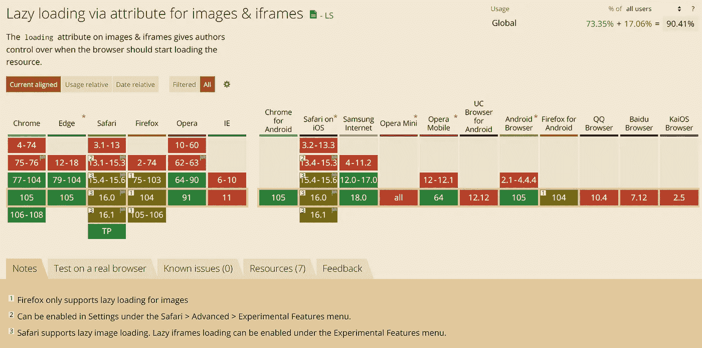
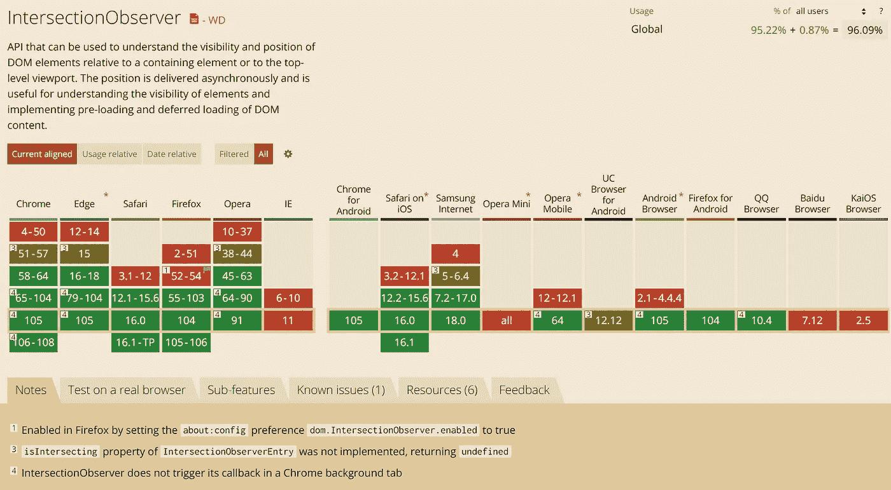

# 4 种延迟加载图像的方法

> 原文：<https://javascript.plainenglish.io/4-ways-to-lazy-load-images-fe2e4bc9211d?source=collection_archive---------13----------------------->

## 哪个最值得推荐？


Photo by [Kate Stone Matheson](https://unsplash.com/@kstonematheson?utm_source=medium&utm_medium=referral) on [Unsplash](https://unsplash.com?utm_source=medium&utm_medium=referral)

在 web 开发中，您的页面可能在折叠上方加载了太多的图像，这导致了更长的加载时间。图像优化可能是 web 性能优化中最有效的项目，那么图像的延迟加载通常是一个解决方案。

懒加载就是延迟那些用户还没看过的图片，只滚动到相应的位置再加载。实现这一点有两个步骤:第一步删除`img`元素的`src`属性，第二步确定用户的视窗是否已经滚动到图像。

对第一步更详细的解释是:由于`src`属性是在 HTML 规范中定义的，所以它在功能上是有意义的，一旦为`img`元素设置了，它就会在页面加载时加载，不管它在页面的什么位置。所以我们需要将其移除，并为相应的`img`设置另一个属性，通常是`data-src`属性。它只是一组无限的`data-*`属性中的一个，这些属性没有明确的含义，但是可以用来在元素中包含不可见的数据。

在第二步中，我们可以用两种方式来判断，它们是:

## 方式 1

向`document`添加一个`scroll`事件，使用 clientHeight、scrollTop 和 offsetTop 来确定元素是否出现在视图中。

## 方式 2

给`document`添加一个`scroll`事件，使用`getBoundingClientRect`来确定元素是否出现在视图中。

这两种方法的代码是相似的，唯一不同的是判断条件:

注意我这里用`throttle`，主要是为了减少高频触发可能带来的性能问题。检查:

[](/what-are-debounce-and-throttle-8908dc7c5a62) [## 什么是去抖和节流？

### 如何在 TypeScript 中编码去抖和节流

javascript.plainenglish.io](/what-are-debounce-and-throttle-8908dc7c5a62) 

## 方式 3

第三种方法是使用`[IntersectionObserver](https://developer.mozilla.org/en-US/docs/Web/API/Intersection_Observer_API)`，它提供了一种异步观察目标元素与祖先元素或顶层文档的 viewport 的交集变化的方法。

这 3 种方法中，更推荐第三种。因为它是异步微任务，所以不需要额外的节流，性能会更好。

## 方式 4

除此之外，第四种方法是现代浏览器增加的新功能— `Lazy loading via attribute for images & iframes`。

它的使用非常简单:

```

```

只需将`[loading="lazy"](https://developer.mozilla.org/en-US/docs/Web/HTML/Element/img#attr-loading)`添加到`img`标签中。

正如您所料，它还不太兼容:



image by [caniuse](https://caniuse.com/loading-lazy-attr)

因此，如果您的目标用户使用支持这一属性的现代浏览器，那么使用`loading="lazy"`就可以了。如果你想兼容大多数浏览器，那么`IntersectionObserver`是个不错的选择。



image by [caniuse](https://caniuse.com/?search=IntersectionObserver)

今天就到这里，感谢阅读！

*不是中等会员？* [*支持我在这里*](https://medium.com/@hibrandonevans/membership) *合二为一。*

*更多内容请看* [***说白了。报名参加我们的***](https://plainenglish.io/) **[***免费周报***](http://newsletter.plainenglish.io/) *。关注我们* [***推特***](https://twitter.com/inPlainEngHQ) ，[***LinkedIn***](https://www.linkedin.com/company/inplainenglish/)*，*[***YouTube***](https://www.youtube.com/channel/UCtipWUghju290NWcn8jhyAw)*，以及* [***不和***](https://discord.gg/GtDtUAvyhW) *。对增长黑客感兴趣？检查出* [***电路***](https://circuit.ooo/) *。***