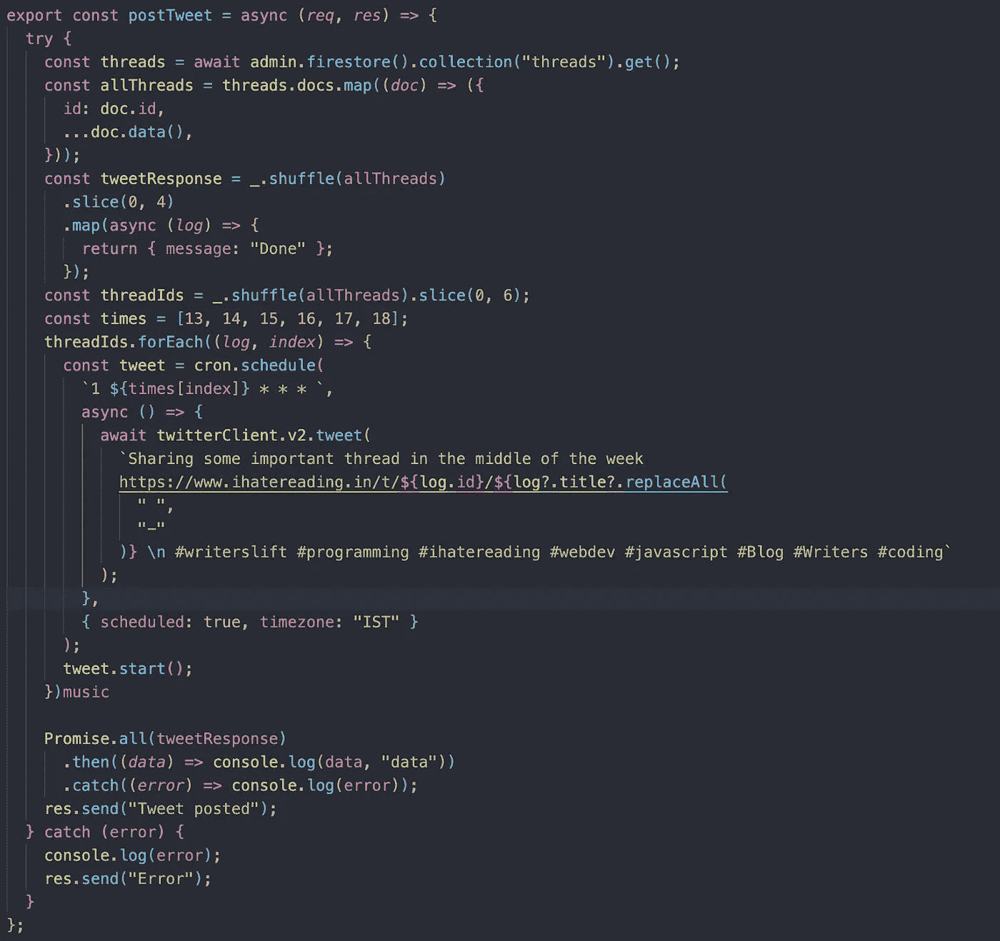

# 用 JavaScript 构建一个自动化的 Tweet 调度工具

> 原文：<https://javascript.plainenglish.io/40-lines-of-code-to-schedule-all-my-tweets-e2ac8da15a2d?source=collection_archive---------12----------------------->

## 用 40 行 JavaScript 代码构建 Twitter 自动化工具的教程。

## 在后台

故事开始于我每天安排 5 条以上的推文。但是每次我每条推文都要花 5 分钟。

5 分钟= 1 条推文
10 条推文= 50 分钟/天

我想节省时间，这项工作是枯燥和重复的，最重要的是我可以自动化。

## [超高速](https://hypefury.com/)

这个工具帮助你安排社交媒体营销，很多人使用这个产品安排推文。

但这是一个付费版本，我不想为一个我相信我可以自己开发的产品付钱。

# 自动化 Twitter 营销

我开始认真考虑自动化整个 twitter 任务。在做了一些研究后，我发现这个 npm 模块有助于发布推文。

我能找到这个模块是因为我已经使用过 Twitter v2 API。

 [## Twitter API 文档

### 通过提升访问权限，您可以获得对终端和数据的免费额外访问，以及额外的应用程序…

developer.twitter.com](https://developer.twitter.com/en/docs/twitter-api) 

如果你对这个 Twitter API 一无所知，那么看看链接，这是一个很酷的 API，可以用你想要的任何方式处理推文。

**推特 V2 NPm**

回到故事，我发现这个 npm 模块可以直接处理 Twitter API，而不需要太关注安装过程。

 [## twitter-api-v2

### 面向 Node.js 的强类型、全功能、轻量、通用但功能强大的 Twitter API v1.1 和 v2 客户端..最新…

www.npmjs.com](https://www.npmjs.com/package/twitter-api-v2) 

**微博自动化行动计划**

*   开发一个 API 或端点，为我发布推文。
*   对于调度，使用 CRON 作业为 API 设置计时器

就是这样。老实说，这不是火箭科学。我刚刚添加了 40 行代码，如下图所示，以实现 Twitter 营销的自动化:

端点首先从数据库获取数据，然后使用 CRON 作业安排 tweet 时间，并使用 Twitter API v2 在特定时间发布 tweet。

## 结论

这个项目不是火箭科学，但它是一个添加到你简历中的好项目，特别是如果你是初级开发人员。

您可以进一步添加的任务列表:

*   此外，对于高级开发人员来说，你可以通过为自己创建一个专用的界面或 UI 或网站来添加推文内容，从而将这个项目提升到一个新的水平。
*   你甚至可以使用机器学习模型为每条推文生成横幅图像，使推文看起来更有吸引力。
*   你甚至可以使用人工智能来创建小的 tweet 内容，使用 tweet 的标题，非常聪明和简单。

下次见，祝你愉快。
Shrey
IHA tereading

*更多内容请看*[***plain English . io***](https://plainenglish.io/)*。报名参加我们的* [***免费周报***](http://newsletter.plainenglish.io/) *。关注我们关于*[***Twitter***](https://twitter.com/inPlainEngHQ)[***LinkedIn***](https://www.linkedin.com/company/inplainenglish/)*[***YouTube***](https://www.youtube.com/channel/UCtipWUghju290NWcn8jhyAw)*[***不和***](https://discord.gg/GtDtUAvyhW) *。对增长黑客感兴趣？检查* [***电路***](https://circuit.ooo/) *。***