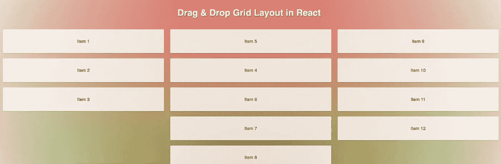
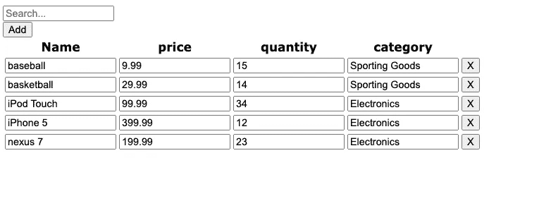
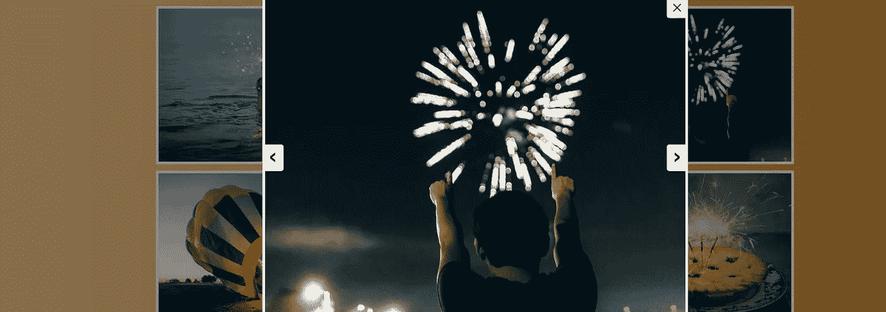

# 47 个用于 Web 开发的 React 示例

> 原文：<https://javascript.plainenglish.io/47-react-examples-for-website-development-1334cf89281d?source=collection_archive---------0----------------------->

## React 项目与源代码，让您开始与 web 开发。

让我们来看看下面这些初学者友好的 React web 开发项目。

# 带有 React 的简单计算器应用程序

Simple Calculator Application With React.JS

请看下面的结果。

[链接](https://codepen.io/mjijackson/pen/xOzyGX)

# 反应渐变背景色

React Gradient Background Color

请看下面的结果。

[链接](https://codepen.io/marcobiedermann/pen/WNGWzYR)

# 反应悬停幻灯片

React Hover Slideshow

请看下面的结果。

[链接](https://codepen.io/hexagoncircle/pen/jgGxKR)

# 反应多选示例

React Multiselect Example

请看下面的结果。

[链接](https://codepen.io/souporserious/pen/vGRZQL)

# 反应拖放示例

React Drag and Drop Example

请看下面的结果。

[链接](https://codepen.io/tjramage/pen/yOEbyw)

# React 可编辑表格示例

React Editable Table Example

请看下面的结果。

[链接](https://codepen.io/Shamiul_Hoque/pen/LNavdZ)

# React JS 待办事项列表

React JS Todo List

请看下面的结果。

[链接](https://codepen.io/marekdano/pen/bVNYpq)

# React JS 卡示例

React JS Card Example

请看下面的结果。

[链接](https://codepen.io/jamiehalvorson/pen/VmrBaP)

# 反应图像库

React Image Gallery

请看下面的结果。

[链接](https://codepen.io/tvweinstock/pen/wegZEW)

# 反应过滤器搜索

React Filter Search

请看下面的结果。

[链接](https://codepen.io/pjmtokyo/pen/ZGVjVV)

# 手风琴反应 JS

Accordion React JS

请看下面的结果。

[链接](https://codepen.io/matthewvincent/pen/EKKeyX)

# 最小反应转盘

React Carousel Minimal

请看下面的结果。

[链接](https://codepen.io/alexboffey/pen/gwbXzq)

# 反应标签输入样式

React-Tag-Input Style

请看下面的结果。

[链接](https://codepen.io/silkine/pen/pPxJOX)

# 反应翻转卡 Onclick

React Flip Card Onclick

请看下面的结果。

[链接](https://codepen.io/alexdevero/pen/pRjNmW)

# 反应日历事件示例

React Calendar Events Example

请看下面的结果。

[链接](https://codepen.io/nickjvm/pen/bERraX)

# 反应输入范围 CSS

React-Input-Range CSS

请看下面的结果。

[链接](https://codepen.io/davidchin/pen/GpNvqw)

# 反应砖石列表

React Masonry List

请看下面的结果。

[链接](https://codepen.io/golle404/pen/wWoXwz)

# 从 Json 呈现 HTML

React Render HTML From Json

请看下面的结果。

[链接](https://codepen.io/sthzg/pen/wzyQEG)

# React JS 功能组件中的密码验证

Password Validation in React JS Functional Component

请看下面的结果。

[链接](https://codepen.io/sashatran/pen/jmBbNL)

# Reactjs 模态动画

Reactjs Modal Animation

请看下面的结果。

[链接](https://codepen.io/ivanodintsov/pen/yqvZzO)

# 反应卡滑块示例

React Card Slider Example

请看下面的结果。

[链接](https://codepen.io/ste-vg/pen/WNvYWKr)

# 反应简单选项卡组件

React Simple Tabs Component

请看下面的结果。

[链接](https://codepen.io/anthonydugois/pen/QyYgaN)

# 反应响应网格布局

React Responsive Grid Layout

请看下面的结果。

[链接](https://codepen.io/sdras/pen/XdgBOa)

# 页面转换反应

Page Transitions React

请看下面的结果。

[链接](https://codepen.io/sdras/pen/gWWQgb)

# 上传前反应图像预览

React Image Preview Before Upload

请看下面的结果。

[链接](https://codepen.io/hartzis/pen/VvNGZP)

# 反应转盘示例

React Carousel Example

请看下面的结果。

[链接](https://codepen.io/andyNroses/pen/KaENLb)

# 自定义日期范围选择器反应

Custom Date Range Picker React

请看下面的结果。

[链接](https://codepen.io/RobVermeer/pen/zBgdwg)

# 反应自定义上下文菜单

React Custom Context Menu

请看下面的结果。

[链接](https://codepen.io/devhamsters/pen/yMProm)

# 免费 React 聊天用户界面模板

React Chat UI Template Free

请看下面的结果。

[链接](https://codepen.io/deammer/pen/NxmEbe)

# Reactjs 电子商务模板免费

Reactjs Ecommerce Template Free

请看下面的结果。

[链接](https://codepen.io/levchenkod/pen/WyNbeQ)

# 响应卡会做出反应

Responsive Cards React

请看下面的结果。

[链接](https://codepen.io/andytran/pen/PNGNpw)

# React 登录页面代码

React Landing Page Code

请看下面的结果。

[链接](https://codepen.io/studiojvla/pen/zBQAWo)

# 反应和还原计数器

React And Redux Counter

请看下面的结果。

[链接](https://codepen.io/iamscottcox/pen/xROoyR)

# 反应视差示例

React Parallax Examples

请看下面的结果。

[链接](https://codepen.io/jscottsmith/pen/eREbwz)

# React 下拉列表示例

React Dropdown List Example

请看下面的结果。

[链接](https://codepen.io/mlaursen03/pen/PqVjMm)

# 反应分页示例

React Pagination Example

请看下面的结果。

[链接](https://codepen.io/cornflourblue/pen/oZZzLr)

# 反应倒计时

Countdown with ReactJS

请看下面的结果。

[链接](https://codepen.io/FlorinPop17/pen/YbpwyG)

# 聊天框人工智能反应

Chatbox AI ReactJS

请看下面的结果。

[链接](https://codepen.io/zephyo/pen/MZmdjb)

# React 3d 旋转木马

React 3d Carousel

请看下面的结果。

[链接](https://codepen.io/team/keyframers/pen/rNxmVZN)

# 回复待办事项列表

React Redux To Do List

请看下面的结果。

[链接](https://codepen.io/iamjoshellis/pen/zBjEpL)

# React 上传图像

React Upload Image

请看下面的结果。

[链接](https://codepen.io/OlgaKoplik/pen/ZdyKGY)

# 反应评论列表

React Comment List

请看下面的结果。

[链接](https://codepen.io/chriscoyier/pen/YqwXQG)

# React 无限滚动分页

React Infinite Scroll Pagination

请看下面的结果。

[链接](https://codepen.io/dazld/pen/cdbgj)

# React IMDB 网站

React IMDB website

请看下面的结果。

[链接](https://codepen.io/J0hn03cb1ac8a4/pen/aVaLQP)

# 反应显示用户信息

React Display User Information

请看下面的结果。

[链接](https://codepen.io/studiojvla/pen/rLExbO)

# React 注册表单模板

React Sign Up Form Template

请看下面的结果。

[链接](https://codepen.io/studiojvla/pen/qNwrrp)

# React JS 社交分享

Social Share With React JS

请看下面的结果。

[链接](https://codepen.io/studiojvla/pen/BzXEWd)

相关文章:

*   [24 React 初学者教程](https://us.niemvuilaptrinh.com/article/24-places-to-help-you-learn-reactjs-for-free)
*   [React 开发者工具](https://us.niemvuilaptrinh.com/article/top-17-react-developer-tools)
*   [React 用于网站开发的库](https://us.niemvuilaptrinh.com/article/24-react-libraries-for-website-development)

# 总结:

我希望这篇文章能为你提供更多有用的 React 网页开发和设计的例子，如果你有任何问题，请发邮件给我，我会尽快回复。希望大家继续支持网站，让我能写出更多好文章。祝您愉快！

*更多内容请看*[***plain English . io***](http://plainenglish.io/)*。报名参加我们的* [***免费周报***](http://newsletter.plainenglish.io/) *。在我们的* [***社区***](https://discord.gg/GtDtUAvyhW) *获得独家获得写作机会和建议。*