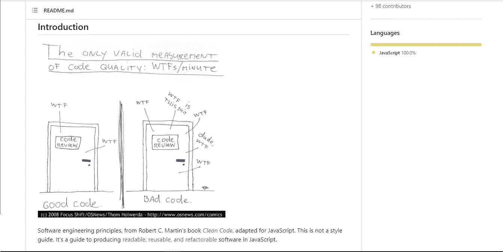
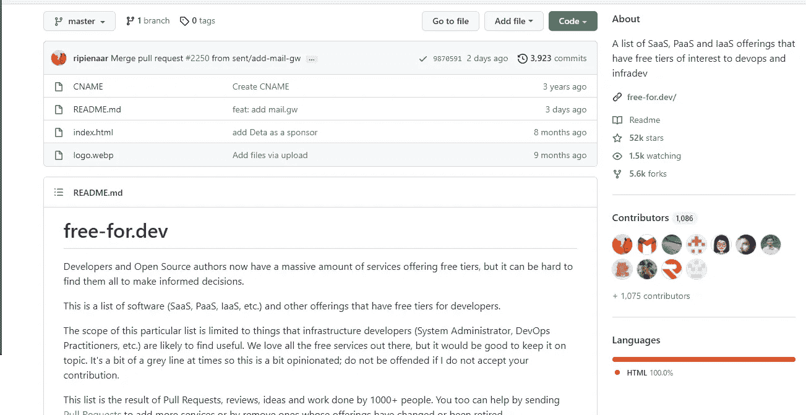
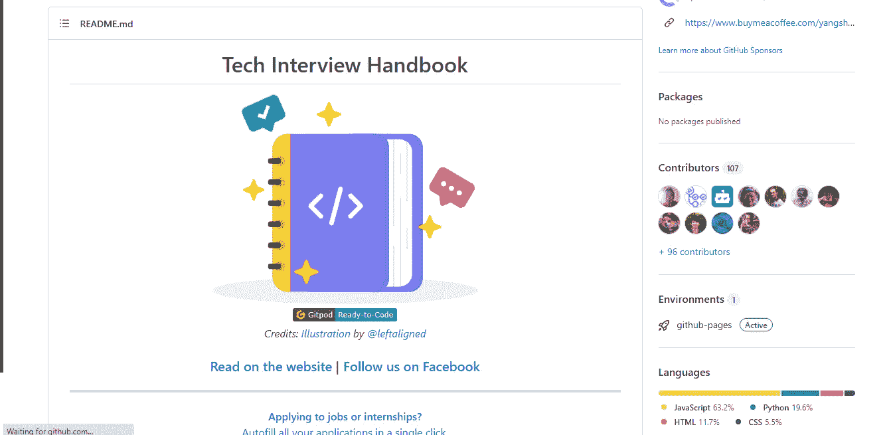
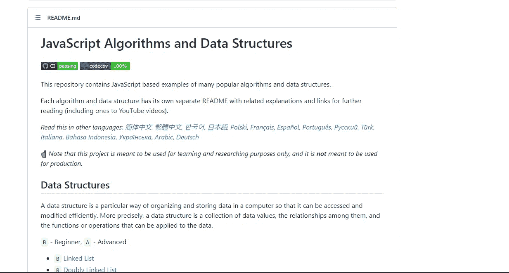
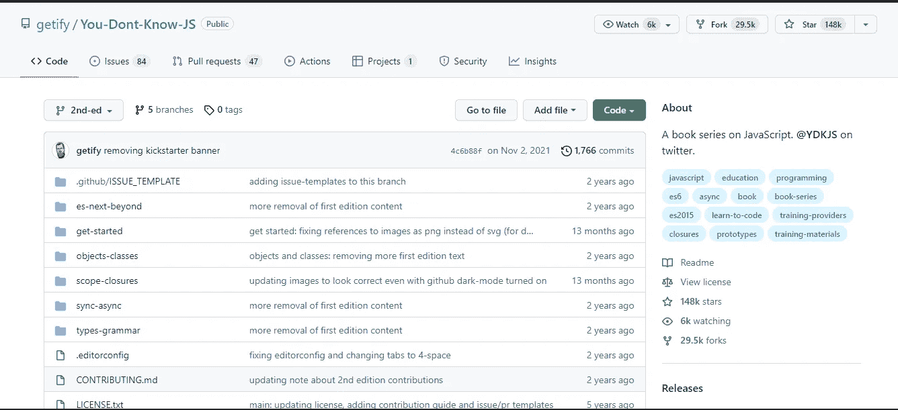
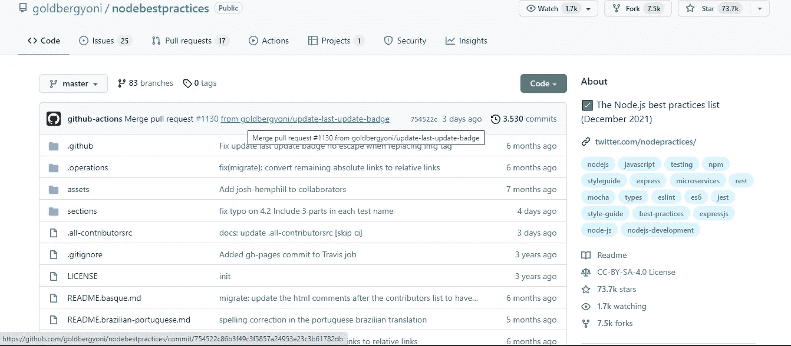

# 每个 Web 开发人员都应该知道的 5+1 Github 库

> 原文：<https://javascript.plainenglish.io/5-1-github-repositories-every-web-developer-should-know-fbdb1da42bb9?source=collection_archive---------16----------------------->

## 这里有一些开源的 GitHub 库，可以帮助你这个开发者。

这里有一些 GitHub 库(主要是 JavaScript ),可能对你的一些主题有所帮助。了解这些储存库是有好处的，因为它们就像是一剂加强剂。

Photo by [Bermix Studio](https://unsplash.com/@bermixstudio?utm_source=unsplash&utm_medium=referral&utm_content=creditCopyText) on [Unsplash](https://unsplash.com/s/photos/secret?utm_source=unsplash&utm_medium=referral&utm_content=creditCopyText)

所以让我们开始吧。

## **1。干净代码 JavaScript**

这个库采用了 Robert C. Martin 先生提出的干净代码的概念，并将其用于 JavaScript，这样您就可以在未来的工作中使用它们。这是用 JavaScript 编写可读、可重用和可重构软件的指南。

链接到相同的[**干净代码 JavaScript**](https://github.com/ryanmcdermott/clean-code-javascript) **。**

## 2.免费开发

链接到同一个[**Free-for . dev**](https://github.com/ripienaar/free-for-dev)**。**

这个存储库由一系列软件(Saas、Paas、Iaas 等)组成。)和其他为开发者提供免费层的产品。

## 3.技术面试手册

任何想在科技公司找到工作但不熟悉技术面试的人、久未参加面试但想重返职场的经验丰富的工程师，或者任何想在技术面试中做得更好的人，都可以使用这个知识库。

链接同 [**理工大面试手册**](https://github.com/yangshun/tech-interview-handbook) **。**

## 4.JavaScript 算法

这个存储库包含许多流行算法和数据结构的基于 JavaScript 的例子。

每种算法和数据结构都有自己独立的自述文件，其中有相关的解释和链接供进一步阅读(包括 YouTube 视频)。

链接到相同的[**JavaScript-算法**](https://github.com/trekhleb/javascript-algorithms) **。**

## 5.你不知道 JS

这个知识库是一系列深入研究 JavaScript 语言核心机制的书籍。这是凯尔·辛普森的系列丛书的第二版。我强烈推荐这个库，因为它将提供关于 JavaScript 的深刻知识。

链接到同一个[**You-not-Know-JS**](https://github.com/getify/You-Dont-Know-JS)**。**

## 6.Node.js 最佳实践

这个存储库是一个让您不断学习和更新 Node.js 世界的好地方，同时您还可以从中了解最佳实践。

它包含了 Node.js 最佳实践的顶级内容的总结和管理，以及与 Docker 等其他工具的集成。

链接同 [**Node.js 最佳实践**](https://github.com/goldbergyoni/nodebestpractices) **。**

## 结论

还有其他几个很棒的 GitHub 库可以教你很多你从未听说过的东西。

希望你在这里学到了新东西。

保持**更新**，保持**学习。**

*更多内容看* [***说白了。报名参加我们的***](http://plainenglish.io/) **[***免费周报***](http://newsletter.plainenglish.io/) *。在我们的* [***社区不和谐***](https://discord.gg/GtDtUAvyhW) *获得独家获取写作机会和建议。***