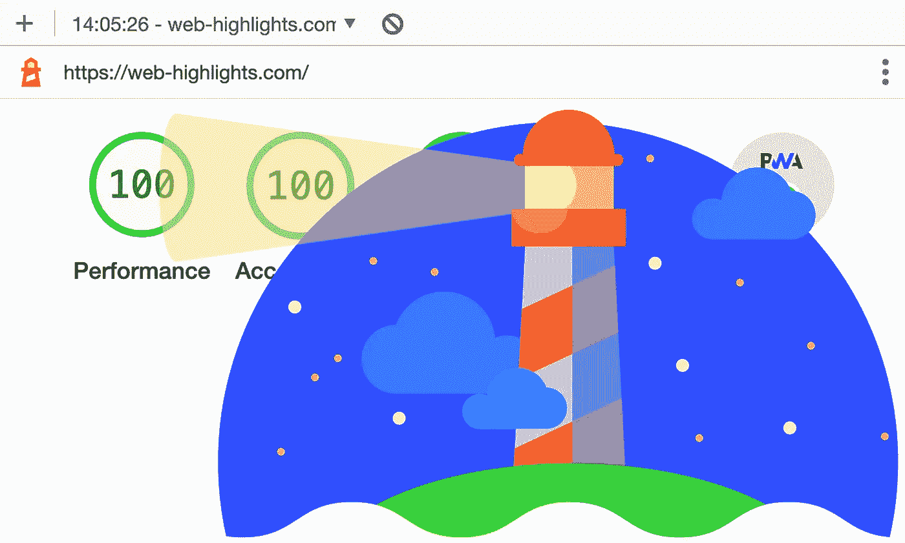
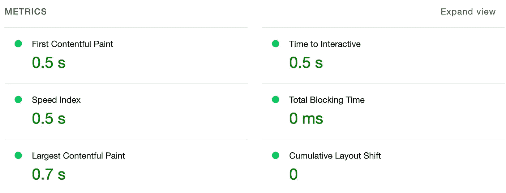
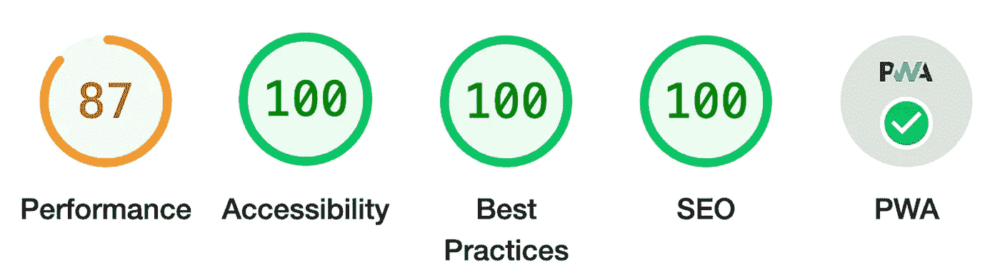
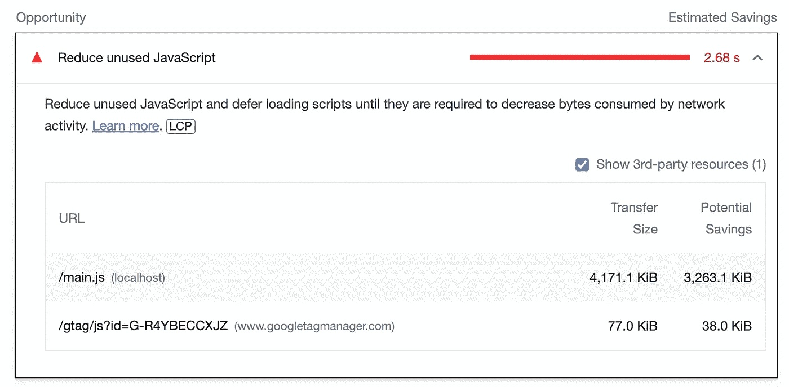
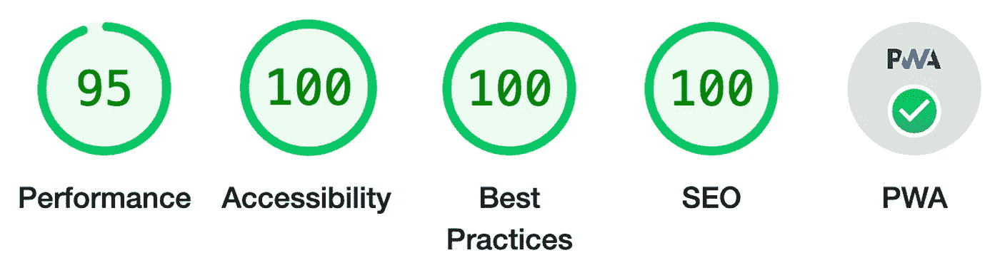
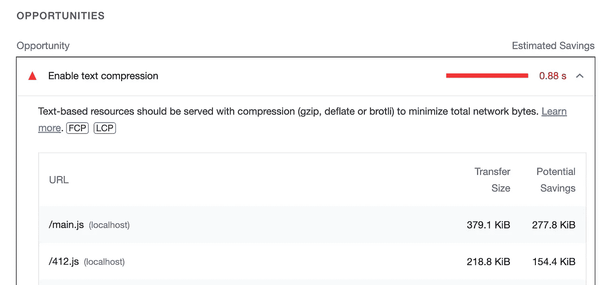
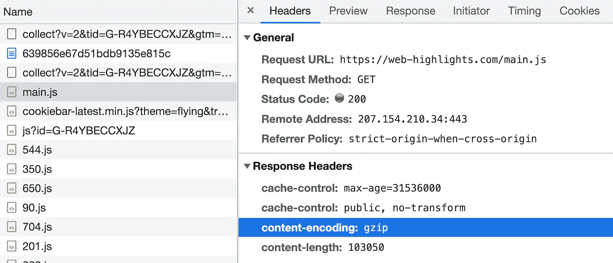
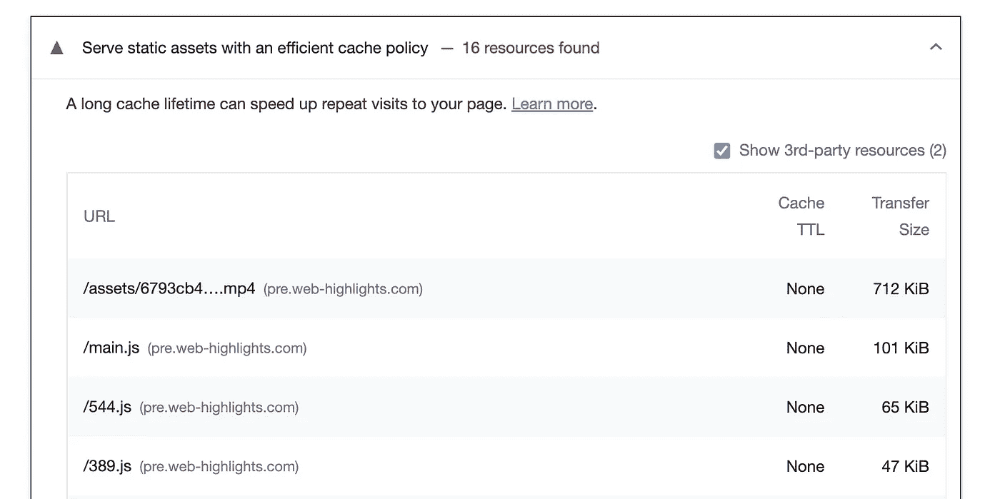
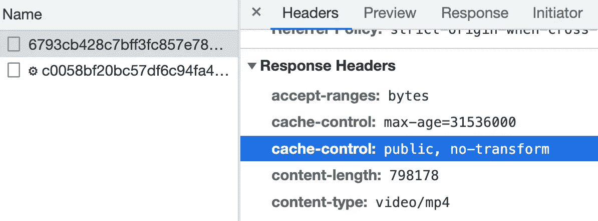
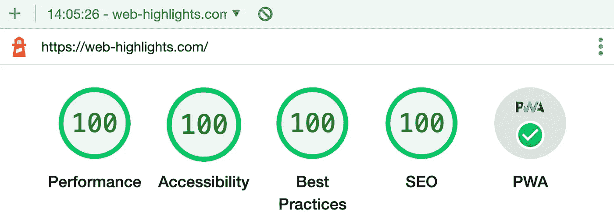

# 在 1 秒钟内加载您的 SPA 网络应用程序的 5 种高级方法

> 原文：<https://javascript.plainenglish.io/5-advanced-ways-to-get-lighthouse-performance-of-spa-web-apps-to-100-de269ce9a73c?source=collection_archive---------7----------------------->

## 让您的网络应用快如闪电

[Web Highlights](https://web-highlights.com/) — Google Lighthouse report

这篇文章将涵盖**高级主题**来挤压出你的网站的最后的性能百分比，使它非常快。

我将向你展示我是如何设法获得我的 Vue 的谷歌灯塔**性能分数**。Js 单页应用程序(SPA)的最大化。以下是我的 [Web Highlights 网站](https://web-highlights.com)上当前的 Lighthouse 性能分数:

Google Lighthouse Performance score of [web-highlights.com](https://web-highlights.com)

# 性能=搜索引擎优化

虽然 Google Lighthouse 有一个相对容易被最大化的独立类别 **SEO** ，但最大化**性能**类别以获得更好的 Google 排名至少同样重要。

> 谷歌希望把质量差、不可信的网站排除在搜索结果之外，把高质量、合法的网站放在最前面。—亚当·克拉克的《搜索引擎优化 2022》

加载时间和页面速度对于 SEO 来说**很重要。毕竟，谷歌的主要任务是为你提供某些关键词的最佳结果。**

***如果第一个搜索结果需要 5 秒钟加载，你会满意吗？***

你不会的。大多数人可能会在页面加载前离开。这也是为什么 **Google** 会将性能作为直接排名因素，对性能不好的网站进行降级。亚当·克拉克在他的书《SEO 2022》中说得很好:

> 用户是不是像胶水一样粘着你的内容？或者他们访问和离开你的网站的速度比乌塞恩博尔特还快？
> 
> 用户在你的网站上的行为告诉谷歌他们是否有积极的体验。简单地说，谷歌希望提供积极用户体验的网站在搜索结果中排名靠前。

本文假设基本的网站优化最佳实践已经实现，并重点关注高级性能问题，以挤出最后几个百分比。

如果你刚接触 **SEO** 并想解决一些基本问题使你的网站对谷歌友好，你应该先阅读文章 [3 种提高你谷歌排名的快速方法](https://medium.com/better-marketing/3-instant-ways-to-increase-your-google-ranking-d36cf98a933e)。

 [## 提高你的谷歌排名的 3 个即时方法

### 任何人都可以实现这三个要点，让他们的产品在 Google、Bing 和 Co 上可见。

bettermarketing.pub](https://bettermarketing.pub/3-instant-ways-to-increase-your-google-ranking-d36cf98a933e) 

# 现状

在关注性能之前，我对我的网站做了许多简单的修改，以实现最佳实践。

这些要实现的基本东西是简单明了的，会直接快速地影响你的 SEO 排名。例如，这包括:

*   为每幅图像添加`**alt**` **属性**
*   使用正确的 **HTML 语义元素**
*   遵循最佳实践，例如，使用 **HTTPS**

这是我的荧光笔扩展网站的谷歌灯塔报告，在我做性能改变之前。

Web Highlights Lighthouse report

所有基本类别，如**可访问性**、**最佳实践**、 **SEO** 和 **PWA** 都已满足。只是在性能类别上还有提升空间。

现在，让我们最大化性能类别。如果你还需要修复基本的东西，我强烈推荐你先这么做。以下是一些入门文章:

*   [让您的网站易于访问的 4 个简单步骤](https://medium.com/@mariusbongarts/4-simple-steps-to-make-your-website-accessible-a29ec305da1e)
*   [我曾经在两个月内获得 2000 名用户的 SEO 策略](https://levelup.gitconnected.com/seo-strategies-i-used-to-gain-2-000-users-in-two-months-e2313c00e107)
*   [3 种快速提升你的谷歌排名的方法](https://bettermarketing.pub/3-instant-ways-to-increase-your-google-ranking-d36cf98a933e)
*   [停止使用 div 做按钮！](/stop-using-divs-for-buttons-87a0b3d7945e)

# 1.最小化 JavaScript

首先，您应该最大限度地减少应用程序的 JavaScript 代码。您的 web 应用程序可能会使用一些 JavaScript bundler，如 Webpack、esbuild、Rollup、Browserify 或 package。

因为我在我的 Vue.js 应用程序中使用 webpack，所以本文中的例子将使用 webpack。但我相信所有其他的捆绑商都有解决同样问题的办法。我假设您已经安装了构建工具。

现在，让我们在做一些优化之前创建一个构建。我的非优化入口文件的大小是 ***1.1 MB。*** 那可是很大的！让我们做一些优化来减少这一点。

对于 webpack，有几个优化选项和插件可以最小化您的 JavaScript。第一步是在`webpack.config.js`配置文件中设置`minimize: true`:

[Webpack Optimization](https://webpack.js.org/configuration/optimization/)

设置此项告诉 webpack 使用 [TerserPlugin](https://webpack.js.org/plugins/terser-webpack-plugin/) 最小化包。请注意，webpack 只会在[生产模式](https://webpack.js.org/configuration/mode/)下缩小您的包，因此请相应地选择模式。你可以在找到更多关于 webpack 模式的信息。

你会发现它的尺寸已经大大减小了。在我的例子中，我的初始文件的大小从 ***1.1 MB*** 减少到 ***378 KB*** 。

Webpack 还允许您通过提供不同的一个或多个定制的 [TerserPlugin](https://webpack.js.org/plugins/terser-webpack-plugin/) 实例来覆盖默认的最小化器。为此，我们可以将一组插件传递给`minimizer`属性:

在这种情况下，您还需要通过运行以下命令来安装相应的软件包:

`yarn add -D terser-webpack-plugin css-minimizer-webpack-plugin`

或者

`npm i -D terser-webpack-plugin css-minimizer-webpack-plugin`

# 2.惰性加载组件

延迟加载对于大型 web 应用程序来说非常重要，可以减少应用程序的初始加载时间。

> 延迟加载是指延迟资源或对象的加载或初始化，直到真正需要它们来提高性能和节省系统资源。—[imperva.com](https://www.imperva.com/learn/performance/lazy-loading)

特别是对于我的应用，[登陆页面](https://web-highlights.com)需要加载超快。除了我的域的子文件夹中的我的博客，这个页面是谷歌和爬虫能找到的唯一页面。只有用户登录后，才能看到所有其他页面。总是在第一页加载时加载整个 JavaScript 是疯狂的。

因此，最初只需加载登录页面所需的 JavaScript。幸运的是，随着动态导入的引入，我们可以很容易地实现这一点。

动态导入允许我们在运行时按需加载模块。大多数前端框架和库使用动态导入按需加载包。您可以在他们的文档中找到每个问题的解决方案。

这是它在我的 Vue.js 应用程序中的样子:

根据路由的不同，相应的视图是延迟加载的。Webpack 将为每个延迟加载的组件创建单独的 JavaScrip 块。这样，在用户访问应用程序的根目录时，只加载 LandingPage 的 JavaScript。如果用户导航到路径*/主页，*主页视图将按需加载。

当然，我总是在应用程序中内置延迟加载。然而，我想知道这对我的应用程序有多大的影响。所以我删除了一次延迟加载，创建了一个 build。

我的启动文件的初始大小已经从巨大的 **378KB** 增加到了 **4.07 MB** ！如果你想知道，是的，上面提到的 Webpack 优化是启用的。

我还做了一个谷歌灯塔的报告。这份报告告诉我们减少未使用的 JavaScript，推迟加载脚本。这正是延迟加载的目的。

Google Lighthouse suggestion

实现 webpack 优化和延迟加载使我们在提高性能分数方面向前迈进了一大步。

另一份 Google Lighthouse 报告显示，性能得分看起来要好得多。尽管如此，它并不完美。

Google Lighthouse report

# 3.启用文本压缩

你可以随时查看谷歌灯塔的建议，看看还能做些什么来达到 100%。这里你可以看到 Google 建议**启用文本压缩**:

Enable text compression

我点击了 Chrome 的“[了解更多信息](https://developer.chrome.com/docs/lighthouse/performance/uses-text-compression/?utm_source=lighthouse&utm_medium=devtools)”链接，这个链接很好地解释了为什么文本压缩可以让我们的 web 应用程序运行得更快。

原因很明显——压缩的 JavaScript 文件要小得多。因此，我们需要为每个 JavaScript 包创建一个压缩的`gzip`文件。

幸运的是，有另一个 Webpack 插件可以帮助我们。通过运行以下命令安装 CompressionPlugin:

`yarn add -D compression-webpack-plugin`

或者

`npm i -D compression-webpack-plugin`

然后，我们可以将它包含在`webpack.config.js`文件的插件数组中:

现在，如果我们创建一个新的构建，您将看到 webpack 在我们的构建目录中为每个包创建了一个压缩文件。

差别相当大。我们 main.js 文件的压缩版本只有 ***103 KB*** ，而未压缩版本是 ***378 KB*** 。现在，我们还需要做一件事:**在服务器上启用文本压缩。**

> 您的服务器应该返回`[Content-Encoding](https://developer.mozilla.org/docs/Web/HTTP/Headers/Content-Encoding)` HTTP 响应头来指示它使用的压缩算法。——[developer.chrome.com](https://developer.chrome.com/docs/lighthouse/performance/uses-text-compression/?utm_source=lighthouse&utm_medium=devtools)

如何启用文本压缩取决于您的 web 服务器环境。在我的情况下，我的应用程序是由 DigitalOcean droplet 使用 NGINX 服务器提供服务的。

NGINX 静态地服务于我所有的文件。因此，我可以简单地通过设置`gzip_static on;`来启用文本压缩。下面是它在我的 NGINX 配置中的样子:

重新加载 NGINX ( `sudo systemctl reload nginx`)并通过在浏览器中查看网络响应来检查您的服务器配置是否正确:

Content-Encoding Header

如果你的服务器在`content-encoding`头中返回`gzip`，那么一切都应该像预期的那样工作。运行另一个 Lighthouse 报告应该会给您带来更好的结果。

# 4.按需延迟加载图像和视频

如果你的网站包括图片和视频，你必须确保用户不需要等待它们被加载。否则，这将对你的阻塞时间和最大油漆含量(LCP)产生负面影响。幸运的是，内置的 HTML 属性可以帮助我们做到这一点。

## 形象

对于 HTML 图像，存在一个`loading`属性来处理图像的加载，图像当前在窗口的可视视口之外。

该属性默认为`eager`，它告诉浏览器在处理完``元素后立即加载图像。相反，我们会将它设置为`lazy`以等待它被加载，直到需要它。

> 例如，如果用户在文档中滚动，值`lazy`将导致图像仅在出现在窗口的[可视视窗](https://developer.mozilla.org/en-US/docs/Glossary/Visual_Viewport)之前不久被加载。—[developer.mozilla.org](https://developer.mozilla.org/en-US/docs/Web/API/HTMLImageElement/loading)

## 录像

如果您的 SPA 包含不直接在视口中的视频，您应该确保它们仅按需加载。为此，HTML 视频有一个`preload`属性。

`preload`属性有三个选项:

> `**none**`:表示视频不应预加载。
> 
> `**metadata**`:表示只取视频元数据(如长度)。
> 
> `**auto**`:表示可以下载整个视频文件，即使用户不会使用。
> 
> **空字符串**:值`auto`的同义词。

现在，如果你想让你的视频延迟加载，你需要把它设置为`none`或者至少是`metadata`。

然而，有一件**至关重要的小事**:如果你设置了视频的`**autoplay**`属性，延迟加载就不起作用了。这是有道理的，因为浏览器显然需要开始下载视频来自动播放。

由于我的登陆页面有五个应该自动播放的视频，所以就遇到了这个问题。我最终移除了`autoplay`属性，并将`preload`设置为`none`。然后我为每个视频创建了一个`IntersectionObserver`。现在，每当一个视频被分割，我就使用 JavaScript 手动触发视频上的`play()`。

如果您感兴趣，下面是我的实现:

HTML Video IntersectionObserver

# 5.启用服务器缓存

另一个对 web 应用程序速度极其重要的点是服务器端缓存。

> HTTP 缓存可以在重复访问时加快页面加载速度。—[developer.chrome.com](https://developer.chrome.com/docs/lighthouse/performance/uses-long-cache-ttl/?utm_source=lighthouse&utm_medium=devtools)

如果您还没有在 web 服务器上实现缓存，那么您应该看看 Google Lighthouse 的另一个建议，用高效的缓存策略来服务静态文件。

Google Lighthouse Caching suggestion

此外，您可以看到本文的第一点已经实现:

*   **延迟加载的视频**:最初只有五分之一的视频被加载。
*   **文本压缩**:JavaScript 包被压缩，服务器在`content-encoding`头中返回`gzip`
*   **惰性加载**:最初只加载登陆页面必需的 JavaScript 包。

现在，让我们通过启用服务器端缓存来获取应用程序的最后百分比。你可以点击灯塔“[了解更多](https://developer.chrome.com/docs/lighthouse/performance/uses-long-cache-ttl/?utm_source=lighthouse&utm_medium=devtools)”链接了解更多。

要启用缓存，您需要配置您的服务器来返回`Cache-Control` HTTP 响应头:

`Cache-Control: max-age=31536000`

> 指令告诉浏览器应该缓存资源多长时间，以秒为单位。本例将时长设置为`31536000`，对应 1 年:60 秒× 60 分钟× 24 小时× 365 天= 31536000 秒。——[developer.chrome.com](https://developer.chrome.com/docs/lighthouse/performance/uses-long-cache-ttl/?utm_source=lighthouse&utm_medium=devtools)

在我的例子中，我将 NGINX 配置为通过缓存为特定文件提供一年的服务。相应的配置如下所示:

我有意不为 JavaScript 文件启用缓存，这样用户就可以随时看到我的应用程序的更新。

> 长缓存持续时间的一个风险是用户看不到静态文件的更新。——[developer.chrome.com](https://developer.chrome.com/docs/lighthouse/performance/uses-long-cache-ttl/?utm_source=lighthouse&utm_medium=devtools)

要检查您的服务器配置是否正确，您可以查看网络选项卡中的响应。要验证资源是否已被缓存，请检查 HTTP 响应的`Cache-Control`头:

Cache Control Header

您可以看到我们的视频由缓存提供服务，这意味着我们成功地在服务器上实现了缓存。

# 最后的想法

以上几点应该也能让你的网络应用达到 Google Lighthouse 的 100 分。

其中一些要点，比如视频和图像的延迟加载，很容易在代码库中实现。对于其他的，比如服务器端缓存和编码，您需要在 web 服务器上进行一些设置。

这是我的[荧光笔扩展网站的最终谷歌灯塔报告——网络亮点](https://web-highlights.com):

[Web Highlights](https://web-highlights.com/) — Google Lighthouse report

我希望你喜欢阅读这篇文章。我总是乐于回答问题，并乐于接受批评。随时欢迎联系我！通过**[**LinkedIn**](https://www.linkedin.com/in/marius-bongarts-6b3638171/)**，**关注我**[**Twitter**](https://twitter.com/MariusBongarts)或 [**订阅**](https://medium.com/subscribe/@mariusbongarts) 通过电子邮件获取我的故事。****

****[**这里是无限制访问介质上每一个内容的链接**](https://medium.com/@mariusbongarts/membership) **。如果你使用此链接注册，我将免费为你赚一小笔钱。******

**** [## 通过我的推荐链接加入 Medium-Marius bong arts

### 作为一个媒体会员，你的会员费的一部分会给你阅读的作家，你可以完全接触到每一个故事…

medium.com](https://medium.com/@mariusbongarts/membership)**** 

# ******延伸阅读******

**** [## 提高你的谷歌排名的 3 个即时方法

### 任何人都可以实现这三个要点，让他们的产品在 Google、Bing 和 Co 上可见。

bettermarketing.pub](https://bettermarketing.pub/3-instant-ways-to-increase-your-google-ranking-d36cf98a933e)  [## 我使用的 SEO 策略在两个月内获得了 2000 个用户

### 下面是我的用户群如何在短短两个月内增长了 37 %

levelup.gitconnected.com](https://levelup.gitconnected.com/seo-strategies-i-used-to-gain-2-000-users-in-two-months-e2313c00e107)  [## 开发人员必备的 7 个生产力 Chrome 扩展

### 这七个 Chrome 扩展每周为我节省了很多时间

levelup.gitconnected.com](https://levelup.gitconnected.com/7-must-have-productivity-chrome-extensions-for-developers-4320abaec24b) 

## 更多内容请访问 [PlainEnglish.io](https://plainenglish.io/) 。

报名参加我们的 [**免费周报**](http://newsletter.plainenglish.io/) 。关注我们 [**推特**](https://twitter.com/inPlainEngHQ) ，[**LinkedIn**](https://www.linkedin.com/company/inplainenglish/)**，**[**YouTube**](https://www.youtube.com/channel/UCtipWUghju290NWcn8jhyAw)**，以及** [**不和**](https://discord.gg/GtDtUAvyhW) **。**

## 对扩展您的软件启动感兴趣吗？检查[电路](https://circuit.ooo/?utm=publication-post-cta)。

我们提供免费的专家建议和定制解决方案，帮助您建立对您的技术产品或服务的认知和采用。****