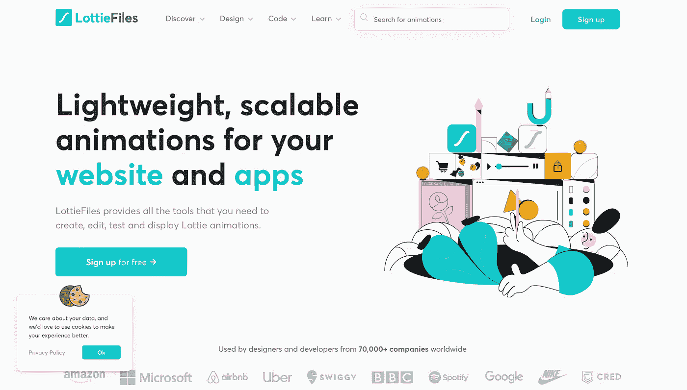
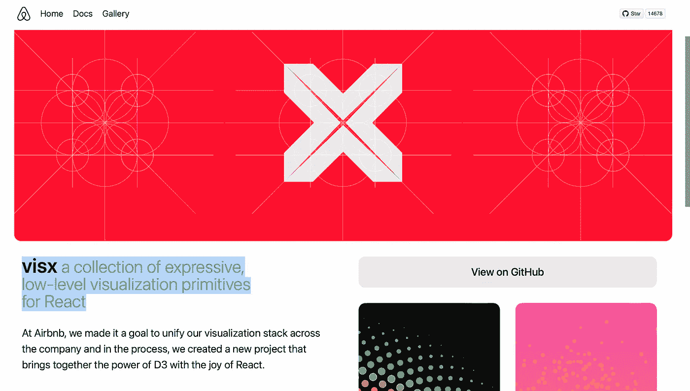

# 帮助开发者节省大量时间的 5 个 Airbnb 项目。

> 原文：<https://javascript.plainenglish.io/5-airbnb-projects-that-have-helped-developers-save-tons-of-time-129ebc067ec2?source=collection_archive---------19----------------------->

## Airbnb 如何帮助开发人员创建令人惊叹的应用程序。

Photo by [Microsoft 365](https://unsplash.com/@microsoft365?utm_source=unsplash&utm_medium=referral&utm_content=creditCopyText) on [Unsplash](https://unsplash.com/s/photos/computer?utm_source=unsplash&utm_medium=referral&utm_content=creditCopyText)

开发者警惕！如果你正在使用 Airbnb 计划你的下一次假期住宿，那么不要担心你在飞机上的空闲时间。我有一套很棒的工具，你可以坐在下一趟航班的座位上查看。这是 Airbnb 开发的一些很酷的开源项目。但为此，你必须保存并阅读这篇文章。

这篇文章包含一个由 Airbnb 开发的鲜为人知的工具列表，你可以用它来构建你的下一个应用程序。它们非常酷、可靠，并且被 Airbnb 开发人员用在他们的工作流程中。

Airbnb 不仅仅是一个在夏威夷、巴厘岛或泰国预订度假房屋或豪华海滩别墅的组织。远不止如此。是的，该组织不仅仅是销售度假住宿的房屋租赁。他们的产品让开发者的生活更轻松。相信我，当我这么说的时候，“它已经为开发人员做了很多事情，帮助他们轻松地构建他们想要的应用程序。”

就个人而言，如果你问我，我会说 Airbnb 是帮助开发者开发 UI 和 UX 的王者。我甚至觉得写下这些很愚蠢。他们的开发者创造了一堆很酷的东西，甚至大的技术组织也在他们的工作流程中使用。

但是，说到网络，他们在 Github 上有大量开源的好项目。开发人员可以使用这些框架和库来构建他们的应用程序。

尽管该行业的大多数开发人员都非常了解这些技术，但许多人仍然不知道，因为社交媒体上没有关于这些项目的宣传。至少在我写这篇文章的时候没有。因此，我决定写这个帖子。我希望它能在开发者社区引起轰动。

# 1.洛蒂动画

screenshot

为了保持简洁，你现在可以得到 JSON 格式的动画。是的，你没看错！开源动画 JSON 文件格式。

组织使用 Lottie 在网络和移动设备上创建令人惊叹的动画。它易于使用，并且易于与设计工具和开发工具集成。

这是一个轻量级的，可扩展的动画，适用于你的移动和网络应用。

网飞、谷歌、微软的开发人员使用 Lottie 为他们的客户创造惊人的视觉效果。

点击下面的链接，获得一个关于“Lottie 和 React 应用入门”的 4 分钟完美教程

 [## 如何在 React 应用中将动画实现为 JSON(包括代码)

### 以 JSON 格式将动画添加到您的下一个 React web 和移动应用程序中。

javascript.plainenglish.io](/how-to-implement-animation-as-json-in-a-react-app-includes-code-df179f8c88a4) 

[链接到洛蒂](https://lottiefiles.com/)

# 2.Polyglot.js

js 是一个很小的 I18n 助手库，用 Javascript 编写，兼容 JavaScript 和 node。

一个简单、易于使用的库，让您的 web 应用程序能够使用多种语言。

它有助于应用程序的本地化。Airbnb 就是这样把应用翻译成 30 种语言的。你现在也可以这样做。嗯，30 对个人开发者来说太多了！但是我能知道谁。

[链接到 Polyglot.js](https://airbnb.io/polyglot.js/)

# 3.对样式做出反应

你想为你的 Javascript 应用程序创建一个或多个主题吗？如果是，那么你必须签出这个项目。

使用 React with Styles，您可以在 React 组件的 javascript 中使用 CSS。您可以访问共享的主题、字体、颜色等。

这是前端开发人员必须尝试的库。

[林克与招式反应过来](https://github.com/airbnb/react-with-styles)

# 4.反应日期

React Dates 是一个 web 日期选择器库。

你曾经尝试过自己创建一个日期选择器吗？如果是，你会知道这要花多少时间吗？没错。通过使用这个成熟和先进的日期选择器库，平滑您的工作流程并减少您的开发时间。

[链接反应过来日期](https://github.com/react-dates/react-dates)

# 5.VisX

screenshot

它是 React 的一个富有表现力的低级可视化原语集合。它是在 D3.js 之上开发的，包含大量可视化组件，开发者可以用它们来构建自己的可视化应用。

是的，所有的 D3 可视化都是通过使用这个 React 库实现的。

[链接到 Visx](https://airbnb.io/visx/)

感谢你花时间阅读这篇文章。我希望你喜欢它。如果你喜欢这篇文章，你可能会喜欢我的其他一些类似的文章

[卡兰·贾戈塔](https://karanjagota.medium.com/?source=post_page-----129ebc067ec2--------------------------------)

## 编程和开源

[View list](https://karanjagota.medium.com/list/programming-and-open-source-483d80defa76?source=post_page-----129ebc067ec2--------------------------------)7 stories [## 帮助开发者节省大量时间的 7 个谷歌项目

### 谷歌如何帮助开发人员创建令人惊叹的应用程序。

javascript.plainenglish.io](/7-google-projects-that-have-helped-developers-save-tons-of-time-fa8a72d9044c)  [## 帮助开发人员节省大量时间的 7 个元项目

### Meta 如何帮助网络和移动应用开发者。

javascript.plainenglish.io](/7-meta-projects-that-have-helped-developers-save-tons-of-time-5a5d25d2ce09) 

**你知道这些工具吗？**

你计划在你的下一个项目中使用上述库吗？

**在评论区写下。我很想知道你对此的看法。**

*更多内容请看*[***plain English . io***](http://plainenglish.io/)*。报名参加我们的* [***免费周报***](http://newsletter.plainenglish.io/) *。在我们的* [***社区***](https://discord.gg/GtDtUAvyhW) *获得独家获得写作机会和建议。*