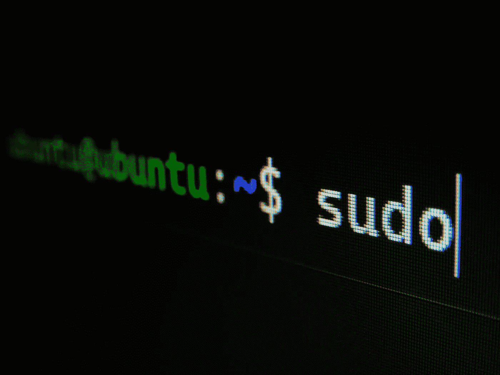
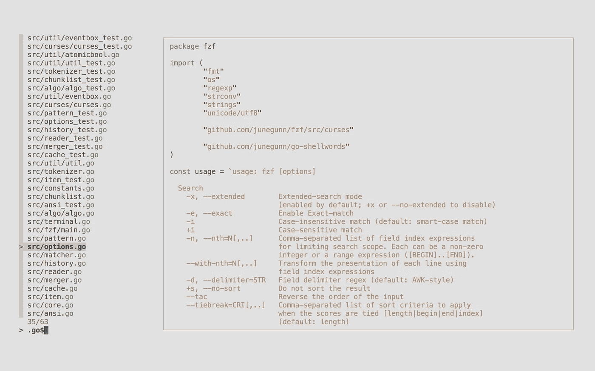
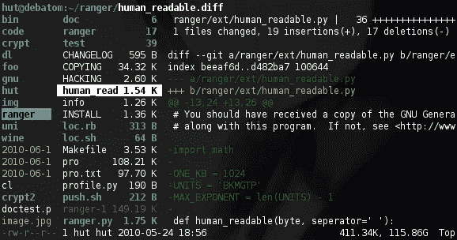
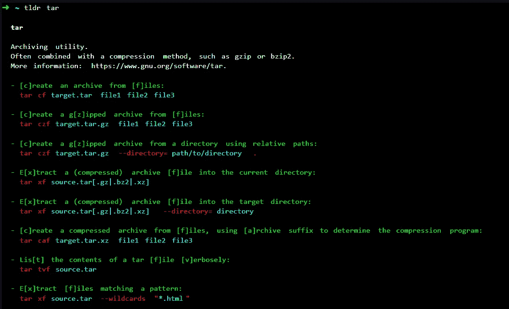

# 5 个惊人的命令行工具

> 原文：<https://javascript.plainenglish.io/5-amazing-command-line-tools-86a657ffd659?source=collection_archive---------6----------------------->

## 从 Linux CLI 中获得更多



Photo by [Gabriel Heinzer](https://unsplash.com/@6heinz3r?utm_source=unsplash&utm_medium=referral&utm_content=creditCopyText) on [Unsplash](https://unsplash.com/s/photos/linux?utm_source=unsplash&utm_medium=referral&utm_content=creditCopyText)

# 1.fzf



Image: fzf

fzf 是一个通用的命令行模糊查找器。这是一个交互式的 Unix 命令行过滤器，可用于任何列表；文件、命令历史、进程、主机名、书签、git 提交等。

## 特征

*   可移植，无依赖性
*   惊人的快
*   最全面的功能集
*   灵活布局
*   电池包括:Vim/Neovim 插件，按键绑定，模糊自动完成

## 安装:

```
$ brew install fzf# To install useful key bindings and fuzzy completion:
$(brew --prefix)/opt/fzf/install
```

# 2.午夜指挥官

GNU Midnight Commander(也称为 MC)是一个用户 shell，具有全屏文本模式界面。它可以从操作系统的控制台运行，也可以从 x term 和其他终端模拟器运行。

GNU Midnight Commander 允许您管理文件，同时利用您的屏幕并提供文件系统的清晰表示，并且它非常简单，可以通过 telnet 或 ssh 会话使用。

它有一个内置的虚拟文件系统，在大多数终端模拟器上支持鼠标，以及文本和十六进制编辑器。它还具有命令补全功能:通过在任何需要文件名或可执行文件的地方按 Alt-Tab，GNU Midnight Commander 将为您补全文件名。

## 安装:

你可以从[https://www.midnight-commander.org/downloads/](https://www.midnight-commander.org/downloads/)下载最新版本的 GNU 午夜指挥官

# 3.自动跳转

autojump 允许您更快地浏览文件系统。它的工作原理是保存一个您经常从命令行使用的目录的数据库。

## 如何使用:

`j`是围绕`autojump`的一个方便的包装函数。任何可以与`autojump`一起使用的选项都可以与`j`一起使用，反之亦然。

*   跳转到包含`foo`的目录:

```
j foo
```

*   跳转到一个子目录:有时跳转到一个子目录(当前目录的子目录)比键入全名更方便。

```
jc bar
```

*   打开文件管理器到目录(而不是跳转):你可以打开一个文件浏览器窗口(Mac Finder，Windows Explorer，GNOME Nautilus 等)而不是跳转到一个目录。)转到目录中。

```
jo music
```

*   也支持打开子目录的文件管理器:

```
jco images
```

*   使用多个参数:

让我们假设以下数据库:

```
30   /home/user/mail/inbox
10   /home/user/work/inbox
```

*   `j in`将跳转到/home/user/mail/inbox 作为较高权重的条目。但是，您可以向 auto jump 传递多个参数来选择不同的条目。在上面的例子中，`j w in`会将目录更改为/home/user/work/inbox。

## 安装:

```
$ git clone git://github.com/wting/autojump.git
$ cd autojump
./install.py or ./uninstall.py
```

# 4.看守人



Image: Ranger

ranger 是一个带有 VI 键绑定的控制台文件管理器。它提供了一个极简而漂亮的 curses 界面，带有一个目录层次结构的视图。它配有`rifle`，一个文件启动器，擅长自动找出哪个程序用于什么文件类型。

## 特征

*   UTF-8 支持(如果您的 Python 版本支持的话)
*   多列显示
*   所选文件/目录的预览
*   常见文件操作(创建/chmod/复制/删除/…)
*   一次重命名多个文件
*   类似 VIM 的控制台和热键
*   自动确定文件类型并使用正确的程序运行它们
*   退出 ranger 后，更改您的 shell 目录
*   标签，书签，鼠标支持。

## 安装:

```
$ pip install ranger-fm
```

# 5.TLDR-页面



Image: TLDR-pages

TLDR 页面项目是一个由社区维护的命令行工具帮助页面的集合，旨在成为传统手册页的一个更简单、更易用的替代方案。

TLDR 是另一个极其有用的指挥官。如果您不熟悉命令行，或者正在尝试学习一个新命令，help 选项可能不够用，而 man 命令可能太长。

## 安装:

```
$ npm install -g tldr
```

*更多内容尽在* [***说白了. io***](https://plainenglish.io/) *。报名参加我们的* [***免费周报***](http://newsletter.plainenglish.io/) *。关注我们关于* [***推特***](https://twitter.com/inPlainEngHQ) *和*[***LinkedIn***](https://www.linkedin.com/company/inplainenglish/)*。查看我们的* [***社区不和谐***](https://discord.gg/GtDtUAvyhW) *加入我们的* [***人才集体***](https://inplainenglish.pallet.com/talent/welcome) *。*