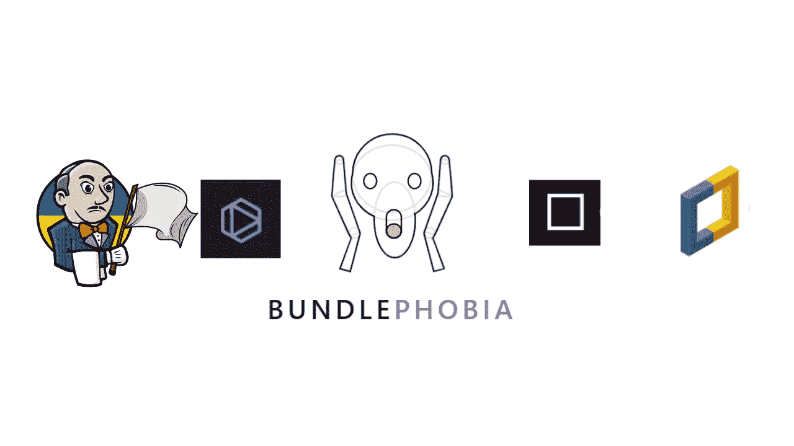
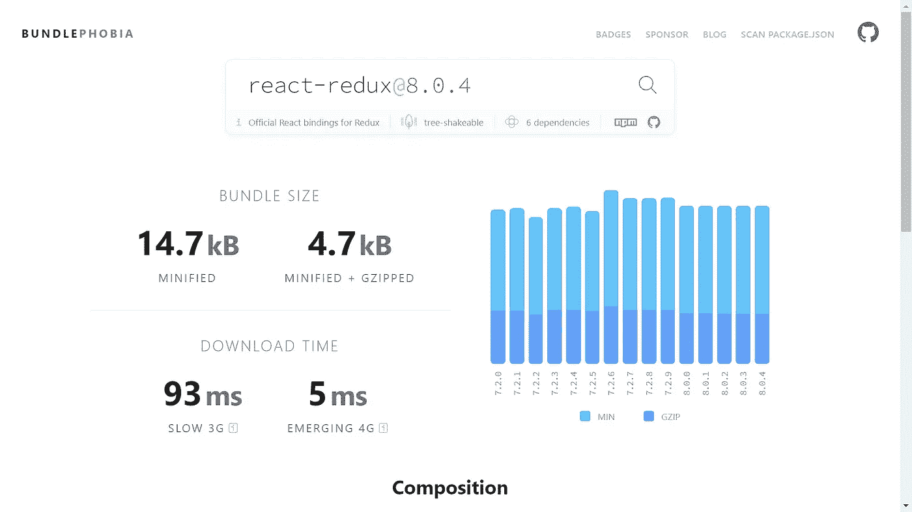
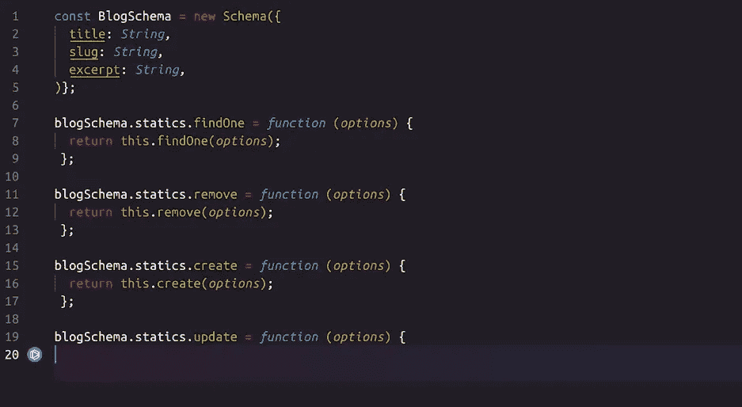
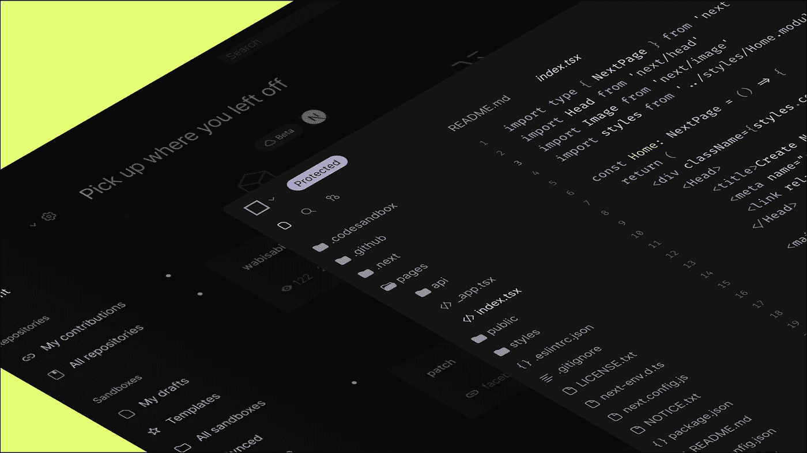
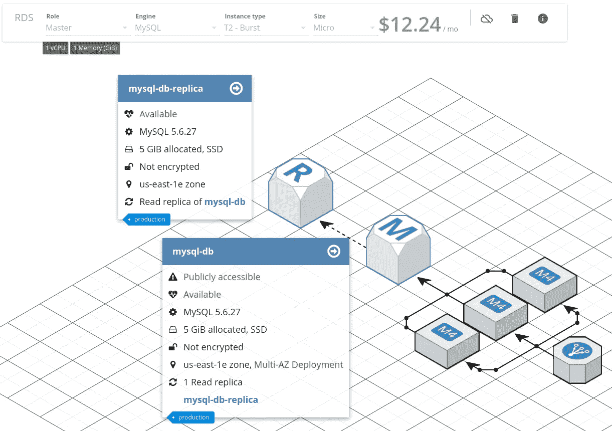

# 你不知道的 5 个神奇的开发工具

> 原文：<https://javascript.plainenglish.io/5-amazing-dev-tools-you-dont-know-4f546a4fff7f?source=collection_archive---------3----------------------->

## 非常有用的工具

Image by author

在过去的几年里，世界经历了前所未有的变化。全球化的疫情迫使我们极大地改变我们的工作和生活方式，模糊了界限，因为我们许多人开始在家工作。

沟通、协作和生产力工具在开发组织中越来越重要。在这篇文章中，我总结了每个开发者都应该知道的 5 个神奇的开发工具。您将发现一些您从未听说过的应用程序开发工具，它们可以为您的工作流程带来协作和生产力。

## [恐束症](https://bundlephobia.com/)

Credit: Bundlephobia

Bundlephobia 是一个网络应用程序，允许您确定一个`npm install`包将增加多少到您的总包大小。如果您正在使用一个现代化的前端框架，那么您希望尽可能地保持包的大小，以便为新用户优化初始页面加载。捆绑恐惧症使得分析向项目中添加新的依赖项变得非常容易。

只需输入包名，它会告诉你包的大小，下载时间，是否是一个摇树碗，以及该包的每个版本的其他有用信息。您甚至可以上传您的整个包 JSON，以查看按大小排序的所有依赖项的列表。

## [禁忌](https://www.tabnine.com/)

Credit: Tabnine

Tabnine 是一个人工智能(AI)代码助手，可以帮助你成为更好的开发者。它根据上下文和语法预测并建议您的下一行代码。

*   Tabnine 在您编码时提供整行完成功能，您可以通过一次击键来完成整行代码。
*   全功能代码完成:Tabnine 只需一个提示就能生成整个函数，而无需离开编辑器。
*   从自然语言到编码:描述你需要的功能，Tabnine 会推荐合适的代码给你使用。

Tabnine 的人工智能可以在你的笔记本电脑、防火墙后的服务器或云中执行。它根据您的编码模式建议代码补全。

*   减少代价高昂的代码审查迭代
*   留在编辑器中(和流程中)
*   内聚、一致的代码完成

Tabnine 支持从 VS 代码到 Jupyter 的所有主流 ide。它掩护了你。你可以在这里了解更多关于 Tabnine [的信息。](https://www.tabnine.com/)

## [CodeSandbox](https://codesandbox.io/)

Credit: CodeSanbox

CodeSandbox 是一个用于 web 开发的全功能在线 IDE，可以在任何有浏览器的设备上运行。允许您快速启动新项目和原型。您可以轻松地创建 web 应用程序，试验代码，测试想法，并通过 CodeSandbox 共享您的创作。

它不需要任何设置，你可以使用一个模板来启动新项目，或者从 GitHub repo 开始，在几秒钟内开始编码。它是协作的。就像谷歌文档一样，但对于代码，你可以实时或异步地获得反馈并一起创建。

点击即可分享。您的朋友、团队或同事可以加入，或者只需一个 URL 就可以查看您的创作。沙盒会实时更新，因此您可以在编写代码时即时看到变化的效果。它对个人使用是免费的，你可以创建静态网站、组件或全栈 web 应用。

## [Cloudcraft](https://www.cloudcraft.co/)

Credit: Cloudcraft

Cloudcraft 是另一款可以帮助您设计和预算云基础设施的 web 应用。目前仅适用于 AWS。然而，它仍然是有用的，因为它提供了一个非常直观的拖放界面，允许您将不同的云基础架构服务连接在一起。

您可以使用 EC2、ELB、Lambda、RDS、DynamoDB、Kinesis、Redshift、CloudFront、Route 53 等智能组件来捕获您的关键服务。您还可以与整个团队在线共享和编辑图表，以及导出到文档、wikis 和演示文稿。

## [詹金斯](https://www.jenkins.io/)

Jenkins 是一个开放源代码的自动化服务器，它包括数百个插件来帮助项目开发、部署和自动化。Jenkins 作为一个可扩展的自动化服务器，可以用作简单的 CI 服务器，也可以用作任何项目的持续交付中心。

由于更新中心有数百个插件，Jenkins 几乎可以与持续集成和持续交付工具链中的每一个工具集成。

Jenkins 是可扩展的；它可以通过其插件架构进行扩展，为 Jenkins 所能做的事情开辟了几乎无限的可能性。它的 web 界面包括即时错误检查和内置帮助，使设置和配置变得简单。

*更多内容请看*[***plain English . io***](https://plainenglish.io/)*。报名参加我们的* [***免费周报***](http://newsletter.plainenglish.io/) *。关注我们关于*[***Twitter***](https://twitter.com/inPlainEngHQ)[***LinkedIn***](https://www.linkedin.com/company/inplainenglish/)*[***YouTube***](https://www.youtube.com/channel/UCtipWUghju290NWcn8jhyAw)*[***不和***](https://discord.gg/GtDtUAvyhW) *。对增长黑客感兴趣？检查* [***电路***](https://circuit.ooo/) *。***