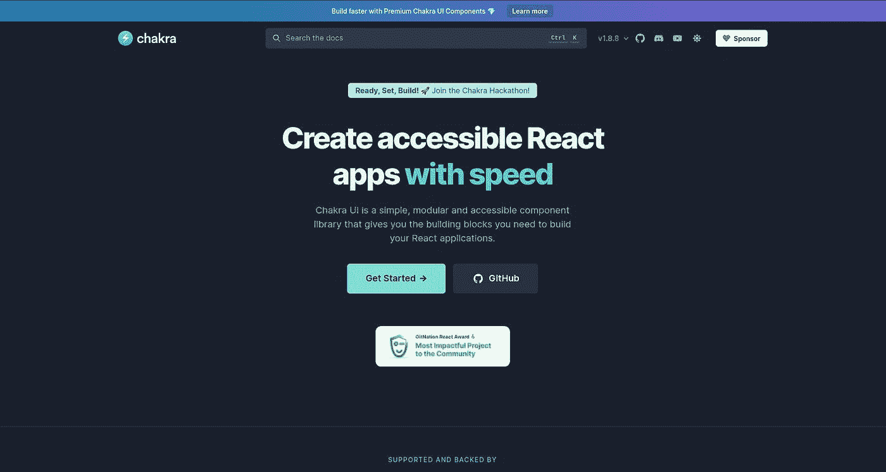
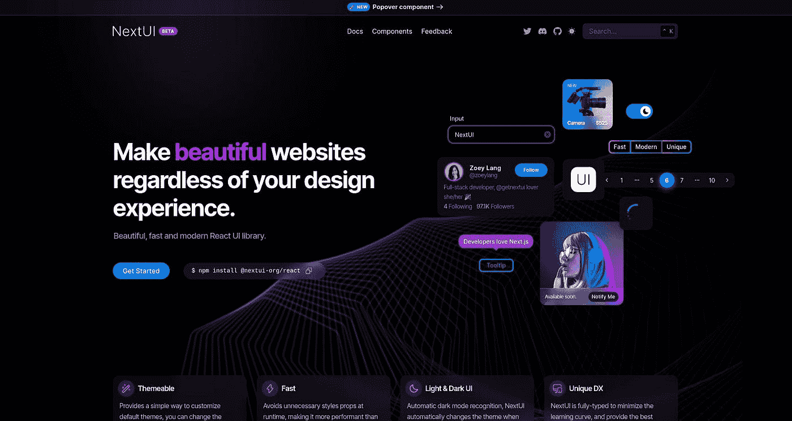
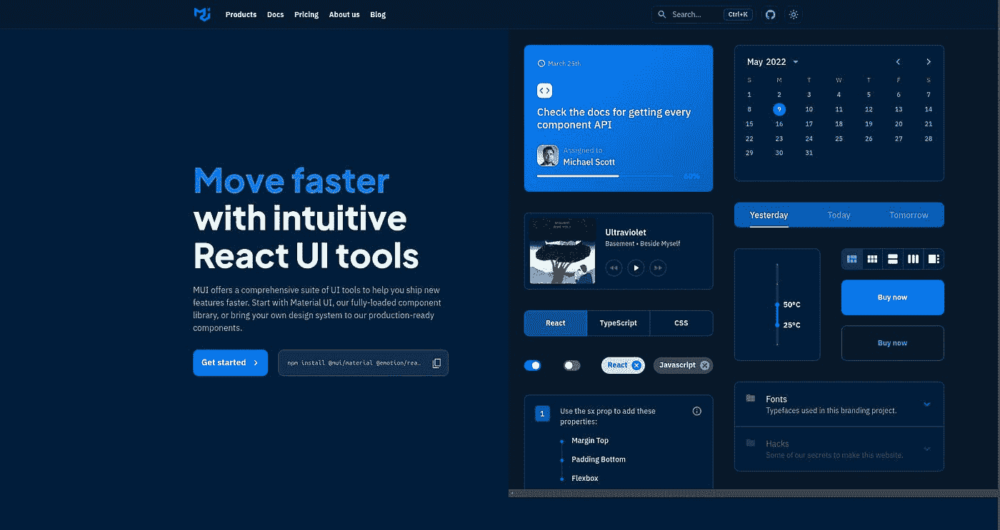
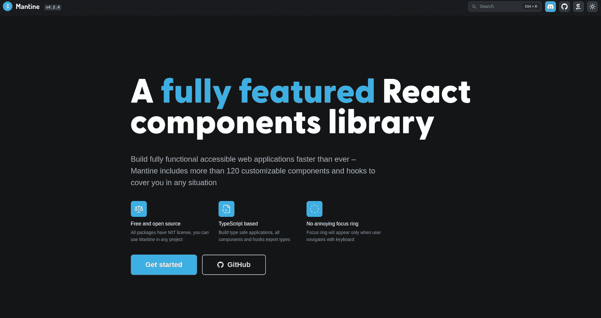
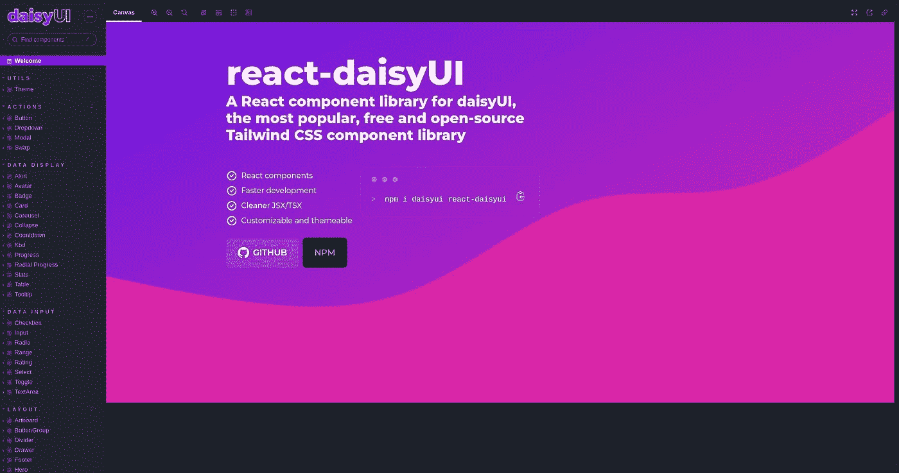

# 为您的下一个项目考虑 5 个惊人的 React 组件库

> 原文：<https://javascript.plainenglish.io/5-amazing-react-component-libraries-to-consider-for-your-next-project-1b980ccb10fa?source=collection_archive---------11----------------------->

作为 web 开发人员，制作可访问的 ui 通常非常困难和耗时。当我们不得不从头开始制作特殊的组件，如模态或 Popovers 时，情况会变得更糟。

令人欣慰的是，React 生态系统非常庞大，有许多了不起的人制作了惊人的库来帮助我们解决这个问题。

今天，我们将重点关注 React 组件库，这些组件库是可访问的，具有良好的基础风格，有好的文档，并带有像模态、弹出窗口、工具提示等组件。

# 1.[查克拉 UI](https://chakra-ui.com/)

当我开始使用 Next.js 时，Chakra UI 是我使用过的第一个组件库，非常神奇！我能够在很短的时间内制作出非常复杂的 ui(包括模态、表格等等),这帮助我专注于其他事情，比如应用程序逻辑。这是用于黑客马拉松的完美选择！它也有一个庞大的社区，非常受欢迎。

# 2.[下一个界面](https://nextui.org/)

Next UI 可能是本文中最漂亮的。虽然它很新，仍处于测试阶段，但它配备了所有的必需品，开箱后看起来绝对令人惊叹！它还提供了一些其他组件库没有的惊人的过渡和动画。

# 3.[梅](https://mui.com/)

MUI 也已经存在了很长时间，被称为 Material UI。它基于谷歌的[材料设计，但也带有大量定制。此外，MUI 还提供了一个](https://material.io/)[无样式版本](https://mui.com/base/getting-started/installation/)和[一个包含一些令人惊叹的 CSS 实用程序](https://mui.com/system/basics/)的包。MUI 还在 MUI X 下提供了一组[高级组件](https://mui.com/x/advanced-components/)，这些组件有些是免费的，有些则需要付费许可。

# 4. [Mantine](https://mantine.dev/)

Mantine 还附带了许多组件和一个不错的开箱即用的 UI。它很像 Chakra UI，但是有一个更小的社区。然而，它也附带了一些令人惊奇的软件包，如[、通知中心](https://mantine.dev/others/notifications/)、[、命令栏](https://mantine.dev/others/spotlight/)、[、富文本编辑器](https://mantine.dev/others/rte/)等等！

# 5. [React Daisy UI](https://react.daisyui.com/)

[Daisy UI](https://daisyui.com/) 是一个令人惊叹的 [Tailwind CSS](https://tailwindcss.com/) 组件库。React Daisy UI 是用于 Daisy UI 的 React 组件库。它有大量的开箱即用的主题和许多组件。由于它是基于 Tailwind CSS 并自带的，所以用 Tailwind CSS 定制它是极其容易的。

# 结论

现在，这 5 个 React 组件库将帮助您加快开发速度。请告诉我你是否有其他的最爱，或者这 5 个中你最喜欢哪一个！

*原发布于*[*https://blog . anishde . dev*](https://blog.anishde.dev/5-amazing-react-component-libraries-to-consider-for-your-next-project)*。*

*更多内容请看* [***说白了就是***](https://plainenglish.io/) *。报名参加我们的* [***免费每周简讯***](http://newsletter.plainenglish.io/) *。关注我们*[***Twitter***](https://twitter.com/inPlainEngHQ)*和*[***LinkedIn***](https://www.linkedin.com/company/inplainenglish/)*。加入我们的* [***社区不和谐***](https://discord.gg/GtDtUAvyhW) *。*