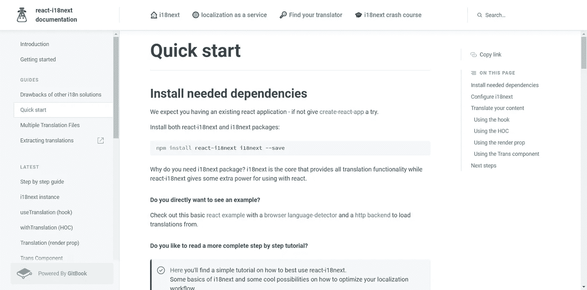
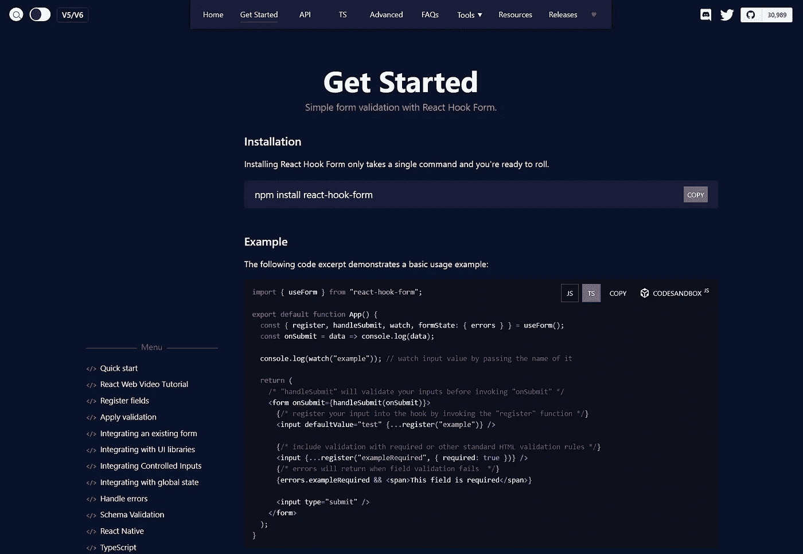
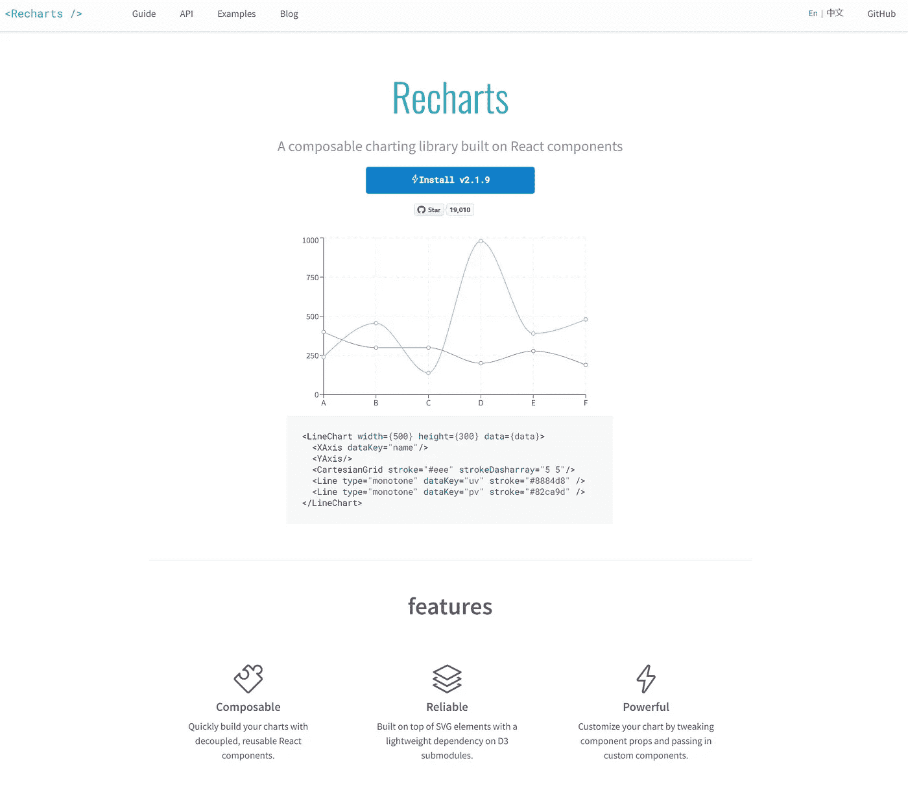
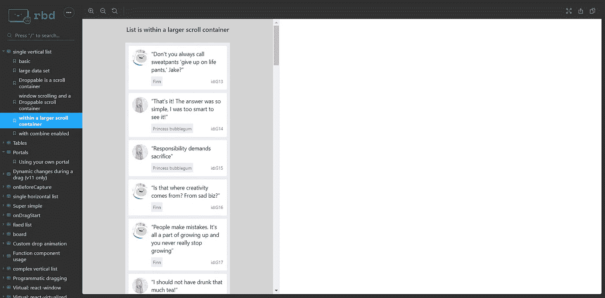
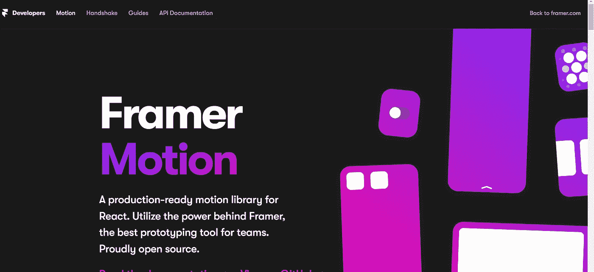

# 你应该看看的 5 个惊人的 React 库

> 原文：<https://javascript.plainenglish.io/5-amazing-react-libraries-you-should-check-out-b4b061450157?source=collection_archive---------4----------------------->

## 这些是你应该知道的一些有用的库！

Photo by [Lautaro Andreani](https://unsplash.com/@lautaroandreani?utm_source=medium&utm_medium=referral) on [Unsplash](https://unsplash.com?utm_source=medium&utm_medium=referral)

React 库帮助您**提供更好更快的方法来创建定制组件，包括输入、选择、按钮和潜在的新组件**。

*嘿，那里！我是* [*哈什*](https://www.instagram.com/harshith_codes/) *！我创建关于 web 开发、金融和生产力的内容。请随意查看这些，并订阅更多精彩文章！*

## [React-i18 下一步](https://react.i18next.com/)

React-i18next 是另一个流行的国际化库，一旦用户请求更改应用程序中的语言，它就使用**组件来呈现或重新呈现应用程序的翻译内容**。可以用多种语言完成！

## [**反应-钩形**](https://react-hook-form.com/get-started/)

它帮助你在 React 中验证表单。这是一个最小的库，没有任何其他依赖，同时性能良好，使用简单，它帮助开发人员使用更少的代码行，具有很好的验证和错误处理能力！

## [**充值**](https://recharts.org/en-US/)

这个库可以帮助你轻松流畅地构建图表。这些动态图表可快速构建，可重复使用，可靠轻便，功能强大，您可以轻松定制您的图表。

## [React-beautiful-dnd](https://react-beautiful-dnd.netlify.app/?path=/story/single-vertical-list--within-a-larger-scroll-container)

为您的应用程序提供各种拖放功能，使您的应用程序具有交互性和美观性！

## [成帧器运动](https://www.framer.com/motion/)

生产就绪的声明性动画。简单的声明性语法意味着您编写的代码更少。更少的代码意味着你的代码库更容易阅读和维护。

今天到此为止，我们将制作更多精彩内容！如果这篇文章帮助你开始，请鼓掌！谢谢！

嘿，你好！如果你喜欢这篇内容， [**关注我**](https://medium.com/@harshithv) **获取更多并订阅** [**快讯**](https://harshithv.medium.com/subscribe) **。我一定会提供一些令人惊叹的内容。谢谢伙计！**

*更多内容看* [***说白了就是***](https://plainenglish.io/) *。报名参加我们的* [***免费周报***](http://newsletter.plainenglish.io/) *。关注我们* [***推特***](https://twitter.com/inPlainEngHQ) ，[***LinkedIn***](https://www.linkedin.com/company/inplainenglish/)*，*[***YouTube***](https://www.youtube.com/channel/UCtipWUghju290NWcn8jhyAw)*，*[*不和*](https://discord.gg/GtDtUAvyhW) *。对增长黑客感兴趣？检查出* [***电路***](https://circuit.ooo/) *。*