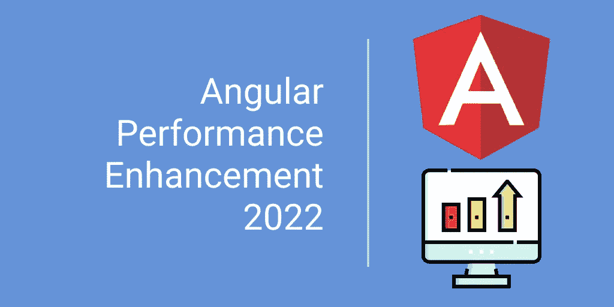
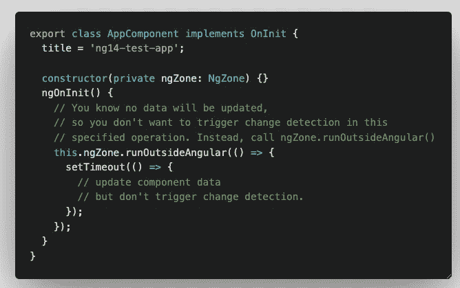
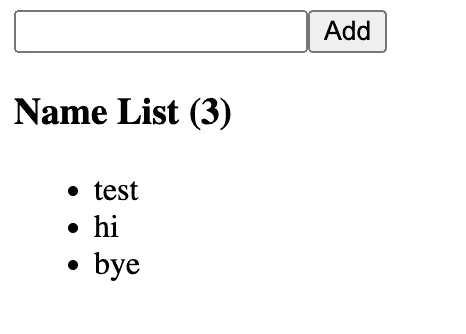
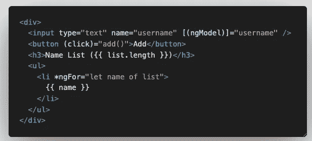
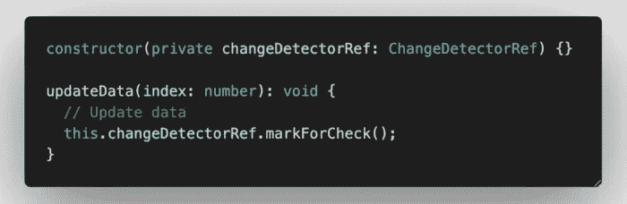
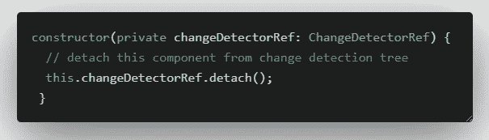
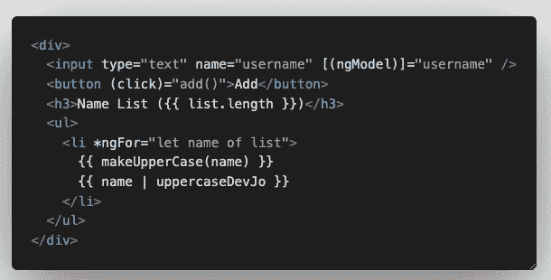
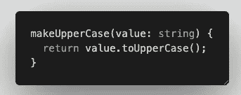
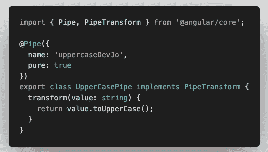
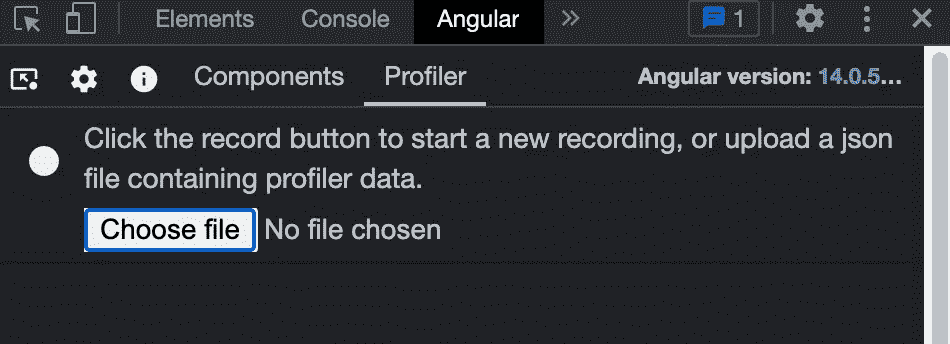

# 2022 年 5 项角度性能增强

> 原文：<https://javascript.plainenglish.io/5-angular-performance-enhancements-in-2022-fc17c3777173?source=collection_archive---------0----------------------->

## 学习 5 种方法，你可以改善你的落后和缓慢的应用程序的性能。

想知道为什么你的角度应用的某些部分仍然很慢吗？本文将向您展示增强应用程序性能的方法。

您是否发现您的角度应用程序滞后且缓慢，但您不知道如何增强它们？让我们直接进入这篇文章，了解提高应用程序性能的 5 种方法。🔥

# 1.ngZone

许多开发人员错过了这项由 Angular 团队提供的服务，该服务旨在增强他们的应用程序性能。默认情况下，所有的**异步**操作如 **setTimeout** 、 **requestAnimationFrame** 等。在角度区域内，这意味着它将触发组件上的**变化检测**，如果组件很大，将会降低网站的速度。因此，如果您拥有的**异步**函数不需要在 DOM 上进行变更检测，那么您可以在`ngZone`服务中运行**异步**函数，方法是调用`runOutsideAngular`回调函数。

# 2.拆分组件

如果您的组件由一个活动(智能)部分和一个非活动(非智能)部分组成，您应该考虑重构并将它们分成智能和非智能组件。例如，在下面的例子中，

我有一个输入和一列数据。当用户输入时，输入部分将继续触发键事件动作，并且它触发整个组件的变化检测检查，即使没有对列表部分做任何事情。想象一下，列表是一个复杂的列表，对它进行更改检测的成本很高。

因此，更好的方法是将输入部分和列表部分分成两个独立的组件，并将其放在父组件下。这样，InputComponent 中的键事件将不会影响和触发 ListComponent 上的更改检测。如果您的列表数据很大并且包含大量复杂的计算，那么它可以大大节省性能。🌈

# 3.onPush

除了上面提到的拆分组件点，你还可以调整你的组件的 **changeDetection 策略**来提高组件的性能。默认情况下，当您使用 **Angular CLI** 创建一个组件时，默认的 **changeDetection** 策略将会是`OnDefault`，这使得每当组件中的数据发生变化时，您的 DOM 都会更新。角度检查组件树中的更改。因此，如果您的父元素或根元素发生变化，它将触发其子组件和孙组件的 DOM 更新。

您可以将您的 list component**change detection**策略更新为`OnPush`，这样 Angular 将只在您调用它时检查和更新 DOM。

将***changeedetorref***注入到您的组件构造函数中，调用 ***markForCheck()*** 方法，强制您的组件及其下的子组件检查变更，并相应更新 DOM。此外，如果在这个父/根组件的组件树中有不需要 DOM 更新而不管数据变化的子组件(哑组件)，您可以选择通过使用 **detach()** 方法从组件中分离 **changeDetector** 。

将 changeDetectorRef 注入到组件中:

在构造函数中调用`detach`方法，将组件从变更检测中分离出来。这个小小的改变可以让你节省大量的内存，优化组件的重新渲染周期。

# 4.使用管道而不是方法

Angular 模板绑定太棒了，你可以绑定变量，也可以绑定它的模板。你们中的许多人和我一样，使用一个**函数调用**来转换数据，因为它方便且易于实现。

Example: Input adding item into a list

function call

Pipe Implementation

看上面这个简单的例子，你不会注意到任何不同。但是你知道吗，每当一个新的项目被添加到列表中时，列表中的每个项目都会被调用**函数调用**，但是**管道**只会在列表中的项目值改变时被调用。所以，除非你知道你真正在做什么，否则请避免在你的模板中进行**函数调用**，而是选择创建你自己的**自定义纯管道**来处理数据转换。

# 5.对于较长的数据集列表，使用虚拟滚动或无限滚动或分页

您是否有一长串需要向管理员用户或客户显示的项目？您的浏览器在您的 web 应用程序中呈现 100 多个 DOM 项目是否需要太长时间？是时候考虑在你的 web 应用中使用虚拟滚动或无限滚动策略了。虚拟和无限滚动有助于在浏览器中重用和回收 DOM 元素，以显示用户可查看的项目。列表中隐藏的项目不会出现在 DOM 中，因此有助于节省 web 应用程序的渲染时间。这些策略有助于优化在一个给定的长项目列表中向用户显示多少 DOM 元素，并且不呈现那些在滚动时不在视图中的项目。我不会用这里的细节来烦你。

你可以使用 [Angular Material](https://material.angular.io/cdk/scrolling/overview) 或 [ngx-virtual-scroll](https://www.npmjs.com/package/ngx-virtual-scroller) 了解更多关于虚拟滚动的信息。你也可以使用 [ngx-infinite-scroll](https://www.npmjs.com/package/ngx-infinite-scroll) 找到更多关于无限滚动的信息。或者，你可以访问下面的网站，找到更多的插件和工具来优化你长长的可滚动项目列表。👍

 [## 2022 年 10 大最佳角度无限卷轴库| Openbase

### 2022 年 10 大最佳角度无限卷轴库对比:ngx-scrollspy，od-virtualscroll…

openbase.com](https://openbase.com/categories/js/best-angular-infinite-scroll-libraries) 

# 奖金🎉

你知道吗，你可以安装 **Angular Devtools** Chrome 扩展，这样你就可以在测试和开发组件时，在浏览器中测量组件的性能。

 [## 角度开发工具

### Angular DevTools 扩展了 Chrome DevTools，增加了特定于 Angular 的调试和分析功能。

chrome.google.com](https://chrome.google.com/webstore/detail/angular-devtools/ienfalfjdbdpebioblfackkekamfmbnh?hl=en&authuser=0) 

Angular devtools

一旦你安装了扩展，你可以打开你的 chrome 开发工具，在 chrome 开发工具的标签列表中寻找 Angular。您可以在您的应用程序中开始记录和执行一个操作，然后停止记录以分析哪个操作有性能改进。

# 摘要

希望这篇文章能为您提供一些关于如何增强 Angular 应用程序性能的线索。使用上面的 5 点 Angular devtools 扩展来识别应用程序中的性能障碍。💯

如果你有其他有助于优化角度应用的性能提升技巧，请在下面的评论中告诉我。我也很想了解一下。干杯！

 [## 用我的推荐链接- DevJo 加入媒体

### 阅读 DevJo 的每一个故事(以及 Medium 上成千上万的其他作者)。你的会员费直接支持 DevJo 和…

medium.com](https://medium.com/@devjo/membership) 

*更多内容请看*[***plain English . io***](https://plainenglish.io/)*。报名参加我们的* [***免费周报***](http://newsletter.plainenglish.io/) *。关注我们关于*[***Twitter***](https://twitter.com/inPlainEngHQ)*和*[***LinkedIn***](https://www.linkedin.com/company/inplainenglish/)*。查看我们的* [***社区不和谐***](https://discord.gg/GtDtUAvyhW) *加入我们的* [***人才集体***](https://inplainenglish.pallet.com/talent/welcome) *。*