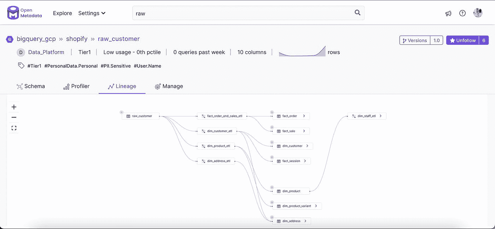
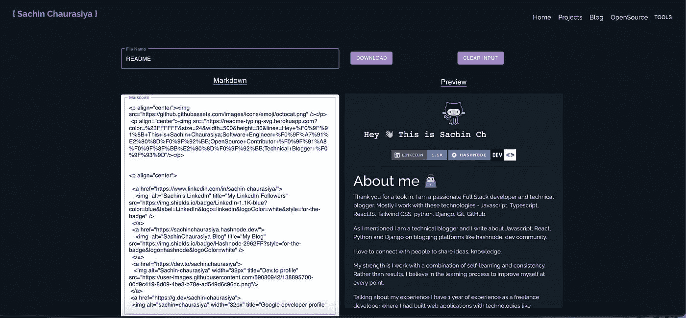
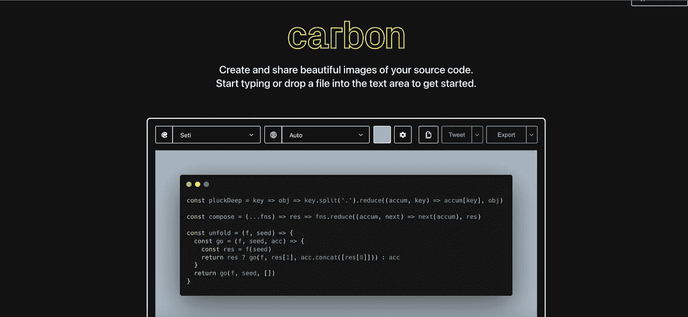
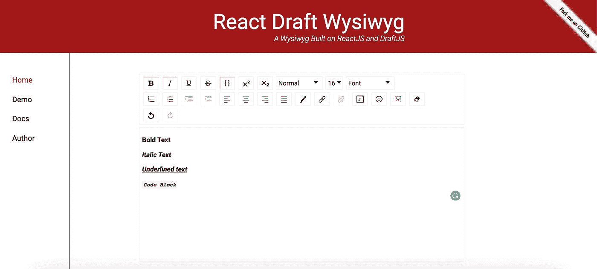
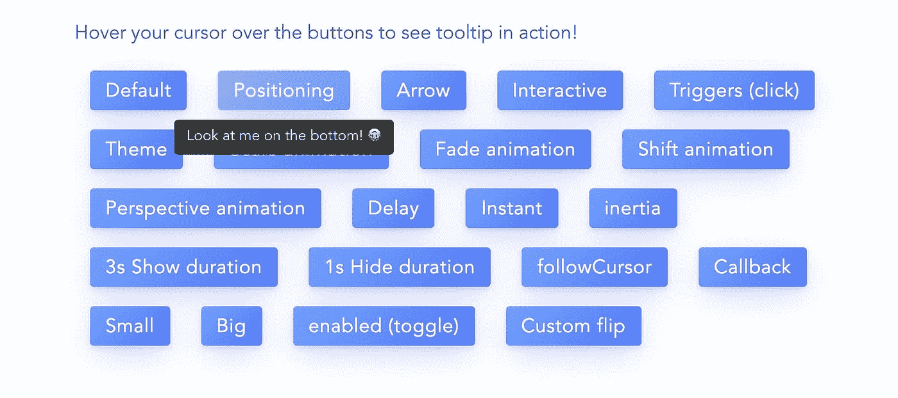

# 在您的下一个 React 项目中使用的 5 个非常棒的库

> 原文：<https://javascript.plainenglish.io/5-awesome-libraries-to-use-in-your-next-reactjs-project-67d32ba904e9?source=collection_archive---------5----------------------->

## 5 个 React 库的用例，以及它们如何帮助您顺利构建下一个项目。

我们都知道 React 是一个 UI 库，使用它我们可以快速构建用户界面。但是 React 生态系统是如此的丰富，以至于你只需要使用一些外部库就可以构建动态的交互式 web 应用。

在本帖中，我们将讨论你可以在下一个项目中使用的 5 个 React 库。我们将讨论它的用例，以及它如何帮助您顺利地构建下一个项目。

下面是我们将要讨论的库列表:

1.  反应流
2.  反应降价
3.  代码镜
4.  反应草稿所见即所得
5.  反应剧烈

让我们开始吧。

# [1。反应流](https://reactflow.dev/docs/)

## 介绍

React flow 是一个构建基于节点的应用程序的库，由 [webkid.io](https://webkid.io) 构建。

## 用例

假设您想要构建一个应用程序，其中您想要呈现从静态到动态的任何节点图/流。在这里，我们可以使用 react flow 来呈现节点图/流，最终用户可以定制它，可以添加新节点，可以更新现有节点，以及删除现有节点。

## 为什么在其他库上使用 react flow

*   可定制的
*   utils 丰富
*   类型支持
*   快速渲染
*   还有更多

## 活生生的例子

这是一个关于 [OpenMetadata](https://open-metadata.org/) 的真实例子，这是一个发现、协作和正确获取数据的地方，它使用 React flow 来呈现实体谱系。

# [2。反应降价](https://github.com/remarkjs/react-markdown)

## 介绍

React markdown 是一个 markdown 解析器 React 组件，它可以接受字符串 markdown 并将其呈现给 react 元素。

## 用例

这个库可能有各种各样的用例，假设您正在构建一个博客应用程序，内容将在 markdown 中，因此您可以使用 react markdown 来解析内容。

在我们的开发者之旅中，我们都至少使用过一次 GitHub 或类似的应用程序，并且知道大多数内容都是 markdown 格式的。因此，我们还可以使用 react markdown 构建一个工具来创建 GitHub 自述文件。

## 为什么使用 react markdown 而不是其他库

*   使用方便
*   丰富的 API 支持
*   定制组件支持
*   可扩展插件系统

## 活生生的例子

这里你可以看到我用 react markdown 构建了一个 [markdown 预览器](https://sachinchaurasiya.dev/tools/markdown-previewer)。您可以编写 markdown 并并排查看输出，也可以将其作为 markdown 文件下载。

# [3。代码镜](https://codemirror.net/)

## 介绍

Code Mirror 是一个文本编辑器，支持不同的语言和插件来实现高级功能和扩展现有功能。

## 用例

假设您正在构建一个 LMS(学习管理系统),您希望为最终用户提供一个编辑器来编辑代码片段，这些代码片段可以是 python、javascript 等任何语言，也可以是 JSON、Avro、SQL 等格式。

在这里，您可以使用 code mirror 构建一个允许最终用户使用代码片段的编辑器。

## 为什么在其他库上使用代码镜像

*   支持 100 多种语言
*   代码折叠支持
*   支持内联和块小部件
*   可配置绑定
*   由 Firefox、Chrome 和 Safari 等浏览器使用。

## 活生生的例子

在这里，您可以看到 code mirror by [Carbon](https://carbon.now.sh/) 工具的真实使用案例，该工具用于创建和共享源代码的美丽图像。

# [4。反应草稿所见即所得](https://jpuri.github.io/react-draft-wysiwyg/)

## 介绍

React Draft WYSIWYG 是一个构建在 React 和 [Draft.js](https://draftjs.org/) 之上的富文本编辑器。准备使用 react 组件在应用程序中提供富文本支持。

## 用例

如今，大多数社区/出版物，如`Hashnode`、`dev.to`、`medium`、`showscase`和`devdojo`都提供了对富文本内容的支持，并且他们已经建立了自己的富文本编辑器。但是您不必重新发明轮子，您可以在应用程序中直接使用 React Draft WYSIWYG。

## 为什么使用 React Draft WYSIWYG 而不是其他库

*   您可以配置工具栏选项
*   支持提及和标签
*   支持表情符号
*   支持国际化。

## 活生生的例子

这里可以看到`React Draft WYSIWYG`的[活例](https://jpuri.github.io/react-draft-wysiwyg)。

# [5。反作用 tippy](https://github.com/tvkhoa/react-tippy)

## 介绍

React Tippy 是 React 的一个轻量级工具提示组件库。它提供了一个工具提示元素或 HOC(高阶组件),并使用 React DOM 来呈现工具提示。

## 用例

React tippy 的用例很简单，如果你需要使用工具提示显示一些内容，那么你应该使用 React Tippy 库。

## 为什么使用 React Tippy 而不是其他库

*   反应良好
*   Tippy.js 的增强
*   支持多个触发器
*   可定制的
*   支持不同的主题
*   支持不同尺寸

## 活生生的例子

在这里你可以找到 [React tippy](https://tvkhoa.github.io/testlib/) 的活生生的例子。

这个话题到此为止。感谢您的阅读。

*原发布于*[*https://blog . sachinchaurasiya . dev*](https://blog.sachinchaurasiya.dev/5-awesome-libraries-to-use-in-your-next-reactjs-project)*。*

*更多内容请看*[*plain English . io*](http://plainenglish.io/)*。报名参加我们的* [*免费周报*](http://newsletter.plainenglish.io/) *。在我们的* [*社区*](https://discord.gg/GtDtUAvyhW) *获得独家的写作机会和建议。*