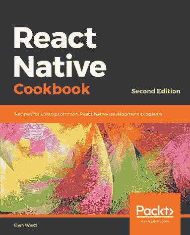
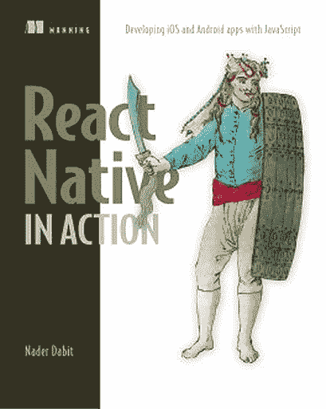
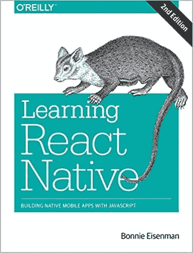
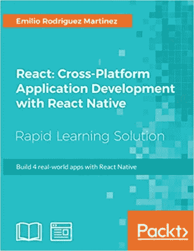
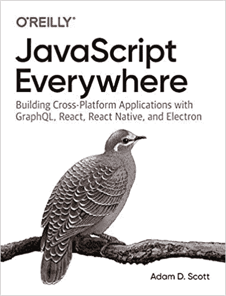

# 你应该知道的 5 本最好的学习反应母语的书

> 原文：<https://javascript.plainenglish.io/5-best-books-to-learn-react-native-you-should-know-about-5fc77eb6a420?source=collection_archive---------1----------------------->

## [反应原生](https://medium.com/@bookeraziz/list/react-native-3e476cc05fe3)

## 用这些伟大的书籍来提升你的反应能力

Photo by [Fotis Fotopoulos](https://unsplash.com/@ffstop?utm_source=medium&utm_medium=referral) on [Unsplash](https://unsplash.com?utm_source=medium&utm_medium=referral)

## 介绍

当学习母语时，使用最好的材料是很重要的。我整理了一个 5 本书的列表，从初级到中级，将会给你的移动开发之旅一个很好的开始。

其中一些书教你需要了解 react native 的来龙去脉，以及如何设置 react native 开发环境。其他书籍采用了一种更加基于项目的方法，并指导您如何创建一个功能完整的 react native 应用程序。

# 1.React 本地食谱—第二版

React Native Cookbook——丹尼尔·沃德的第二版是一本开始学习 React Native 的好书。这本书从简单开始，教你如何用 android 和 IOS 模拟器建立一个 react 本地开发环境。

随着时间的推移，这本书变得更加深入，因为它教你如何构建复杂的 UI，创建动画，并在你的应用程序中实现 redux。这本书更进了一步，教你如何在你的应用中使用原生 android 和 ios 模块。

**这使得阅读 React Native Cookbook 成为成为 React Native 开发者的第一步。**

React Native Cookbook- Second Edition Coverpage

# 2.React Native in Action:用 JavaScript 开发 iOS 和 Android 应用

我会推荐曼宁出版社的任何一本【T4 在行动】的书，因为它们对任何编程都有深入而精彩的介绍。这适用于 **React Native in Action:用 JavaScript 开发 iOS 和 Android 应用**，因为它是学习 React Native 的绝佳入门。

React Native in Action 首先解释 react-native 是如何工作的。如果你有普通的 javascript 背景，这很好，因为它解释了像 JSX 和 React 组件层次结构这样的概念。

这本书接着会教你样式、导航、动画、*和* redux。学完所有这些之后，你将会使用这些知识，因为这本书会向你展示如何一步一步地创建一个星球大战应用程序。

**如果你刚开始接触 react native 并想成为一名移动开发者，这是另一本很棒的书**

React Native In Action Cover Page

# 3.学习 React Native:用 Javascript 构建原生移动应用

而 **Learning React Native** 解释的概念和其他书一样。它以一种将组件与其 HTML 等价物进行比较的方式来解释组件。

如果你想作为一名 web 开发人员学习 Native React，这是非常好的，因为这将使某些概念，如组件，更容易掌握。

Learning React Native Coverpage

# 4.React:使用 React Native 进行跨平台应用程序开发:使用 React Native 构建 4 个真实应用程序

**React:跨平台应用开发**在学习 react native 时采用基于项目的方法。这本书将带你通过 4 个不同的反应原生项目。这些项目是一个汽车预订应用程序，一个图像共享应用程序，一个消息应用程序，甚至是一个游戏。

**如果你已经掌握了 react native 的一些基础知识，并且想要一些构建移动应用的实践经验，我会推荐 React:跨平台应用开发**

React: Cross-Platform Cover Page

# 5.JavaScript 无处不在:用 GraphQL、React、React Native 和 Electron 构建跨平台应用程序第 1 版

**Javascript Everywhere** 不是一本给想要学习 Javascript 的初学者的书。这本书将带你了解使用 react native for mobile apps 和 electron for desktop apps 为移动和应用程序创建全栈应用程序的步骤。

这本书将自己描述为:*“非常适合想要构建全栈应用程序的开发人员，以及希望启动一家初创公司的雄心勃勃的 web 开发初学者”*

**我只向 react native 中寻求构建跨平台应用的中级及以上技术开发人员推荐 Javascript Everywhere。**

Javascript Everywhere Coverpage

# 结论

感谢你在我的文章**“你需要知道的关于**的 5 本最好的学习 React Native 的书”的结尾。如果你有任何问题，请随意提问，我会尽快回答。

我希望你有美好的一天。如果你是中级新手，你可以点击这里的[链接](https://bookeraziz.medium.com/membership)加入。

## 资源

1.  [React 本土食谱-第二版](https://www.packtpub.com/product/react-native-cookbook-second-edition/9781788991926)

2. [React Native in Action:用 JavaScript 开发 iOS 和 Android 应用](https://www.manning.com/books/react-native-in-action)

3.[学习 React Native:用 Javascript 构建原生移动应用](https://www.amazon.com/Learning-React-Native-Building-JavaScript/dp/1491989149)

4. [React:用 React Native 进行跨平台应用开发:用 React Native 构建 4 个真实世界的应用](https://www.amazon.com/React-Cross-Platform-Application-Development-real-world/dp/1789136083)

5. [JavaScript 无处不在:用 GraphQL、React、React Native 和 Electron 构建跨平台应用程序第 1 版](https://www.amazon.com/JavaScript-Everywhere-Building-Cross-Platform-Applications/dp/1492046981)

## 进一步阅读

这是我的一些进一步阅读。

 [## 5 您需要了解的 React 本地组件/UI 库

### 4.反应本机用户界面库

javascript.plainenglish.io](/5-react-native-component-ui-libraries-you-need-to-know-about-214cbc4a5d4d)  [## 你绝对需要了解的 8 个 React 原生库

### 当谈到使用 React Native 创建应用程序时，找到正确的库可以使开发过程变得更加…

javascript.plainenglish.io](/8-react-native-libraries-you-absolutely-need-to-know-about-28f6038d0b76) 

*更多内容请看*[***plain English . io***](http://plainenglish.io/)*。报名参加我们的* [***免费周报***](http://newsletter.plainenglish.io/) *。在我们的* [***社区***](https://discord.gg/GtDtUAvyhW) *获得独家获得写作机会和建议。*