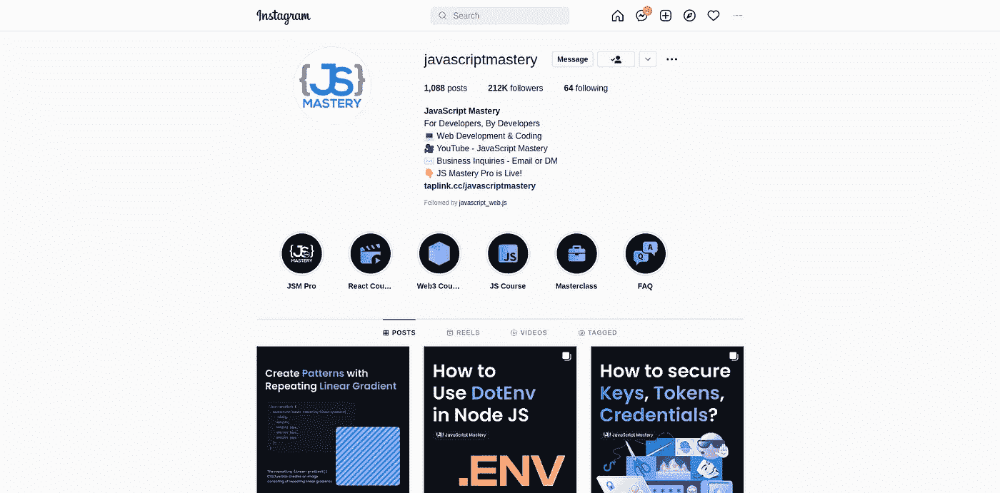
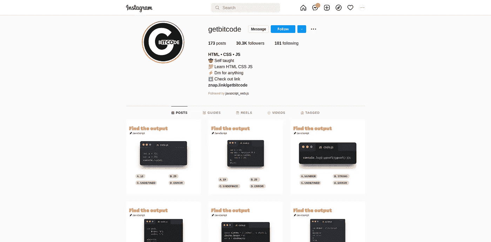
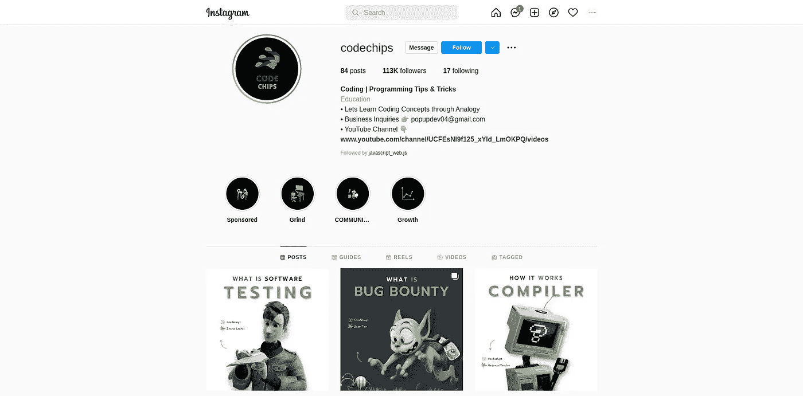
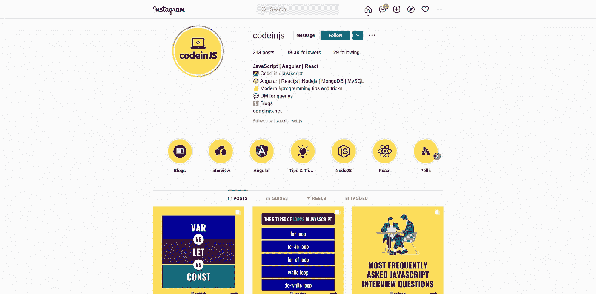
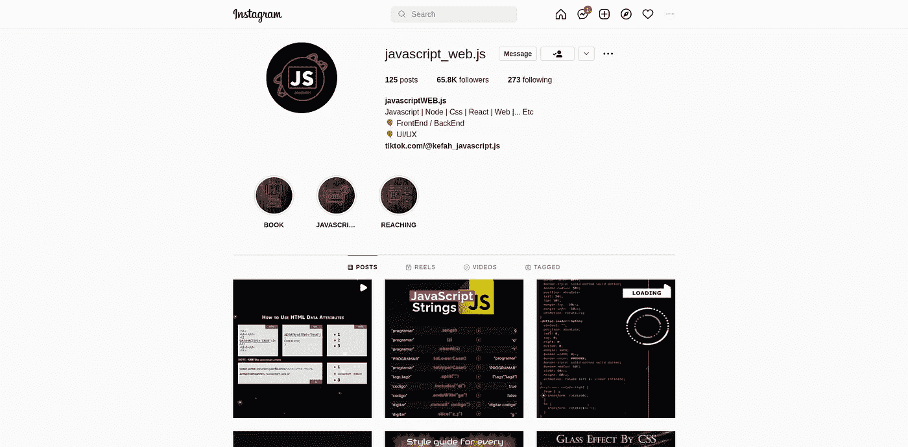
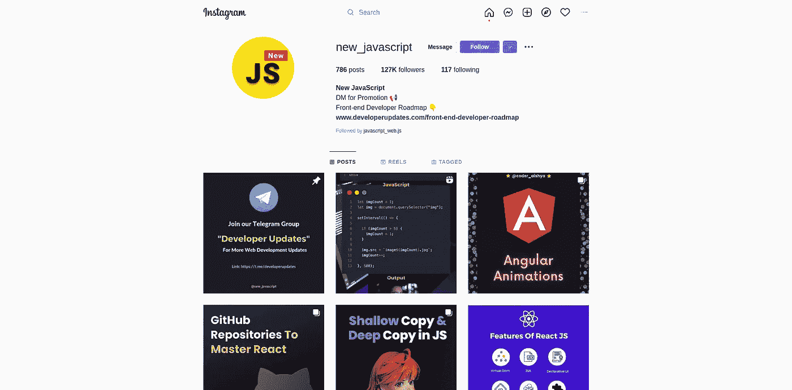

# 面向前端开发者的 6 个 Instagram 页面

> 原文：<https://javascript.plainenglish.io/5-best-instagram-accounts-for-frontend-developers-feda2efeca95?source=collection_archive---------2----------------------->

## Instagram + JavaScript

## 如何高效使用 Instagram 学习编程——初学前端开发者的绝佳资源。

如今，Instagram 是年轻人和内容创作者中非常受欢迎的社交媒体平台。全球有 60 亿人使用 32 种语言在 Instagram 上创建内容。出于这个原因，一个新的程序员会发现 JavaScript 上有很多内容可以学习。

10 Best Instagram account for a frontend developer.

新的 JavaScript 程序员渴望开始构建项目并学习他们的交易，他们在网上花了大量的时间，特别是在脸书和 Instagram 这样的社交媒体平台上。如果你是一个程序员新手，这篇文章将会帮助你。

## 为什么要用 Instagram？

我之前说过，Instagram 是一个巨大的平台，有许多创作者，他们创造并与其他开发者分享 JavaScript 知识、技巧和诀窍。因此，有足够的内容来帮助初露头角的程序员。

## Instagram 怎么用？

在 Instagram 上，JavaScript 上有几个 Instagram 标签和账号。可以简单的跟着 Instagram 标签和页面学习 JavaScript。

第二种方法是使用 Instagram 上的搜索功能来寻找和关注更多与 JavaScript 相关的人和帖子。

# 5 个最佳 Instagram 账户

在这篇文章中，我会给你最好的 Instagram 帐户，分享方便的 JavaScript 技巧和窍门。我只分享那些 Instagram 页面，这些页面张贴了新程序员可以理解的有用的 JavaScript 指南。

## [1。javascriptmastery](https://www.instagram.com/javascriptmastery/)

JavaScript mastery on Instagram

Javascriptmastery 是开始学习 JavaScript 技巧和诀窍的最佳来源。这个简介在 Instagram 上分享了大约 980 个帖子。也可以关注 YouTube 上的 javascriptmastery，深入了解 JavaScript 概念。

## [2。获取位代码](https://www.instagram.com/getbitcode/)

Getbitcode on Instagram

Getbitcode 是另一个向他人提供 javascript 知识的 Instagram 页面。这个 Instagram 页面提供了结构良好的帖子、简单的指南和概念。

## [3。码片](https://www.instagram.com/codechips/)

codechips on Instagram

Codechips 是最好的 Instagram 页面，因为 codechips 创造性地使用信息图和插图来覆盖主题。我不认为其他人会像他们一样教代码。他们的帖子是独一无二的，他们用很少的话来引导你。

除了 JavaScript，codechips 还涵盖了与 DevOps、Python、C++和 Java 相关的主题。

## [4。代码注入](https://www.instagram.com/codeinjs/)

codeinjs on Instagram

Codeinjs 在其 Instagram 页面上涵盖了许多与 JavaScript 框架 React 和 Angular 相关的主题。他们的 Instagram 帖子设计得很好，很容易被浏览者看到。他们的帖子对新程序员非常有帮助。

## [5。javascript_web.js](https://www.instagram.com/javascript_web.js/)

javascript_web.js on Instagram

Javascript_web.js 涵盖了大部分与 web 开发相关的主题。他们还在自己的 Instagram 页面上发布小型 JavaScript 和 CSS 项目。这些项目对开发者是有益的。这些 Instagram 帖子可以帮助开发人员创建新项目进行实践。开发人员也能够随着他们的进步添加更多的特性。

## [6。新 _javascript](https://www.instagram.com/new_javascript/)

new_javascript on Instagram

new_javascript Instagram 页面涵盖了很多与 javascript 前端开发者相关的话题。所有的帖子都是为初学者到专业开发人员精心定义和组织的。

# 最佳 Instagram Hastags

1.  [#javascript](https://www.instagram.com/explore/tags/javascript/)
2.  [#frontenddeveloper](https://www.instagram.com/explore/tags/frontenddeveloper/)
3.  [#前端](https://www.instagram.com/explore/tags/frontend/)
4.  [# JavaScript 开发者](https://www.instagram.com/explore/tags/javascriptdeveloper/)
5.  [# JavaScript](https://www.instagram.com/explore/tags/javascripts/)
6.  [# JavaScript 开发者](https://www.instagram.com/explore/tags/javascriptdevelopers/)

## 结论

Instagram 是一个社交媒体平台。它不是一个编程教程网站。但是如果你正确使用 Instagram，你会学到很多小技巧和窍门。JavaScript 上有很多资源，每周都有新的资源被分享。你可以创建自己的标签、个人资料和 Instagram 页面列表，帮助自己学习编程。

请在评论区给出你最喜欢的 Instagram 简介。

*更多内容请看*[***plain English . io***](https://plainenglish.io/)*。报名参加我们的* [***免费周报***](http://newsletter.plainenglish.io/) *。关注我们关于*[***Twitter***](https://twitter.com/inPlainEngHQ)**和*[***LinkedIn***](https://www.linkedin.com/company/inplainenglish/)*。查看我们的* [***社区不和谐***](https://discord.gg/GtDtUAvyhW) *加入我们的* [***人才集体***](https://inplainenglish.pallet.com/talent/welcome) *。**