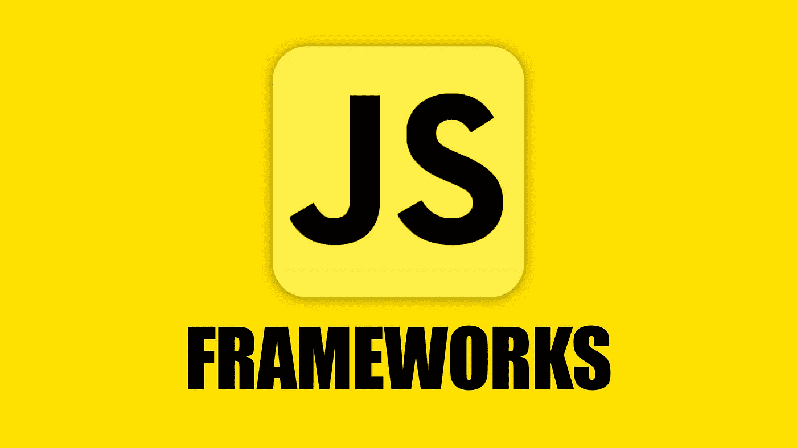
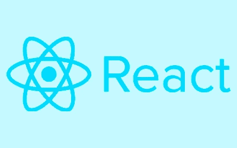
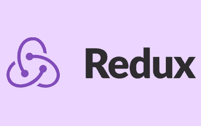
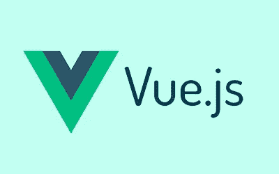
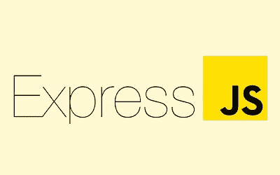
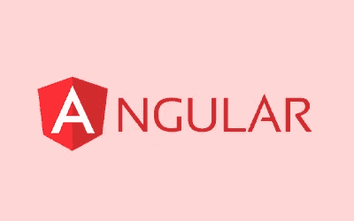

# 你可能没听说过的 5 个最好的 JavaScript 框架

> 原文：<https://javascript.plainenglish.io/5-best-javascript-frameworks-that-you-probably-havent-heard-of-31ae13b569a0?source=collection_archive---------5----------------------->

## **5 个你可能没听说过但应该认真考虑使用的最好的 JavaScript 框架**。

Javascript 框架在 Javascript 的早期就已经存在了，那时它还被称为 ecmascript，从那时起它已经走过了漫长的道路。随着 web 技术的进步，现在有许多可用的框架**来帮助开发人员更高效、更快地工作**。选择这 5 个最好的 javascript 框架中的一个可以帮助你轻松快速地完成你的编程目标，所以在你开始编码之前了解它们是值得的。以下是**2022 年 5 个最好的 Javascript 框架**，以及它们如何让你这个开发者或程序员受益。

# JavaScript 简史

在过去的 10 年里，javascript 框架的发展呈爆炸式增长。这是有原因的——使用 **HTML5** 和 **CSS3** 我们可以开发应用程序，就像我们使用 **iOS** 或 **Android** 一样。此外，网页设计师之间的竞争也越来越激烈，他们都在创造更好的应用程序，并在移动设备上吸引新用户。

例如，2010 年 AngularJS 发布，由于其用户友好的设计，其受欢迎程度迅速飙升。此后，一些更令人兴奋的框架被开发出来: **Ember JS** 和 **Meteor JS** 仅举几例！今天，有如此多的选择，很难选择哪一个最适合你，但有一点是清楚的——没有什么能打败开发者自由。以下是一些使每个框架独一无二的特性

# 反应

[https://reactjs.org/](https://reactjs.org/)

你可能听说过 React，因为它是目前最流行的 javascript 框架之一。它是由脸书开发的，目的是简化复杂的前端开发，它允许开发者使用可重用的组件和模板来构建用户界面。这种方法有助于简化代码管理，同时也简化了开发人员的任务，使他们可以花更多的时间来构建网站。该框架是**开源**的，并且**可以免费在线**获得。

# **Redux**

[https://redux.js.org/](https://redux.js.org/)

Redux 是我最喜欢的 javascript 框架之一，它几乎是开始构建复杂应用程序所需的一切。如果您正在寻找 Angular、React 或 Vue 的**替代品，这将非常有用。如果你不知道 Javascript 中的状态管理是如何工作的，一开始可能会很混乱。Redux 是一个非常简单的库，一旦你理解了它的所有概念，它会让你更容易理解。**

Redux 最好的一点是**让生活变得简单，并确保与任何现代浏览器** ( *因为它使用严格模式*)兼容。尽管 Javascript 具有面向对象的语法和结构，但在大多数情况下，人们更喜欢使用函数式编程。

# vue . j

[https://vuejs.org/](https://vuejs.org/)

Vue.js 是一个 JavaScript 框架，旨在让**构建 web 界面更加愉快。**使用 Vue，您可以使用简单而优雅的语法轻松创建电抗组件。得益于它的小尺寸(*只有 25kB* )和基于组件的架构，它很容易拾取并集成到现有项目中。

它的多功能性也值得一提；借助 Vue，您可以创建复杂的*单页应用* ( **SPAs** )，构建复杂的过渡，甚至设计移动应用，这要归功于它在移动环境方面的渐进式方法。有了大量的工具、教程和社区支持， **Vue 对于任何寻求可靠而灵活的前端解决方案的开发人员来说都是一个很好的选择**。

# 表达

[https://expressjs.com/](https://expressjs.com/)

Express 是我最喜欢的框架之一。**它使编写 web 应用程序变得简单快捷**，因为它提供了一系列中间件功能，您可以使用这些功能轻松处理常见的 web 应用程序任务，例如验证请求或处理错误。它是**轻量级的**和**简单的**，这意味着它不需要很多样板代码就可以开始。

然而，由于它缺少大型框架中的许多高级特性(比如对模板引擎的支持)，对于需要复杂工作流的大型项目来说，它不是一个好的选择。对于大多数小型应用程序(甚至微服务)，Express 工作得很好！如果你想快速构建一些东西，我建议你使用 Express——*这种简单性让你真正专注于重要的东西:你的应用程序逻辑*。

# 有角的

[https://angular.io/](https://angular.io/)

Angular 是 Google 创建的开源 web 应用程序框架，用于创建单页面应用程序。这是一个强大的 JavaScript 框架，可用于开发 Ionic 移动应用程序、网站前端和 spa。Angular 的关键组件有**指令**、**控制器**、**服务**、**模块**、**滤镜**和**动画**。

Angular 基于 HTML ( *或者说 HTML 基于 Angular* 可能更好。所有这些组件与模型数据和视图之间的数据绑定一起工作，在 angular web 应用程序或 Ionic hybrid 移动应用程序中创建动态内容。

## 特色:

[https://www.softwaretestinghelp.com/javascript-frameworks/](https://www.softwaretestinghelp.com/javascript-frameworks/)

[https://www . makeuseof . com/most-popular-JavaScript-frameworks/](https://www.makeuseof.com/most-popular-javascript-frameworks/)

【https://blog.sagipl.com/javascript-frameworks/ 

*更多内容看* [***说白了就是 io***](http://plainenglish.io/) *。报名参加我们的**[***免费周报***](http://newsletter.plainenglish.io/) *。在我们的* [***社区不和谐***](https://discord.gg/GtDtUAvyhW) *获得独家获取写作机会和建议。**