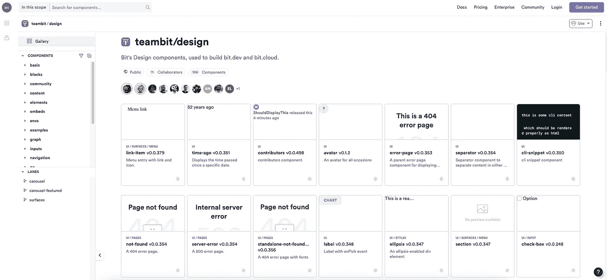

# 5 种最佳 Lerna 替代品

> 原文：<https://javascript.plainenglish.io/5-best-lerna-alternatives-42ffe75d403e?source=collection_archive---------1----------------------->

## 用于 JavaScript monorepos 和多包 repos 的工具，以取代 Lerna

截至 2022 年 4 月 [LernaJS](https://github.com/lerna/lerna) 不再保留。

由 [Henry Zhu](http://Henry Zhu) 创建，Lerna 的目标是自动化为同一个 javascript 库创建和发布多个包的工作流程。也就是说，不要构建传统意义上的“整体”,在同一个存储库中开发、构建和部署多个应用程序或服务。

从同一个存储库中发布多个包解决了代码共享的问题，这是在多回购架构中工作的一个典型问题，它不同于集中式的整体回购，并且比集中式的整体回购更具可伸缩性。

然而，随着时间的推移，Lerna 成了 Javascript 中“monorepo”一词的同义词，人们并没有意识到这种区别。因此，你现在可以在 GitHub 上找到超过 [10 万个依赖 Lerna 的项目。他们现在都必须找到一种新的解决方案来取代 Lerna。](https://github.com/lerna/lerna/network/dependents?package_id=UGFja2FnZS0xNDExNDQ0MQ%3D%3D)

这份清单为您带来了将任何 JS 存储库转变为 monorepo 的最佳选择——无论是开发几个不同的项目或内部组件，还是发布和代码共享。

重要的是要记住*为什么*你首先要寻找这样一个工具，以及你试图解决什么问题，比如代码共享、依赖性、协作、可发现性、标准化等等。monorepo 可能会解决一些问题，但会产生新的问题，如构建、学习曲线、版本控制、耦合等，这将使以后的扩展变得非常困难。

祝你好运，欢迎在评论中提问。

# 1.少量

[**Bit**](https://bit.dev/) 大概是你应该尝试的第一个工具。

它解决了 monorepos 中的许多问题。例如，在 pnpm 的开发者写的一个简短的概述中，了解 Bit 如何解决 [monorepo 依赖管理](https://bit.cloud/blog/painless-monorepo-dependency-management-with-bit-l4f9fzyw)。

 [## 使用 Bit 进行无痛 monorepo 依赖管理

### 简化 monorepo 中的依赖关系管理，以避免虚拟依赖关系和版本问题。了解…

比特云](https://bit.cloud/blog/painless-monorepo-dependency-management-with-bit-l4f9fzyw) 

作为 Lerna 的直接替代品，这是一个有用的选择:您可以轻松地创建、版本化和发布许多(实际上是许多)“组件”(几个文件+配置和元数据)，作为从单个 repo 到 npm、yarn 或任何您喜欢的地方的包。因此，Bit 是组件库等的强大工具。

但是，与大多数 monorepo 工具相比，Bit 实际上是一种不同的工具。

Bit 实际上是一个组件驱动开发的工具。它将 monorepo(即时代码共享、协作、依赖等)的流畅开发体验与分布式开发的规模和优势结合在一起。

使用 Bit，您可以轻松地在一个或一千个存储库中共享代码、协作、维护您的系统、管理依赖性等等。

 [## 少量

### 用于可组合开发的开源工具

bit.dev](https://bit.dev/) 

有了 Bit，你就不再受任何回购架构的束缚；在您的工作区中，您可以动态地从任何 repo 中获取并处理组件。您可以使用任何组件(不仅仅是 UI；具有配置和元数据的任何文件)，协作，无缝管理所有依赖关系，传播更新，标准化开发等。

A design system in React components with Bit

其结果是一种类似单回购的开发体验，在任何规模下都能保持流畅，没有单回购或多回购的问题。例如，每个组件都是独立的版本，变化自动传播到依赖项，构建是增量的并且只为组件图上发生变化的组件运行，每个代码都是可发现的，等等。

对于组织来说， [**bit.cloud**](https://bit.dev) 托管服务已经被一些世界上最好的企业使用，在这里组件可以被托管，团队可以相互协作使用和更新彼此的组件。组织编写的每一个组件都是所有人可以构建的资产。

Graph-driven builds on bit.cloud

请访问 bit.dev，尝试一下 bit。

 [## 比特云:团队如何一起构建可组合软件

### Bit 是组件驱动开发的平台。忘记独石，将应用程序开发分配给组件…

比特云](https://bit.cloud/) 

# 2.Yarn 和 pnpm 工作空间

> **附加功能** : [**pnpm 工作区**](https://pnpm.io/workspaces) 对于那些使用 pnpm 的人来说是一个非常好的选择，依我拙见，pnpm 比 Yarn 更好。由你决定。

[**Yarn work spaces**](https://classic.yarnpkg.com/en/docs/workspaces/)让 monorepos 变得更加简单，主要是在处理依赖关系方面。在 Yarn 工作空间中，它们都是链接在一起的，因此您的工作空间变得相互依赖，代码保持最新。这是一个比 yarn-link 更好的解决方案，因为它不改变整个系统，而只是改变相关的工作空间。

附加好处包括拥有一个单一的 node_modules 文件，这意味着您不需要跨包克隆依赖关系。此外，所有依赖项都安装在一起，这有助于优化安装。单个锁文件意味着代码审查和版本冲突变得更简单。最后，您可以看到从一个包到另一个包的代码变化，这很好。

Yarn workspaces 是一个强大的附加工具，可用于您尝试构建 monorepo 体验的任何其他工具。您甚至可以使用工作区直接发布。

因此，Yarn workspaces 可以与列表中的几乎任何工具进行非常强大的组合，尤其是像 Bit、Nx 和 Lerna 这样的工具，充当 monorepo 管理抽象的较低层。

但是，您也可以使用工作区直接发布。当一个工作空间被打包到一个归档文件中时，它会用一个包版本动态地替换任何`workspace:`依赖项，因此您可以将生成的包发布到远程注册表，而不必运行中间步骤——消费者将能够像使用任何其他包一样使用发布的工作空间。酷！

# 3.（同 nonexpendable）非消耗品

[**NX**](https://nx.dev/react) 是一家名为 Narwhl 的公司开发的工具，它优化了 monorepo 的构建体验，是为现代网络技术设计的。

NX 可以通过您的 CLI 和一组编辑器插件来使用，这些插件有助于利用增量构建，无需在每次提交时重新构建和重新测试整个 repo 及其所有代码。

NX 的命令执行允许使用一致的命令来测试、服务、构建和 lint 每个项目。它使用分布式计算缓存，因此如果有人已经构建或测试了类似的代码，Nx 将为其他人加速命令，而不是从头开始重建或重新测试代码。

NX 自带 [NX cloud](https://nx.app/) ，旨在帮助你优化和提高计算利用率，以加速构建并使其更高效。这里有一个 NX 云高级解决方案的简短视频。

# 4.冲

由[微软+开源](https://medium.com/u/940e606ec51a?source=post_page-----42ffe75d403e--------------------------------)推出的[**Rush**](https://rushjs.io/)**是一个强大的 monorepo 基础设施，它试图优化构建**和**帮助你从同一个存储库中版本化和发布许多包。**

****

**像 Lerna Rush 支持批量版本控制和包发布，所以它检测哪些包发生了变化，自动碰撞所有相关的版本号，在每个文件夹中运行`npm publish`。**

**像 Yarn 工作区一样，它允许您为所有软件包运行单个 npm/yarn/pnpm 安装，并且您可以将所有 repo 的依赖项安装在一个带有符号链接和单个节点模块文件夹的公共文件夹中。就像 yarn workspaces 一样，这旨在帮助您防止克隆的依赖关系和依赖关系冲突，这在大范围内会成为一个严重的问题。**

****

**Rush 独特的安装策略为您的所有项目生成一个快速安装的包膜/锁定文件。Rush 检测您的依赖图并以正确的顺序构建您的项目，因此如果两个包不直接相互依赖，Rush 会将它们的构建作为独立的过程并行化。**

**Rush 还通过针对上游和下游依赖项的增量构建来处理您的构建。Rush 甚至通过分离项目的版本来处理循环依赖。**

**Rush 还帮助实现和执行开发策略，以帮助标准化开发。例如，当创建 PR 时，您可以要求开发人员为受影响的项目提供主要/次要/补丁日志条目，这些条目将在发布时汇总到 changelog 文件中。**

# **5.Turborepo**

****

**Vercel 最近收购的 Turborepo 是 monorepos 的解决方案，本质上是另一个智能和高度优化的 monorepo 构建系统。它的一些主要功能包括:**

****增量构建:**跳过已经计算过的东西。**

****内容感知哈希:** Turborepo 查看文件的内容，而不是时间戳来确定需要构建什么。**

****远程缓存:**与你的队友和 CI/CD 共享一个远程构建缓存，以实现更快的构建。**

****并行执行**:以最大并行度使用每个内核执行构建，而不会浪费空闲的 CPU。**

****零运行时开销:** Turborepo 不会干扰您的运行时代码或接触您的 sourcemaps。**

****删减子集:**通过生成 monorepo 的子集，只包含构建特定目标所需的内容，从而加快 PaaS 部署。**

****任务管道:**定义任务之间的关系，然后让 Turborepo 优化构建什么以及何时构建。**

**您可以了解更多信息，并开始使用这个简洁的教程:**

# **了解更多信息**

** [## 我们如何构建一个组件设计系统

### 用组件构建一个设计系统来标准化和扩展我们的 UI 开发过程。

blog.bitsrc.io](https://blog.bitsrc.io/how-we-build-our-design-system-15713a1f1833)  [## 我们如何构建微前端

### 构建微前端来加速和扩展我们的 web 开发过程。

blog.bitsrc.io](https://blog.bitsrc.io/how-we-build-micro-front-ends-d3eeeac0acfc)  [## 可扩展的 UI 组件

### 我最近受命为 bit.cloud 平台构建一个用户卡组件。我还负责建造…

比特云](https://bit.cloud/blog/extendable-uis-how-to-build-better-uis-for-developers-l1jkl1pc)  [## 组件聚焦:可组合搜索栏

### 你可以随时通过点击 cmd/ctrl+shift+k 来搜索这篇博文的标题

比特云](https://bit.cloud/blog/component-spotlight-composable-search-bar--l2ndd0k8)**