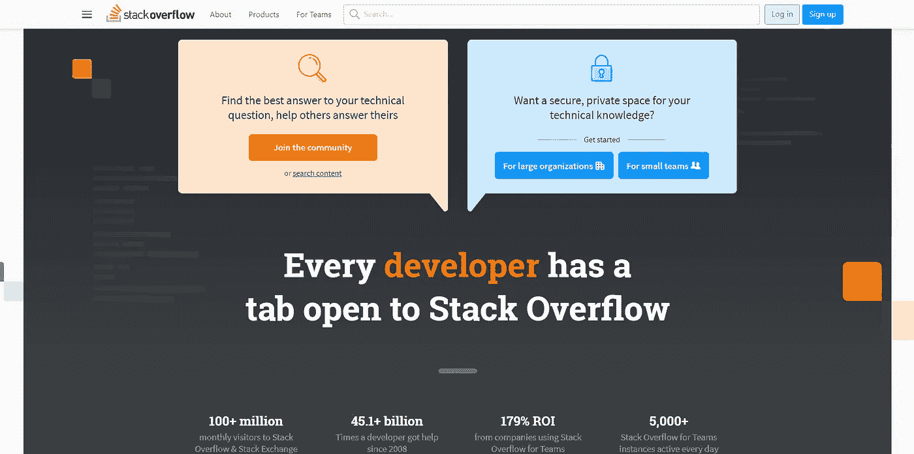
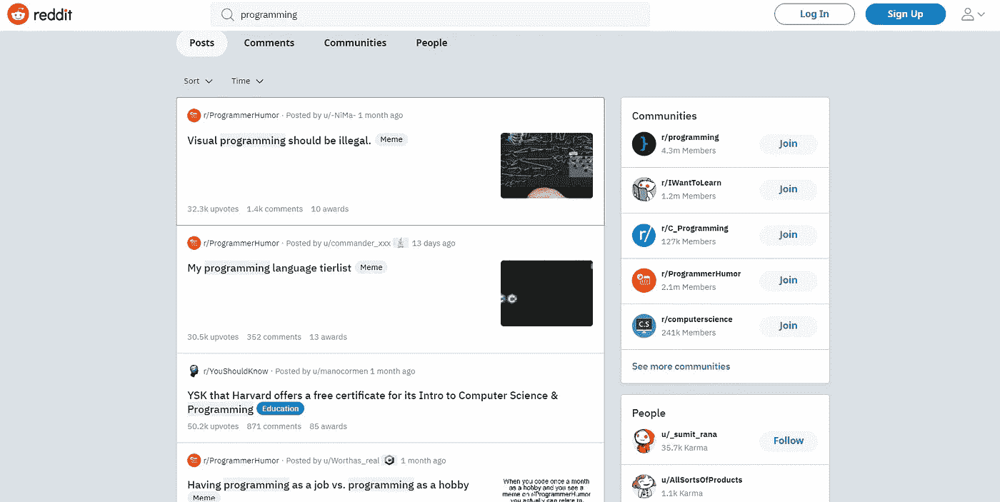
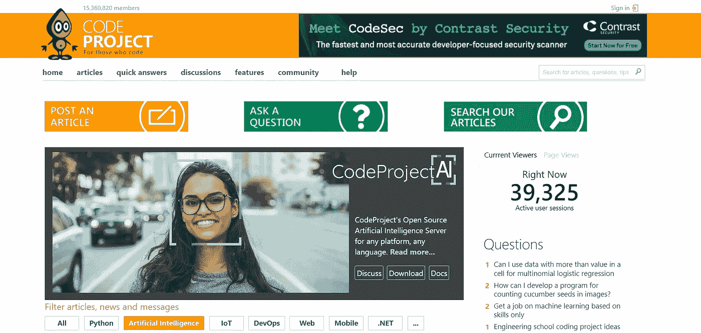

# 解决您所有编程问题的 5 个最佳网站

> 原文：<https://javascript.plainenglish.io/5-best-websites-to-solve-all-your-programming-queries-fe7a1639b1d1?source=collection_archive---------8----------------------->

## 编程查询的最佳网站

万一你被困在你的代码中，谷歌一下或者尝试追踪来自不同资产的响应。这是一种从对方身上获益的聪明方法。

拖延编写计算机程序是所有设计师的典型特征。令人惊讶的是，大多数新手和有经验的开发人员都从某些资产中获得帮助，但这并不意味着他们是愚蠢或糟糕的软件工程师。当你从一些不同的资产中获得帮助时，它会让你成为一个优秀的软件工程师和一个不错的调试器。每个开发人员都应该检查大量的网站，在这些网站上，人们可以提出有趣的编程问题，做出安排并互相帮助。

Photo by [Max Duzij](https://unsplash.com/@max_duz?utm_source=medium&utm_medium=referral) on [Unsplash](https://unsplash.com?utm_source=medium&utm_medium=referral)

# 1.堆栈溢出

栈溢出，软件工程师学习、分享他们的知识和促进他们的职业发展的最大和最著名的基于网络的讨论叫做栈溢出。客户可以寻求澄清紧迫的问题，并在网站上得到答复。如果你有任何关于 JavaScript，Java，C#，PHP，Android，jQuery，Python，HTML，或者其他一些编程语言的请求，加入本地区。来自 StackOverflow 的超过 1 亿个人专注于提升他们的编码技能。

[https://stackoverflow.com/](https://stackoverflow.com/)

## 堆栈溢出的特征:

*   无限的私人问题和答案:与铁板一块的内部维基不同，团队成员可以根据需要问尽可能多的问题，他们可以依靠团队成员提供与他们特定问题相关的回答。
*   直观的归档功能:允许用户按主题浏览问题和答案，以进一步了解感兴趣的主题。当特定问题的答案被填充时，用户将看到可能相关的其他问题和答案。
*   成员简介:团队平台强调每个用户的独特技能和他们经常回答的问题，以便团队成员知道向公司内部的谁寻求更多信息。
*   团队的 Stack Overflow 位于 stackoverflow.com，这已经是开发人员非常喜欢的日常目的地。这允许无缝集成到工作流中。此外，Teams 与 Slack 之类的程序相连接，使得将问答集成到团队的交流和工作流程中变得简单。

# 2.Quora

有关编程和编程进步的信息，请咨询 Quora。根据您提供的答案的类型和相关性，您可以将焦点放在其他人身上，或者通过向上投票框架来建立焦点。这允许所有的客户获得一些紧迫问题的澄清，分享技能，并给予答复。开发者可以从在 Quora 上拥有账户的众多 PC 行业先驱和专家那里获得帮助和安排。

[https://www.quora.com/](https://www.quora.com/)

## Quora 的特点:

禅宗模式。

匿名提问，匿名回答。

投票赞成和投票反对答案。

回答可以以博文的形式发布。

# **3。Reddit**

[Reddit](https://www.reddit.com/) ，对于一个重视支持数据的严肃程序员来说，是一篇真正的文章。编程方言、PC、互联网和不同点只是组成帮助的几个网络。你可以加入一个当地的游戏设计师的圈子，他们会就不同的编程问题开玩笑，或者你可以参与一个关于 C++编程的讨论。

[https://www.reddit.com/](https://www.reddit.com/)

## 编程子编辑是关于编码和开发的讨论。您可以查看:

*   [C++](https://www.reddit.com/r/cpp/) 关于 C++的讨论和新闻。
*   GameDev 是游戏爱好者和活跃的游戏开发者的天堂，他们在这里讨论游戏引擎和编程问题。

AndroidDev 是一个很受欢迎的社区，提供关于 Android 应用程序开发的新闻、教程和其他有用信息等。

# 4.堆栈交换

大约 174 个社区有各种各样的主题，比如游戏开发、网页改进、编程难题、ask ubuntu、PC 编程等等。专家们对相关反应的帖子进行投票，以确保可以轻松找到最支持的游戏计划。

## 它的 149 个社区包括:

*   [程序员](https://softwareengineering.stackexchange.com/):专业程序员可以解释软件开发的概念。
*   [编程拼图](http://codegolf.stackexchange.com/):人们在这里玩，解决与编程相关的拼图
*   [超级用户](https://superuser.com/):超级 PC 用户讨论组。
*   [web 应用](https://webapps.stackexchange.com/):供用户和开发者了解 Web 应用，解决有关 Web 应用的查询。
*   [游戏开发](https://gamedev.stackexchange.com/):独立游戏开发者可以在这里提问，并从社区获得快速回复。
*   [问 Ubuntu](https://askubuntu.com/) :一群 Ubuntu 新人和超级用户，还有更多。

[https://stackexchange.com/](https://stackexchange.com/)

## 堆栈交换的特征:

声誉和徽章

主持人和选举过程

慷慨

# 5.代码项目

CodeProject 拥有超过 11100 万个客户！为了使信息查找过程更加开放，它被设计成具有独立的社会事件，考虑到编程术语、改进阶段和网络组织。在那里，你会发现流行的焦点。NET，C#，C++，Java，Android，SQL，Web。为了分享你的想法或找到一个特定问题的答案，你可以停下来与类似的客户在本地聊天。

[https://www.codeproject.com/](https://www.codeproject.com/)

## 代码项目的特点:

*   竞争
*   新闻
*   内幕新闻简报
*   每日建筑时事通讯
*   时事通讯档案
*   调查

# 结论

我希望这篇文章对你来说是有益的和有趣的。这是我最近的一些文章。

> 如果你喜欢我的文章，我希望你能成为我的观众。这鼓励我做出更多像这样的精彩文章。所以我会很感激你能关注我的最新文章，这里是我的网站【https://infoyl.com/blog/】*的链接*

* [## JAVA 死了吗？(撕😢JAVA)

### JAVA 会被 KOTLIN 取代吗？

medium.com](https://medium.com/codex/is-java-dead-rip-java-2d91aa663ddd)  [## PYTHON 是未来吗？🤖

### python 是未来的 9 个理由

medium.com](https://medium.com/codex/why-python-is-so-overpowered-2dc747cf28dc)  [## 谷歌还是最好的公司吗？🤷‍♂️

### 现在是为谷歌工作的最佳时机

medium.com](https://medium.com/codex/is-google-still-the-best-company-%EF%B8%8F-40fa74a9873f) 

*更多内容看* [***说白了就是 io***](https://plainenglish.io/) *。报名参加我们的* [***免费周报***](http://newsletter.plainenglish.io/) *。关注我们关于* [***推特***](https://twitter.com/inPlainEngHQ) ， [***领英***](https://www.linkedin.com/company/inplainenglish/) *，*[***YouTube***](https://www.youtube.com/channel/UCtipWUghju290NWcn8jhyAw)*[***不和***](https://discord.gg/GtDtUAvyhW) *。***