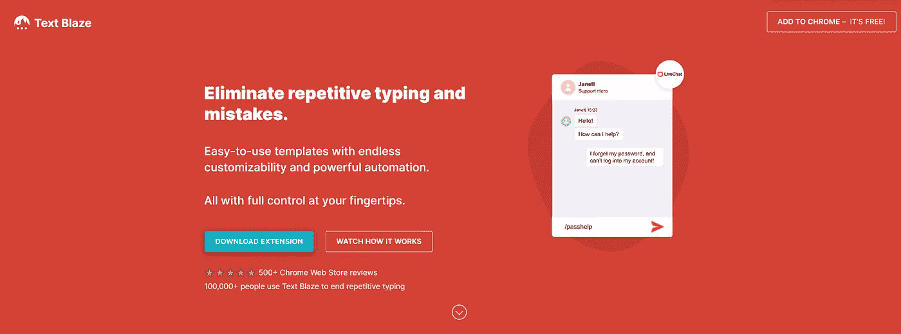
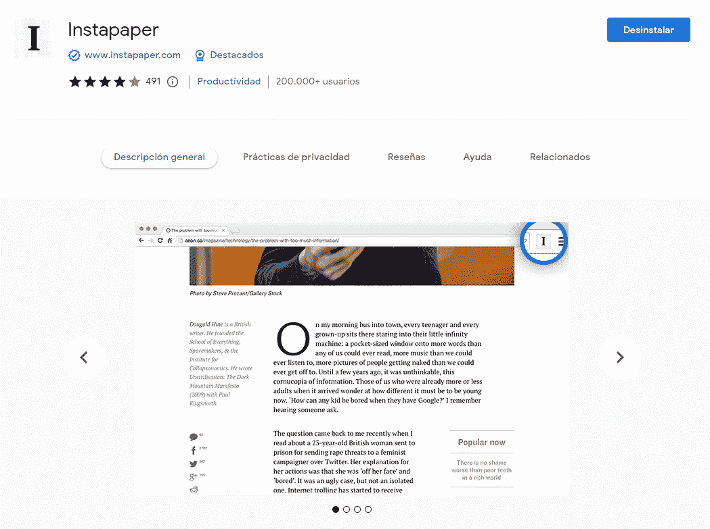
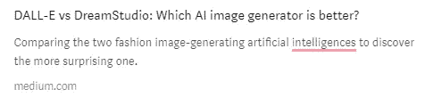
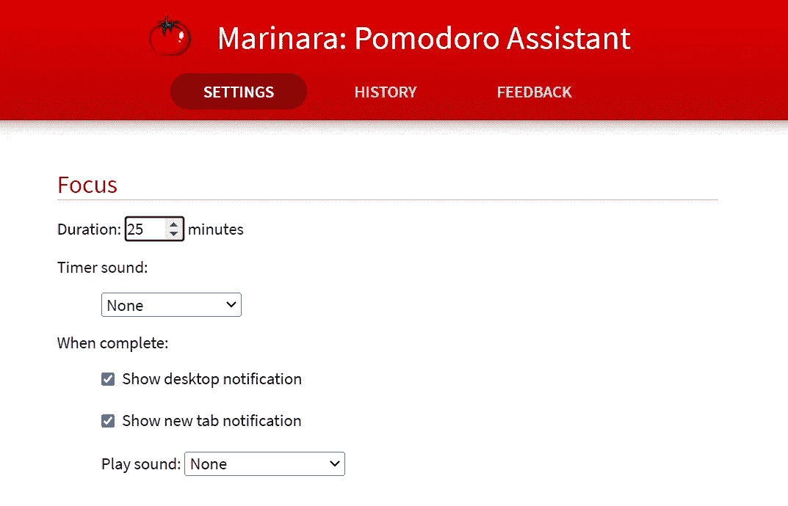

# 5 Chrome 扩展，让你在 2022 年成为更高效的网络开发者

> 原文：<https://javascript.plainenglish.io/5-chrome-extensions-for-being-a-more-productive-web-developer-in-2022-8d17de09ac2e?source=collection_archive---------2----------------------->

## 使用这些有用的(免费的)Chrome 扩展，节省时间并提高开发人员的工作效率。

我不认识你，但很可能你使用谷歌浏览器作为你的主要网络浏览器。如果是你的情况，我来告诉你，你只要用几个扩展，就可以在工作过程中提高生产力。

我喜欢使用扩展。一小段代码，我只需点击两下就可以下载，它提高了我的生活质量，还有什么比这更好的呢？

我已经搜索并测试了许多不同的扩展。此外，我已经和我的工作伙伴谈过了，我们已经向其他人推荐了扩展。作为所有这些过程的结果，我已经能够找到一些真正有用的扩展，帮助我作为后端开发人员的日常工作。

你想发现这些小代码吗？

# 什么是 Chrome 扩展？

Chrome 扩展是一个小“应用”，你可以添加到你的网络浏览器(在这种情况下是 Google Chrome)，它通过纯 HTML、CSS 和 JavaSript 或使用一些 API 为 de Chrome 浏览器添加一些额外的功能。

现在有很多扩展，但从我的角度来看，并不是所有的都一样有用。

# 作为 Web 开发人员，我最喜欢的 Chrome 扩展

在市场上，你可以找到许多不同的扩展。然而，作为一名 web 开发人员，我最喜欢改进我的工作的是…

## [正文冒火](https://chrome.google.com/webstore/detail/text-blaze/idgadaccgipmpannjkmfddolnnhmeklj)

[TextBlaze official website](https://blaze.today/?ref=U4U7RBVL&gclid=CjwKCAjw-L-ZBhB4EiwA76YzOQ-aaVjNIGAAStngxVCQXVCFQM2C9cjprLZQj5zRAikpyWjrs0RMjBoCAMkQAvD_BwE)

你写过几次电子邮件？你是否也讨厌不得不寻找一个你过去复制的新的十六进制代码？用 TextBlaze 杜绝这些时间精力大盗。

Text Blaze(或 Blaze Today，如果你在互联网上发现了这个扩展)是一个允许你使用个性化模板消除重复键入的扩展。

例如，您可以添加一个模板，自动粘贴 youremail@gmail.com，只有写作/电子邮件。每当我需要在网页上注册时，我就用这个例子来复制我自己的电子邮件。你可以复制文本，电子邮件，十六进制代码…试试吧，因为我知道你会节省很多时间。

 [## 文本闪耀

### 创建智能文本扩展以完成更多工作并简化您的工作。节省了数十亿次击键！

chrome.google.com](https://chrome.google.com/webstore/detail/text-blaze/idgadaccgipmpannjkmfddolnnhmeklj) 

## [Instapaper](https://chrome.google.com/webstore/detail/instapaper/ldjkgaaoikpmhmkelcgkgacicjfbofhh?hl=es)

[Instapaper chrome extension](https://chrome.google.com/webstore/detail/instapaper/ldjkgaaoikpmhmkelcgkgacicjfbofhh?hl=es)

想象你每天都在工作。您必须解决公司 API 中出现的新错误。你不知道如何解决这个问题，所以你开始在谷歌上搜索解决方案。当你在搜索的时候，你会发现一篇非常有趣的文章，关于如何用 JavaScript 编写更好的代码，但是你没有阅读它，因为你的首要任务是解决这个问题。你在一个新的页面上打开文章，你遗忘了它，当你完成你的工作时，你关闭了 Chrome，失去了永远成为一个伟大的开发者的机会。

这会产生什么结果？结果是，你没有成为一个开发人员，因为你错过了那篇很棒的文章。

你想避免吗？然后，您必须使用 Instapaper。这个扩展就像一个盒子，供以后阅读。您可以保存一篇 Medium 文章、一个网站、烹饪食谱、视频、歌词……无论您在浏览时遇到什么，只需单击一下即可。

你想试试这个神奇的扩展吗？然后检查这些奇怪的文章；)

 [## DALL-E vs DreamStudio:哪种人工智能图像生成器更好？

### 比较两种时尚形象生成人工智能，发现更令人惊讶的一种。

medium.com](https://medium.com/codex/dall-e-vs-dreamstudio-which-ai-image-generator-is-better-c94cdaa9136c)  [## 在 5 分钟内获得 4 年的计算机科学学位

### 💻探索我学习该学位的经历，为您节省 4 年大学时光。

medium.com](https://medium.com/codex/4-years-of-a-computer-science-degree-in-5-minutes-2fdbf915e627) 

## [语法上](https://chrome.google.com/webstore/detail/grammarly-grammar-checker/kbfnbcaeplbcioakkpcpgfkobkghlhen)

An example of an error highlighted by [Grammarly](https://medium.com/r?url=https%3A%2F%2Fchrome.google.com%2Fwebstore%2Fdetail%2Fgrammarly-grammar-checker%2Fkbfnbcaeplbcioakkpcpgfkobkghlhen)

我们是开发人员，每个人都知道编码是团队合作。我们必须与我们的合作伙伴沟通，我们必须给客户写电子邮件，我们必须在一份请求书中描述我们的工作……总而言之，我们必须与他人一起写作，而且在大多数情况下，我们必须使用英语。

无论英语是你的母语还是你只在工作中使用它，你很可能会犯错误或者能够更好地表达自己。因此，我认为延期是必须的。

如果我们使用 Grammarly for Chrome 扩展，我们将会得到实时的建议来帮助你在网上写出最好的作品。它会分析我们的句子，并在单词和短语上用颜色标注下划线，以提高我们的写作水平。

 [## 语法:语法检查和写作应用程序

### 在 Grammarly 的交流帮助下提高你的写作水平-包括拼写检查，语法检查，标点符号检查…

chrome.google.com](https://chrome.google.com/webstore/detail/grammarly-grammar-checker/kbfnbcaeplbcioakkpcpgfkobkghlhen) 

## [ColorZilla](https://chrome.google.com/webstore/detail/colorzilla/bhlhnicpbhignbdhedgjhgdocnmhomnp)

ColorZilla use example

您每天都使用颜色选择器吗？那你就需要这个应用程序。如果您是前端开发人员，或者您只是一个喜欢了解颜色的人，那么您需要这个应用程序。

[有了这个扩展](https://chrome.google.com/webstore/detail/colorzilla/bhlhnicpbhignbdhedgjhgdocnmhomnp)，你可以从浏览器的任何一点得到一个颜色读数，快速调整这个颜色并粘贴到另一个程序中。此外，您还有一个网页颜色分析器，可以从任何网站获取调色板，一个 CSS 渐变生成器和一个滴管。

 [## ColorZilla

### 高级眼药水，颜色选择器，梯度发生器和其他彩色的好东西

chrome.google.com](https://chrome.google.com/webstore/detail/colorzilla/bhlhnicpbhignbdhedgjhgdocnmhomnp) 

## [玛丽娜:波莫多罗助理](https://chrome.google.com/webstore/detail/marinara-pomodoro%C2%AE-assist/lojgmehidjdhhbmpjfamhpkpodfcodef)

Marinara chrome extensions options

如果你花很多时间在屏幕前，你必须休息。至少在我的情况下，我的眼睛受伤时，我呆了很多小时编码没有休息。此外，如果我们想提高生产力，休息是必须的。

有许多不同的方法来安排你的工作时间和放松。其中最著名的是波莫多罗技术。有了这个技巧，你将工作 25 分钟，放松 5 分钟(这个技巧实际上有点复杂，但我会在将来写下来)。

你可以用你的手机定时器记录你的时间，尽量不要分散你的注意力，或者你可以安装一个不改变你的窗口的扩展，以避免分散注意力。我使用[玛丽娜拉](https://chrome.google.com/webstore/detail/marinara-pomodoro%C2%AE-assist/lojgmehidjdhhbmpjfamhpkpodfcodef)，但是你可以在市场上找到其他的 Pomodoro 定时器扩展选项。

 [## 马里纳拉:波莫多罗助理

### Pomodoro 时间管理助理。

chrome.google.com](https://chrome.google.com/webstore/detail/marinara-pomodoro%C2%AE-assist/lojgmehidjdhhbmpjfamhpkpodfcodef) 

# 最后的想法

如果你是一个开发人员，并且使用谷歌浏览器，你就可以拥有一个充满可能性的世界。这个网络浏览器允许我们安装扩展来增加新的功能，以方便我们的日常工作。

在本文中，我与大家分享了我每天使用的 5 个 Chrome 扩展。基于我自己的经验，我可以说，由于这些扩展，我可以成为一个更有生产力的开发人员。我不仅可以通过简单的快捷方式节省时间，还可以为以后节省资源或不犯错误。

*您使用这些扩展吗？您还有什么其他的扩展可以推荐吗？*

*您是否考虑购买* [*中额会员*](https://medium.com/@jesuslagares/membership) *？如果你想在 Medium 上获取最好的内容，想想* [*使用我的推荐链接*](https://medium.com/@jesuslagares/membership) *。同样的价格，你会支持我的工作。*

# 结论👋

谢谢大家！非常感谢您阅读这篇文章。如果您想了解更多关于技术和发展的信息，请不要忘记**关注我**。我很想知道你对此的看法，所以不要花花公子**写在评论里**，我会读给你听。

如果这篇文章帮助你记住了，你可以**为它鼓掌**并与你的战友分享。

# 关于作者🤓

嗨！很高兴见到你！我是**赫苏斯·拉加雷斯**。目前，我是一名后端软件工程师，正在加的斯大学完成我的计算机科学学位。

我的两大爱好是**技术**和**交流**，所以我会抓住一切机会谈论或撰写关于技术的文章。我喜欢把复杂的概念转换成每个人都能理解的简单概念。

# 想要连接吗？📲

📸[**Instagram**](https://instagram.com/jesuslagares_)**|**💼 [**领英**](https://www.linkedin.com/in/jesus-lagares/) **|** 📹[Youtube](https://www.youtube.com/c/Jes%C3%BAsLagares)**|**🐦 [**推特**](https://twitter.com/jesuslagares_)

📩**jesuslagaresgalan@gmail.com**

谢谢！❣️

*更多内容请看*[***plain English . io***](https://plainenglish.io/)*。报名参加我们的* [***免费周报***](http://newsletter.plainenglish.io/) *。关注我们关于*[***Twitter***](https://twitter.com/inPlainEngHQ)[***LinkedIn***](https://www.linkedin.com/company/inplainenglish/)*[***YouTube***](https://www.youtube.com/channel/UCtipWUghju290NWcn8jhyAw)*[***不和***](https://discord.gg/GtDtUAvyhW) *。对增长黑客感兴趣？检查* [***电路***](https://circuit.ooo/) *。***