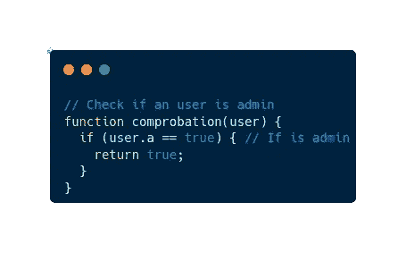
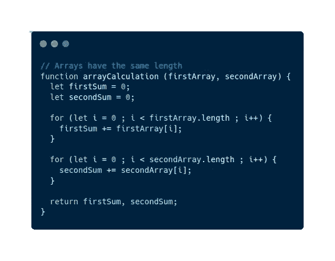
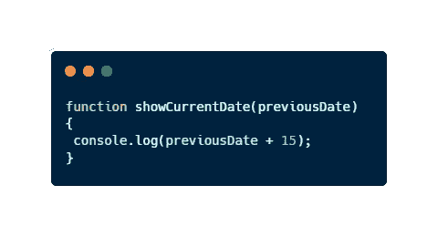
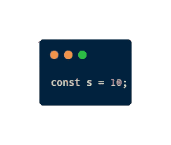
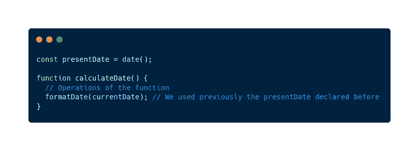

# 5 个可能已经存在于 JavaScript 代码中的代码味道示例

> 原文：<https://javascript.plainenglish.io/5-code-smell-examples-that-are-probably-already-in-your-javascript-code-9292a9ba1f68?source=collection_archive---------4----------------------->

## 如果你想写更好的代码，避免这些细节

Photo by [Mohammad Rahmani](https://unsplash.com/@afgprogrammer?utm_source=medium&utm_medium=referral) on [Unsplash](https://unsplash.com?utm_source=medium&utm_medium=referral)

作为一名初级开发人员，我犯了很多错误。

目前，我在做我的第一份工作，我还有很多东西要学。如果你看我的代码，很可能**你会发现一些代码味道**。

我知道是因为我检测到了。我分析了我的代码，发现了 5 个被认为是代码味道的小细节。我发现通过改变这几件事**，我可以大大提高我代码**的质量。

你准备好通过改变一些细节来改进你的代码了吗？

# 解释代码的注释

> 不要评论糟糕的代码——重写它。

如果你必须用注释来解释你的代码，那是因为**是坏代码**。

你的代码应该是**自解释的**。任何人都应该拿着你的代码，毫不怀疑地一目了然。

不会出现这种情况吗？那么就意味着**你写了复杂的代码，很难理解**，对于可维护性和可伸缩性来说是如此痛苦。

注释没有好坏之分，它们是我们在编码时可以使用的工具，但是如果我们不得不强制使用它们，**这是一种代码气味**它可以识别出一些可以做得更好的东西。

当我们可以使用函数或变量时，我们不应该使用注释。在很多情况下，只有有了正确的命名，我们才能删除注释。

An example of a bad code with comments

我们可以用很多方法来解决这个问题，例如应用干净的代码实践

 [## 使用 JavaScript 示例清理代码的 3 个最有用的实践

### 提高代码质量的 3 个实践:正确命名变量，保持参数数量最少

javascript.plainenglish.io](/clean-codes-3-most-useful-practices-using-javascript-examples-e80721ad3d4) 

# 重复代码

复制代码被认为是一种**反模式**(别担心，我以后会解释什么是反模式)。我们应该尽可能地避免它，以保持代码的整洁。

编程语言为我们提供了许多避免重复代码的工具。我们可以**实现函数**，我们可以**声明变量**和接口，我们可以**在类中封装信息**…实际上，如果我们复制代码是因为我们想要(在大多数情况下，总是有例外)。

有时，如果我们面临一个狭窄的期限，我们可以允许重复的代码。但是接下来，**我们应该重构并修复这个重复**，它不可能是永远的东西。

如果我们想保持代码**更短**和**更简单**的结构，我们应该合并代码中的重复部分。

An example of a big code smell because there’s code duplicated

例如，在前面的图片中，我们可以只使用一个循环来重构重复的代码。因此，这是一个非常明显的代码味道。

# 魔法常数

你是否在代码中包含了**数字，却没有解释它们来自于**？那你就是在犯代码气味。

当你阅读一段代码时，你必须**完全了解它的目的和上下文**，所以你不能包含孤独的文字，因为是的。你必须**正确使用变量**给数字一个解释，说明这个值的意思，以及它为什么出现在代码中。

A magic constant example inside a code

如果您想了解更多关于神奇常数的知识以及为什么不应该使用它们，请查看这篇文章

 [## 你想保住你的好工作吗？—那么就不要使用神奇的常数

### 在我们的代码中使用神奇的常量是一种糟糕的编程实践，如果我们想成为一个…

javascript.plainenglish.io](/do-you-want-to-keep-your-fantastic-job-then-do-not-use-magic-constants-2dac70989a5d) 

# 难以理解的名字

我们在编程时遇到的许多问题都是一个**命名问题**。我们非常喜欢使用抽象的名字或者非常短的名字，这些名字不能表达变量或者函数的意图，这是一个不好的习惯。

当我们给一个变量命名时，我们必须用一种**描述性的**、**清晰的**和**简洁的**来思考，不要写错，避免与语言的保留字冲突。

名称必须是**不言自明的**，我们应该能够通过阅读它来理解目的以及如何使用这个变量。

An example of naming bad a variable

也许你用不好的名字写变量，因为你是初级开发人员。那你应该检查一下这个

 [## 你是一名初级开发人员——冷静点，没人指望你做什么

### 如果你是一名初级开发人员，很可能你正承受着很大的压力。你必须改变你的心态…

medium.com](https://medium.com/codex/youre-a-junior-developer-calm-down-no-one-expects-anything-from-you-95ab6a8c3918) 

# 死代码

这可能是我经常犯的代码错误。

当我们编程时，我们在第一种方法中使用了依赖关系、函数和变量**,但是当我们改进我们的解决方案时，我们没有使用更多的**。

很明显，我们应该删除这些不用的线…不是吗？在许多情况下，它不是很明显，因为我们忘记了它。当我们面临截止日期时，没有人有时间清理旧代码。

但是如果我们不删除它**，我们将会积累不做任何事情的代码行**。如果我们热爱我们的代码，我们必须关注细节，我们不能让自己有这种代码味道。

Dead code example

# 了解更多信息的资源

搜索补充本文所写的信息我发现了一些非常棒的资源，如果你想了解更多，可以查看一下:

*   [Refactoring.guru](https://refactoring.guru/refactoring/smells)
*   [什么是码味](https://linearb.io/blog/what-is-a-code-smell/)？

# 最后的想法

代码气味**并不是绝对真理**。在某些情况下，它们中的许多并不表明代码是坏的。但是，另一方面，有一些**明确指出代码可以改进**。

在这篇文章中，我与你分享了 5 种代码味道，我认为你可以很容易地在你的代码中找到它们，因为我在自己的代码中找到了它们。此外，我认为它们是初学者开发人员犯的典型错误。

我希望它们对你有用，并且帮助你改进你的代码并产生更高质量的代码。

*您是否在代码中发现了任何代码味道？你认为其他代码有什么味道是真的？*

> *你在考虑买一个* [*中等会员*](https://medium.com/@jesuslagares/membership) *？如果你想在媒体上获得最好的内容，考虑一下* [*使用我的推荐链接*](https://medium.com/@jesuslagares/membership) *。同样的价格，你会支持我的工作。*

# 结论👋

谢谢大家！非常感谢您阅读这篇文章。如果你想了解更多关于技术和发展的知识，别忘了跟我来。我很想知道你对此的看法，所以不要花花公子**写在评论里**，我会读给你听。

如果这篇文章已经帮你记住了，你可以**鼓掌**分享给你的战友。

# 关于作者🤓

嗨！很高兴见到你！我是**杰西·拉加雷斯**。目前，我是一名后端软件工程师，正在加的斯大学完成我的计算机科学学位。

我的两大爱好是**技术**和**交流**，所以我会抓住一切机会谈论或撰写关于技术的文章。我喜欢把复杂的概念转换成每个人都能理解的简单概念。

# 想要连接吗？📲

📸[**Instagram**](https://instagram.com/jesuslagares_)**|**💼[**LinkedIn**](https://www.linkedin.com/in/jesus-lagares/)**|**📹[YoutubeT16)|🐦](https://www.youtube.com/c/Jes%C3%BAsLagares) [**推特**](https://twitter.com/jesuslagares_)

📩**jesuslagaresgalan@gmail.com**

谢谢！❣️

*更多内容请看*[***plain English . io***](https://plainenglish.io/)*。报名参加我们的* [***免费每周简讯***](http://newsletter.plainenglish.io/) *。关注我们* [***推特***](https://twitter.com/inPlainEngHQ) ，[***LinkedIn***](https://www.linkedin.com/company/inplainenglish/)*，*[***YouTube***](https://www.youtube.com/channel/UCtipWUghju290NWcn8jhyAw)*，* [***不和***](https://discord.gg/GtDtUAvyhW) *。对增长黑客感兴趣？检查出* [***电路***](https://circuit.ooo/) *。*