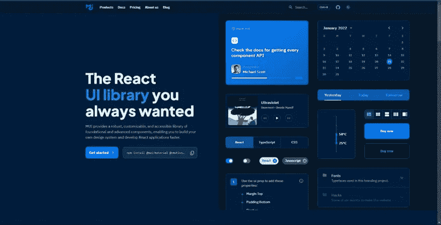
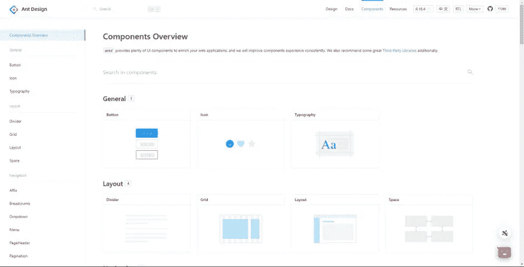
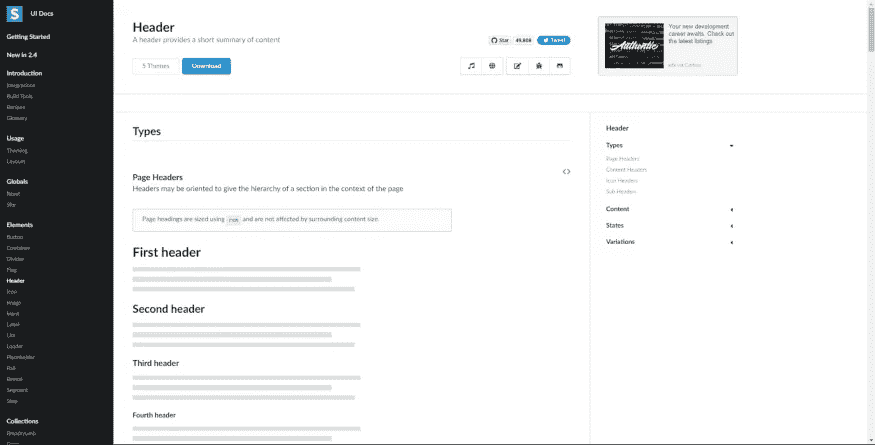
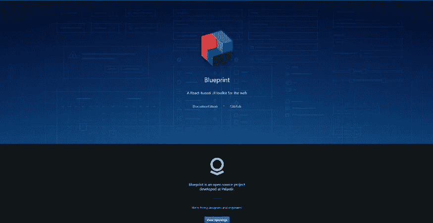
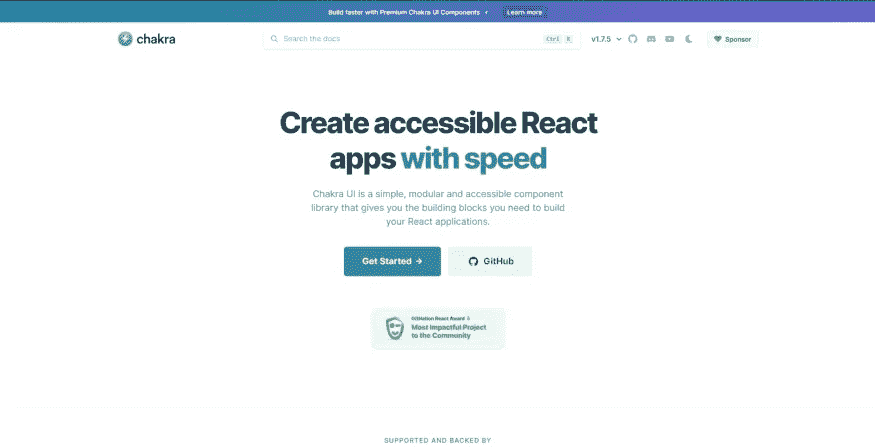

# 每个 React 开发人员都需要知道的 5 个组件库

> 原文：<https://javascript.plainenglish.io/5-component-libraries-every-react-developer-needs-to-know-f15682d566b9?source=collection_archive---------6----------------------->

## 5 个 React 组件库将帮助你创建更好的 UI。

在这篇文章中，我将向你展示 **5 React 组件库**，它将帮助你创建更好的 UI。组件库是快速创建风格一致的 React 应用程序的好方法。

# 1.梅姐

我们列表上的第一个组件库是 [**MUI**](https://mui.com/) **。**

**MUI** 有一个超过 40 个组件的广泛列表，这使得它非常适合任何 UI 密集型 web 应用程序。

有了像 [AutoComplete](https://mui.com/components/autocomplete/) 和 [TransferList](https://mui.com/components/transfer-list/) 这样的组件，我确信 MUI 将是您下一个 react 项目的一个很好的组件库。

MUI Component Library HomePage

# 2.蚂蚁设计

有了口号**‘世界第二受欢迎的 React UI’**我不可能**不**把 [**蚂蚁设计**](https://ant.design/) 列为名单上的第二项。

Ant Design 是一个组件库，它自称被许多企业级公司使用，如阿里巴巴、百度。当查看 AntDesign 的[组件库](https://ant.design/components/overview/)时，这些组件看起来非常简单。这似乎不是一个意外，因为它遵循了 AntDesign 的[设计值。](https://ant.design/docs/spec/values)

这使得 Ant Design 非常适合任何正在构建企业级 web 应用程序的开发人员。

Ant Design Component Library HomePage

# 3.语义用户界面

语义 UI 是一个组件库，提供了各种各样的响应组件。

而没有一个单独的组件是突出的。

语义 UI 是一个非常棒的组件库，适合任何打算构建需要响应的中小型 react 项目的人。

Semantic UI Component Library

# 4.蓝图

[**蓝图**](https://blueprintjs.com/) 对于任何希望构建需要显示大量数据的 react 应用程序的人来说，都是一个非常棒的组件库。

这使得[**蓝图**](https://blueprintjs.com/) 非常适合构建项目:例如管理仪表板或电子表格。

Blueprint Component Library Homepage

# 5.Chakra UI

我们名单上最后一个组件库是 [**Chakra UI**](https://chakra-ui.com/) 。

Chakra UI 是一个 r simple 库，拥有在 react 中构建一个好项目所需的所有组件。你可以在这里查看组件，看看 [**Chakra UI**](https://chakra-ui.com/docs/getting-started) 是否很适合你的下一个项目。

Chakra UI Component Library HomePage

# 结论

感谢您阅读完我的文章**“最佳反应组件库”**。如果你有任何问题，请随意提问，我会尽快回答。

如果你刚接触媒体，你可以点击这里的[链接加入。](https://bookeraziz.medium.com/membership)

# 资源

1.  [**梅**](https://mui.com/)
2.  [**蚂蚁设计**](https://ant.design/)
3.  [**语义 UI**](https://semantic-ui.com/)
4.  [**蓝图**](https://blueprintjs.com/)
5.  [**查克拉 UI**](https://chakra-ui.com/)

*更多内容请看* [***说白了。报名参加我们的***](https://plainenglish.io/) **[***免费周报***](http://newsletter.plainenglish.io/) *。关注我们关于*[***Twitter***](https://twitter.com/inPlainEngHQ)*和*[***LinkedIn***](https://www.linkedin.com/company/inplainenglish/)*。加入我们的* [***社区不和谐***](https://discord.gg/GtDtUAvyhW) *。***