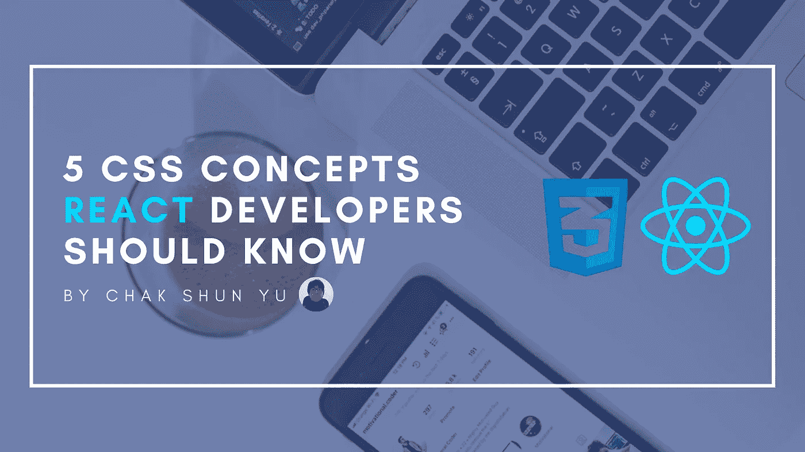

# 开发人员应该知道的 5 个 CSS 概念

> 原文：<https://javascript.plainenglish.io/5-css-concepts-react-developers-should-know-11051efe77e4?source=collection_archive---------10----------------------->



前端开发最有争议的一个方面是样式。无论你使用 React、Angular、Vue、Svelte 还是其他前端库，你要么讨厌它，要么喜欢它。但是不管你多么喜欢前端开发中的 CSS 部分，它仍然是不可避免的。

但是，CSS 作为一个话题是极其庞大的。浏览所有可用的概念和规则可能会令人望而生畏。幸运的是，没有必要记住所有不同的概念。相反，有一些你更可能每天都需要的话题。本文将根据我的经验介绍其中的 5 个 CSS 概念。这将会给你一个学习 CSS 的起点，或者知道哪些 CSS 主题你可能需要更多的磨练。

# 布局

无论你只是创建一个登陆页面，一个显示数据的小前端，还是创建一个大规模的网络应用，所有这些都需要一定的布局。对于像我们这样的前端开发人员来说，知道如何实现不同的布局，使用哪些工具或 CSS 规则，以及哪些更适合特定的场景是必须的。

很长一段时间以来，CSS Flexbox 是实现你能想象到的几乎任何现代布局的默认。尽管 Flexbox 布局模型有一些例外和限制，但它们都很小，并且非常特定于某些场景。花时间掌握 Flexbox 及其所有属性永远不会是一个坏决定。

如今，也存在 CSS 网格布局模型。凭借非常强大的能力和功能，它可以做几乎所有 CSS Flexbox 可以做的事情，甚至更多。有一段时间，阻碍 CSS Grid 的主要因素是它的浏览器兼容性。但是现在每个现代浏览器都至少支持 CSS Grid 的最低功能，作为 React 开发人员，没有理由不将这作为您技能的一部分。

# CSS 选择器

与布局主题相关的是布局内部的内容。通常，尤其是在 React 中，布局是使用数据列表和特定的用户界面(UI)元素来填充的。这意味着应用程序(的一部分)充满了外观相似的元素，这些元素相对于上下文也具有相似的样式。但是在这些元素之间，通常也有关系或特定的样式。

这可以使用 CSS 选择器和伪类来完成。然而，[有很多](https://developer.mozilla.org/en-US/docs/Web/CSS/CSS_Selectors)。有选择器或类来查找直接子元素、任何后代、兄弟、相邻元素、第一个子元素、偶数(非偶数)索引的子元素、最后一个子元素等等。能够浏览所有不同的选择器和类是一项很有价值的技能。

# 箱式模型

如果你曾经使用过 CSS，你会对边距、边框和填充这些术语很熟悉。它们和元素的内容区域一起决定了元素的宽度和高度。所有这些方面之间的关系被称为 CSS 盒子模型。

虽然我不认为作为一名 React 工程师，对盒子模型的深刻理解是你日常工作所必需的，但是有一定程度的理解会让你的生活轻松很多。这将包括不同的方面如何相互作用，如何计算结果尺寸，以及[其他现有的盒子模型](https://www.chakshunyu.com/blog/how-to-create-more-intuitive-styling-using-css-border-box-box-model/)

# 响应性

如今，web 应用程序不仅仅是为桌面屏幕设计的。他们还需要响应不同屏幕尺寸的设备，如宽屏显示器、笔记本电脑、平板电脑，尤其是手机。作为一名前端开发人员，让我们的前端以一种响应性的方式跨所有不同的屏幕工作也是我们的责任的一部分。

关于响应性，最重要的是 CSS 媒体查询。媒体查询允许您在屏幕级别定义断点，并根据这些断点有条件地更改样式。这使得您的 web 应用程序可以根据其显示的屏幕采用不同的样式。

将来，我们还会有所谓的[集装箱查询](https://developer.mozilla.org/en-US/docs/Web/CSS/CSS_Container_Queries)关于我们的可用性。它们非常类似于媒体查询。但是，您可以创建相对于其他元素或容器的断点，而不是定义与屏幕大小相关的断点。这为我们提供了对 web 应用程序响应的更细粒度的控制。

# 内容对齐

如果您已经在前端开发方面花了一些时间，那么您很可能熟悉这个古老的难题:如何将一个 div 居中。虽然它在现代前端开发中已经部分成为一种迷因，但内容对齐的概念仍然是一个常见的问题。

幸运的是，有相当多的方法可以解决它。有 CSS Flexbox、CSS Grid、`auto` margins、paddings、`text-align`for text、float、absolute position、transforms 等等。让自己熟悉内容对齐的不同可能性和解决方案将会对提高你的 CSS 技能大有帮助。这就像一项长期投资。

# 最后的想法

无论您是 React 新手还是已经是一名经验丰富的开发人员，在 CSS 的大千世界中导航都是令人畏惧的。根据我自己日常使用 CSS 的经验，本文涵盖了每个 React 开发人员都应该知道的 5 个 CSS 主题。这些包括布局、CSS 选择器、盒子模型、响应和内容对齐。新的 React 开发人员可以使用这个列表作为起点，而更有经验的开发人员可以使用它来补充他们现有的知识。

```
**Want to Connect?**If you liked this article, consider checking out the other entries in the [Uncommon React](https://www.getrevue.co/profile/chakshunyu) newsletter and my [Twitter](https://twitter.com/keraito) for future updates.
```

*更多内容请看*[***plain English . io***](https://plainenglish.io/)*。报名参加我们的* [***免费周报***](http://newsletter.plainenglish.io/) *。关注我们关于*[***Twitter***](https://twitter.com/inPlainEngHQ)*和*[***LinkedIn***](https://www.linkedin.com/company/inplainenglish/)*。加入我们的* [***社区不和谐***](https://discord.gg/GtDtUAvyhW) *。*