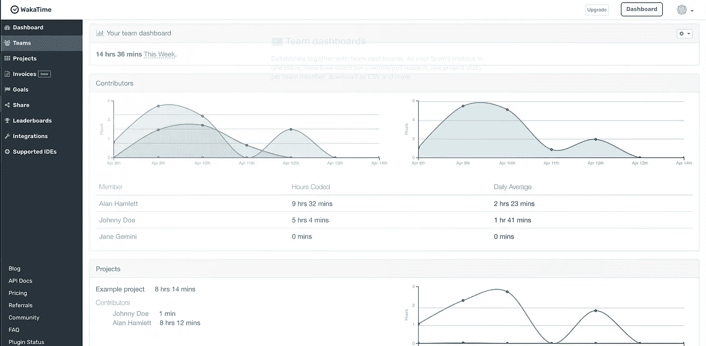

# 开发人员需要知道的 5 个开发人员生产力网站

> 原文：<https://javascript.plainenglish.io/5-developer-productivity-websites-frontend-devs-need-to-know-7e1455f0ef0f?source=collection_archive---------5----------------------->

## 不过可能以前没听说过。

Photo by [Clay Banks](https://unsplash.com/@claybanks?utm_source=medium&utm_medium=referral) on [Unsplash](https://unsplash.com?utm_source=medium&utm_medium=referral)

作为一名开发人员，我以创建最高效的工作流为荣。我喜欢搜索新的工具、应用程序和网站，这样以后可以节省我的时间。我特别喜欢开发网站，因为它们不占用我的机器空间，我也不用担心安装或更新它们。

*我在本文中分享的五个在线工具鲜为人知，是免费的，对前端开发人员非常有用。我喜欢它们，因为它们使用简单，让我更有效率！*

# [代码截图](https://www.codefromscreenshot.com/)

不管是好是坏，代码截图在开发人员中很常见。它们可能来自 Twitter 帖子、YouTube 教程，甚至是大学讲座。Codefromscreenshot.com 是一个易于使用的工具，可以从代码截图中提取原始文本。我通常会在各种教程中遇到很多 Javascript 截图，并让这个网站并行打开，以便立即将它们全部转换为文本。

因为它可以立即从截图中提取代码，所以有助于节省宝贵的时间和精力，否则这些时间和精力会浪费在从这些截图中重新键入代码上。在这里上传一个截屏会提供可复制的代码，可以马上在我的 IDE 中使用。它节省了我很多时间，让我可以专注于更重要的事情，如开发和修复 bug。

[codefromscreenshot.com](https://www.codefromscreenshot.com/) (image from the author)

# [WakaTime](https://wakatime.com/)

在远程工作的时代，作为一名开发人员，记录自己的时间至关重要。能够分析我如何和在哪里使用我的时间让我能够调整和提高我的生产力。这个工具显示了我在工作日的各种事情上花了多少时间。

[WakaTime](https://wakatime.com/) 是一个网站和扩展，它在一个易于理解的仪表板中提供了关于您花费在开发上的时间的有用指标。它们支持最流行的代码编辑器和语言，如果你是竞争型的，甚至还有排行榜。

[WakaTime](https://wakatime.com/) (image from the author)

# [雷.索](https://ray.so/)

Ray.so 是一个在线工具，你可以用它从你的源代码中创建漂亮的带有渐变背景的代码截图。我和我的团队用它来美化截图，但它对你在社交媒体上分享的截图也很有用。只需将您的代码复制并粘贴到工具中，即可获得最终的屏幕截图。你可能在 Reddit 或 Twitter 上见过 [Ray.so](http://ray.so/) 的代码截图。

[Ray.so](https://ray.so/) (image from the author)

# [代码沙盒](https://codesandbox.io/)

CodeSandbox 是一个用于 web 开发的在线编辑器。它可以帮助你原型化，实验，并很容易地与他人分享你的创作。它使 web 开发更快，消除了设置开发环境、工具和共享项目时的麻烦，使像我这样的开发人员更有效率。它为普通 Javascript、React、Typescript、Angular、Node 等框架提供了模板和初始代码。使用该工具，开发人员可以在任何地方工作，并以更有效的方式进行协作。

[CodeSandbox](https://codesandbox.io/) (image from the author)

# [Devdocs.io](http://devdocs.io/)

DevDocs 是一个开源的 web 应用程序，它将许多开发者工具的文档合并到一个可搜索的界面中。干净易用的用户界面让我成为了它的忠实粉丝。我总是用它来查找我需要的 React 和 Javascript 函数。在这个地方，我几乎可以找到任何我想找的医生。它让包括我在内的许多开发人员快速、轻松地阅读和搜索参考文档！

[Devdocs.io](https://devdocs.io/) (image from the author)

你还发现了哪些有用的网站？如果你了解到任何新的或有用的网站，请在下面评论并分享这篇文章。

*更多内容请看*[***plain English . io***](https://plainenglish.io/)*。报名参加我们的* [***免费周报***](http://newsletter.plainenglish.io/) *。关注我们关于*[***Twitter***](https://twitter.com/inPlainEngHQ)*和*[***LinkedIn***](https://www.linkedin.com/company/inplainenglish/)*。查看我们的* [***社区不和谐***](https://discord.gg/GtDtUAvyhW) *加入我们的* [***人才集体***](https://inplainenglish.pallet.com/talent/welcome) *。*