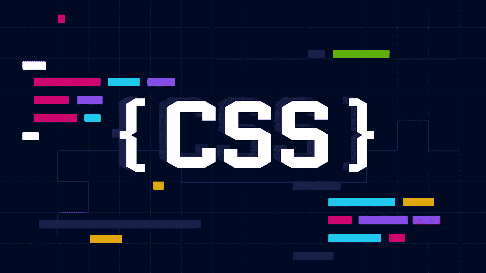

# React 中处理 CSS 的 5 种不同方式

> 原文：<https://javascript.plainenglish.io/5-different-ways-to-handle-css-in-react-1a8caa3f452b?source=collection_archive---------11----------------------->

## 在这篇博客中，你将学习如何以不同的方式在你的 React 应用中集成 CSS 样式。



web 开发的三个主要组件——HTML、CSS 和 JavaScript——是 web 应用程序的基本构件。第一个用于添加内容，第二个用于样式，第三个用于逻辑。

最初，使用内联、内部或外部 CSS 将 HTML 与 CSS 集成非常简单。但是当脸书团队发布了 HTML 和 JS 的混合体 React 时，JSX 诞生了&这导致了 JSX 和 CSS 结合的新方法。

事实上，React 是全球大多数开发人员的首选前端开发库，许多开发人员发现很难将 CSS 与 React 结合起来。

这就是这篇博客将帮助你的地方，因为我们将讨论在 React 中使用 CSS 的不同方法。

让我们开始吧。

# **1。创建并导入一个 CSS 文件**

在 React 项目中包含 CSS 的最简单方法是创建一个 CSS 文件，并将其导入 React 文件。

这类似于在 HTML 文件中使用外部 CSS 文件。

该过程如下所示:

1.  首先，您必须创建一个 CSS 文件，例如 style.css，并编写您的样式
2.  将其导入到 React 文件中

例如:

创建一个 style.css 文件并编写内容。

```
.container{
   margin: 10px;
}
```

然后将其导入 React 文件中。

```
import { React } from "React";
import "./style.css";
function App() {
  return (
    <div className="container">
      <h1>Hello</h1>
    </div>
  );
}
export default App;
```

通过这样做，您创建了一个 style.css 文件，并向其中添加了样式属性。稍后，您可以在首选的 React 文件中使用 CSS 文件。

# 2.React 文件中的内联 CSS

您甚至可以在 React 文件中使用 CSS 样式，就像在 HTML 文件中使用内联 CSS 一样。这非常适合编写简单的样式属性，而不必创建和维护整个文件。

您可以将此样式编写为一个对象，并将其传递给元素的“style”属性。值得注意的是，所有的属性键都必须转换成 camel case，即“margin-top”将变成“marginTop”等等。

例如，您可以简单地向 div 元素添加一个边距，如下所示:

```
<div className="container" style={{margin: 10px}}>
  <h1>Hello</h1>
</div>
```

CSS 样式甚至可以使用对象来创建，如下例所示:

```
import { React } from "React";
function App() {
  const style = {
    container: {
      margin: "10px",
    },
  };
  return (
    <div className="container" style={style.container}>
      <h1>Hello</h1>
    </div>
  );
}
export default App;
```

在本例中，您有一个添加了一些样式的样式对象。

然后可以像这样访问它:

```
<div className="container" style={style.container}>
      <h1>Hello</h1>
</div>
```

# 3.使用 CSS 模块

根据官方 [GitHub repo](https://github.com/css-modules/css-modules) 的说法，CSS 模块是一个 CSS 文件，默认情况下所有的类名和动画名都在本地范围内。简而言之，您可以将样式分别应用于每个组件，而不会影响任何其他组件的功能。

假设您在两个组件中定义了按钮，这两个组件在不同的 React 文件中具有不同的 CSS 属性。

如果你有一个全局的 CSS 文件，那么相同的设计将应用于两个按钮。这真的很吓人&这是你在建立网站时可以使用 CSS 模块的地方。

为此，您必须创建一个 style.module.css 文件，并将其导入相关的 React 文件。因此，您的特定风格将只添加到您想要的地方。

例如:

在“src”目录中创建一个 Home.module.css 文件。

```
.container {
     margin: 10px;
}
 .btn {
     color: white;
     padding: 10px 20px;
     cursor: pointer;
     border: none;
}
```

并将其导入到 App.js 文件中。

```
import HomeCSS from "./Home.module.css";

export default function App() {
 return (

   <div className={HomeCSS.container}>
     <h1>Hello </h1>
     <button className={HomeCSS.btn}>Click Me!</button>
   </div>
 );
}
```

在此示例中，Home.module.css 作为 Homecss 导入，并分配 CSS 属性作为{HomeCSS.container}。

请注意，我们可以用不同的方法在 React 应用程序中添加 CSS 模块，这是最简单的方法之一。

# 4.样式组件

JSX 允许你同时使用 HTML 和 JavaScript，但是 CSS 呢？在这里，您可以使用样式化的组件。

简而言之， [Styled Components](https://styled-components.com/) 是一个第三方库，它让你设计可重用的定制 HTML 组件，带有预定义的 CSS 属性，并在你项目中选择的任何地方使用它们。

ES6 版本中引入的一个名为 template literal 的新特性构成了这个库的基础，允许您创建自定义的字符串插值规则。这个模板文字和 CSS 一起，可以用来创建样式化的组件。

因为它是一个 npm 包，你必须首先把它安装在你的 React 应用程序中。

```
npm install styled-components
```

然后你可以在你的 React 应用中使用它。

```
const Title = styled.h1`
  font-size: 1.5em;
  text-align: center;
  color: palevioletred;
`;

const Container = styled.section`
  margin: 10px;
`;

render(
  <Container>
    <Title>
      Hello World!
    </Title>
  </Container>
);
```

正如您所看到的，有两个自定义标签“容器”和“标题”,并为每个标签指定了 CSS 属性。

# 5.尾翼 CSS

[TailwindCSS](https://tailwindcss.com/) 是将 CSS 包含在 React 项目中的另一个流行选项。

它是一个实用至上的 CSS 框架，用于快速构建定制用户界面。在这里，你可以轻松地建立现代网站，而无需离开你的 HTML。

例如，您可以使用“m-2.5”在顶部、底部、右侧和左侧添加 10px 的边距。同理，你可以用“p-2.5”给每个方向加 10px 的填充。

```
function App() {
  return (
    <div className="m-2.5">
      <h1>Hello</h1>
    </div>
  );
}
export default App;
```

由于 TailwindCSS 提供了实用程序优先的 CSS 类，您将不会直接使用 CSS，而是与预定义的 Tailwind 类进行交互。为了减小包的大小，它清除了未使用的类，这样您就只需要发布您需要的 CSS 了。

# 你应该使用哪种 CSS 方法？

在这里，我们研究了将 CSS 合并到 React 项目中的各种方法。你可能会问哪个最适合你。

一方面，内联 CSS 和样式化组件最适合可以在 JavaScript 文件中包含 CSS 而不会使其膨胀的项目，另一方面，使用传统的 CSS 文件或 CSS 模块(用于限定范围的样式)是具有复杂设计的文件的最佳选择，这些文件属于专用文件，以便于管理和编辑。

然而，如果你想用一个合适的设计系统更快地发布，TailwindCSS 可能是你所喜欢的。

无论您选择在 React 中处理 CSS 的方式如何，从头开始设计一个像素级的完美设计可能需要花费很多周的时间。这就是 Locofy.ai 的用武之地。

Locofy.ai 是一个插件，可以将 Figma 或 Adobe XD 中的设计转换为生产就绪的 React 代码，具有不同的样式选项，如 CSS、TailwindCSS 和 CSS 模块，以及配置文件命名的选项。

你甚至可以在 Next.js 和 Gatsby 中导出你的设计，还可以用流行的 UI 库如 Material UI 和 Bootstrap[定制你的设计。这使您能够快速地](https://guide.locofy.ai/drag-and-drop-basics)[导出不同配置的代码](https://guide.locofy.ai/exporting-your-code)，并查看哪种配置最适合您的团队。

希望你喜欢。

就这样——谢谢。

[*如果你喜欢看这样的故事，并想帮助我成为一名作家，考虑成为一名中等成员*](https://nitinfab.medium.com/membership) *。每月花费 5 美元，你可以无限制地访问媒体内容。如果你通过我的链接注册，我会得到一点佣金。*

*原载于*[*https://blog . locofy . ai*](https://blog.locofy.ai/5-ways-to-handle-css-in-react)*。*

[](/7-insanely-useful-react-libraries-for-your-next-project-no-bs-7dde47feb54d) [## 为您的下一个项目提供 7 个非常有用的 React 库——没有废话！

### 最后一个是我最喜欢的。

javascript.plainenglish.io](/7-insanely-useful-react-libraries-for-your-next-project-no-bs-7dde47feb54d) [](/what-is-jamstack-the-best-way-to-build-content-sites-ae381d8a92da) [## 什么是 Jamstack:构建内容网站的最佳方式？

### 在这篇博客中，我们来看看 Jamstack，这是一个现代的 web 架构，它使得构建内容驱动的网站变得很容易。

javascript.plainenglish.io](/what-is-jamstack-the-best-way-to-build-content-sites-ae381d8a92da) 

## 更多内容请访问 [PlainEnglish.io](https://plainenglish.io/) 。

报名参加我们的 [**免费周报**](http://newsletter.plainenglish.io/) 。关注我们关于 [**推特**](https://twitter.com/inPlainEngHQ)[**LinkedIn**](https://www.linkedin.com/company/inplainenglish/)**[**YouTube**](https://www.youtube.com/channel/UCtipWUghju290NWcn8jhyAw)**[**不和**](https://discord.gg/GtDtUAvyhW) **。******

## ****对扩展您的软件启动感兴趣吗？检查[电路](https://circuit.ooo/?utm=publication-post-cta)。****

****我们提供免费的专家建议和定制解决方案，帮助您建立对您的技术产品或服务的认知和采用。****