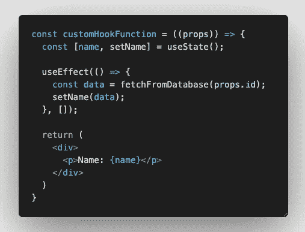

# 2022 年你需要知道的 5 个关键问题——做出反应

> 原文：<https://javascript.plainenglish.io/5-essential-hooks-you-need-to-know-in-2022-react-42aac69f4a62?source=collection_archive---------6----------------------->

## 了解这些挂钩在您的新功能组件中的使用有多简单方便。

如今，我们中的许多人都在使用 React 开发前端应用程序，React 开发人员的市场也在不断增长。一些公司正在使用遗留的 React 开发过程，由此编写基于类的组件仍然是他们的首选。但是从 React 16.8 开始，作为 React 开发人员，您可以编写纯功能组件，并使用 React 库提供的挂钩来实现您希望使用基于类的组件实现的相同开发目标。

如果您对切换/升级 React 库犹豫不决，现在是最好的时机。现在是 2022 年，让我们不断更新我们的开发工具，提升我们的应用程序性能。

# 钩子法则

钩子只是普通的 JavaScript 函数，但是每个工具都有自己的指导方针和一套规则，为了让工具工作良好，钩子就是其中之一。钩子只有两个简单的规则。

*   只调用顶层的钩子**。不要在循环、条件或嵌套函数中调用钩子。**

*   只从 React 函数组件调用钩子**。不要从常规的 JavaScript 函数中调用钩子。**

# 使用状态挂钩

**useState** 函数接受一个初始值并返回两个值，这两个值可以被解结构为 count，这是变量的当前值，以及 setCount，这是一个用于更新变量状态的函数。在 setCount 中，您可以通过向函数传递最新值来直接使用它来更新状态，也可以在 setCount 函数中获取以前的值并在更新状态之前执行一些操作。

与传统的基于类的组件不同，这里的状态不一定是对象。它可以是您想要的任何数据类型，并且您可以在一个组件中声明多个 useState 来管理不同 DOM 元素的状态。

# 使用效果挂钩

用 useEffect 钩子替换 componentDidMount 函数，在 useEffect 回调函数的末尾加上方括号([])，保证这个 useEffect 中的逻辑在你的组件生命周期中只运行一次。

删除 useEffect 回调函数末尾的方括号将在组件中的任何状态发生变化时运行代码。请注意，如果您正在使用它，请不要在您计划运行的 useEffect 代码块中实现状态变更逻辑，否则，您将陷入无限循环。

但是，如果您只想在 props 中的 param 变量发生变化时更新某些逻辑，那么您可以将该参数放在 useEffect 回调函数的方括号([])中，告诉 React 只有在该参数发生变化时，我才会运行 useEffect 函数中的代码块。

如果您正在订阅一个 API 调用，或者有一个观察器或开放的 API 连接，当组件被销毁时，您需要停止它，您可以通过在 useEffect 钩子中实现一个返回回调函数来做到这一点。

# useRef 挂钩

useRef hook 是一个可变值，但它不重新呈现 UI。因此，如果你试图实现类似上面的东西，你可以继续点击按钮来增加计数，那么它不会在 UI 上反映任何变化。

使用 useRef 的一种常见方式是当您需要在函数调用中访问本机元素特性时，比如聚焦输入或对输入进行一些验证。

# useReducer 挂钩

这个钩子看起来很复杂，但它只是使用 useState 来更新与 useReducer 钩子相关的变量状态的一种冗余模式。

你一定在想，既然有了 useState 钩子，为什么还要重新发明轮子呢？有时，您的代码中有非常复杂的逻辑，您需要使用 redux 模式来管理组件状态，而不是使用 useState，因此，如果 useState 对您的组件来说变得太复杂和混乱，您可能会考虑使用这个钩子。

# 自定义挂钩

构建您的定制钩子的一个用例是当您使用钩子并在其中实现复杂的逻辑，并在多个组件中重复它们时。

想象一下，如果我需要实现我的用户设置来显示从应用程序的每个组件的数据库中获取的用户名。我可以重构这些重复的代码，并实现一个 useNameHook 来提取这些重复的代码。

现在，您可以在任何需要从数据库中获取用户名的地方重用这个 useNameHook。

# 摘要

我希望这篇文章能让你明白，在新的功能组件中使用这些钩子是多么的简单和方便。要知道 React 设计这些钩子并不是为了让我们作为开发人员的生活更加痛苦和艰难，而是为了让我们能够利用它们来让我们的开发人员的生活更加轻松，并构建更高性能的应用程序。如果你对这些钩子有其他有趣的使用案例，请在下面的评论中告诉我，因为我很想看看你们是如何使用它们的。干杯。

 [## 用我的推荐链接- DevJo 加入媒体

### 作为一个媒体会员，你的会员费的一部分会给你阅读的作家，你可以完全接触到每一个故事…

medium.com](https://medium.com/@devjo/membership) 

*更多内容请看*[***plain English . io***](http://plainenglish.io/)*。报名参加我们的* [***免费周报***](http://newsletter.plainenglish.io/) *。在我们的* [***社区***](https://discord.gg/GtDtUAvyhW) *获得独家获得写作机会和建议。*