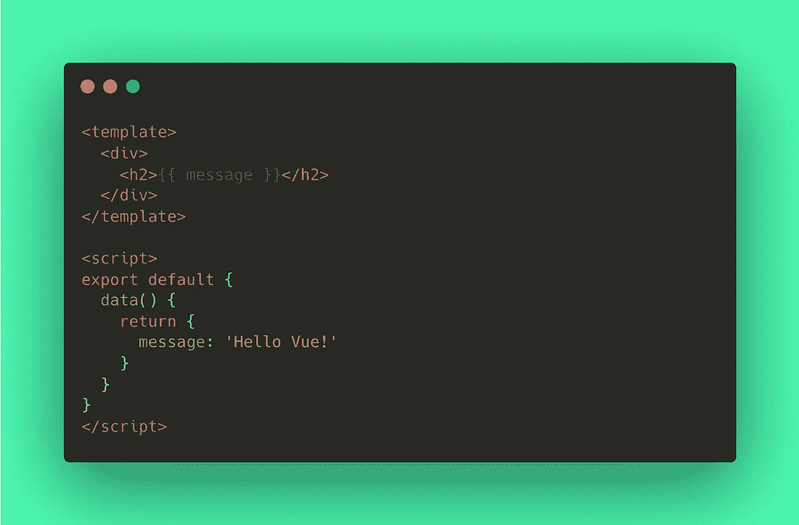
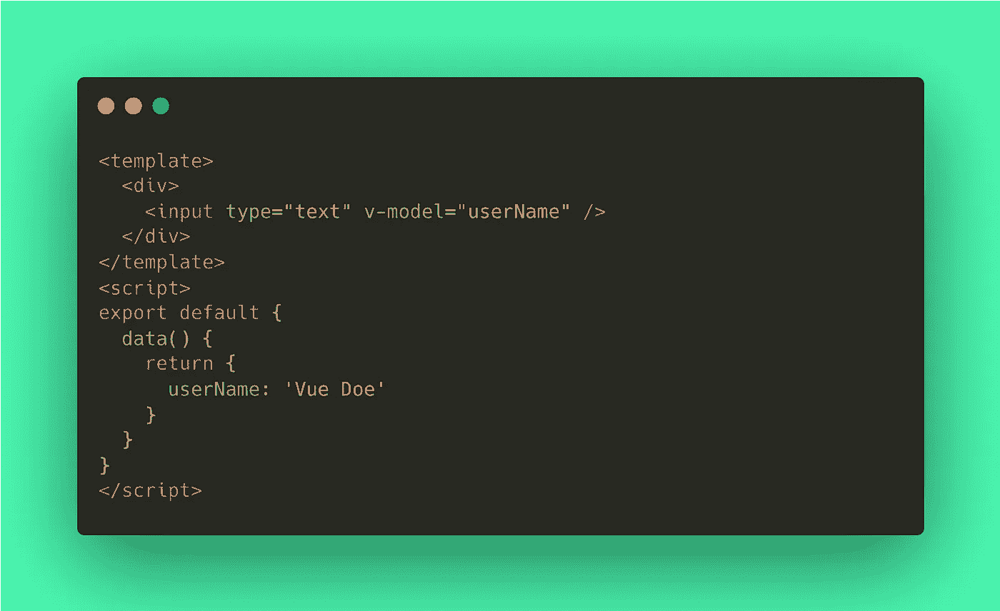

# Vue 3 中的双向数据绑定

> 原文：<https://javascript.plainenglish.io/5-essential-ways-to-reactively-bind-data-in-vue-3-ab241ccab633?source=collection_archive---------3----------------------->

Vue 支持双向数据绑定。对视图中的数据所做的更改会反映在模型中。在模型中所做的更改会反映在视图中。下面是 Vue 3 中数据绑定的一些常见用例。

Image by [PIRO](https://pixabay.com/users/piro4d-2707530/?utm_source=link-attribution&utm_medium=referral&utm_campaign=image&utm_content=2364830) from [Pixabay](https://pixabay.com//?utm_source=link-attribution&utm_medium=referral&utm_campaign=image&utm_content=2364830)

# 1.线

**字符串**数据绑定是通过用两个双花括号`{{ String }}`封装输出字符串来完成的。标签`h2`内的内容将被替换为对象`data()`内的`message` s *tring* 。这意味着`message`的任何变化都会更新标题内容。

# 2.超文本标记语言

我们也可以通过使用`v-html`绑定 **raw HTML** 。包含`htmlHeader` *字符串*的原始 HTML 在`div`标签内被更新。但是，不建议使用这种类型的数据绑定，因为它可能会导致[跨站点脚本(XSS)](https://en.wikipedia.org/wiki/Cross-site_scripting) 。

# 3.文本输入

数据绑定一个**文本** **输入**标签通常是使用`v-model`完成的。这个语法支持双面性，视图中`input`的变化也会更新`data()`对象中的`input`对象。

`input`标签的`value`属性被替换为`userName`。在`data()`对象内更改该值将更新`input`内的文本。改变`input`内的文本同样会改变`data()`内的`userName`值。

# 4.复选框和无线电输入

像文本输入标签一样，`checkbox`和`radio`输入使用`v-model`来绑定用户动作数据。`checkbox`输入接受多个输入，导出的`data()`对象需要是一个*数组*对象。每个选中的项目都将被插入到`favoriteLang`数组中，取消选中项目将删除该项目。相反，`radio`输入有`type=“radio”`，其对应的`data()`对象必须是单字符串对象。

# 5.属性

对于**属性**，数据绑定是用`v-bind:`语法完成的，或者简单地用冒号`:`后跟属性。在这个例子中，我们在`data()`对象中使用`imgSrc`，并将其绑定到`img`标签的`src`属性。这可以是任何属性，如`href`、`value`、`style`等。

# 好了

这里有一些你必须知道的最常见的数据绑定语法。在 essentials 选项卡下的官方 Vue [文档](https://vuejs.org/guide/essentials/template-syntax.html)中找到更多关于数据绑定及其工作方式的信息。现在我们有了。我希望你已经发现这是有用的。感谢您的阅读！

## 点击此处了解更多信息:

*   [https://www . geeks forgeeks . org/types-of-data-binding-with-template-in-vue-js/](https://www.geeksforgeeks.org/types-of-data-binding-with-template-in-vue-js/)
*   [https://vuejs.org/guide/essentials/template-syntax.html](https://vuejs.org/guide/essentials/template-syntax.html)
*   [https://www.youtube.com/watch?v=b0ImUEsqaAA&t = 12963s](https://www.youtube.com/watch?v=b0ImUEsqaAA&t=12963s)

## 更多内容请访问 [PlainEnglish.io](https://plainenglish.io/) 。

报名参加我们的 [**免费周报**](http://newsletter.plainenglish.io/) 。关注我们关于 [**推特**](https://twitter.com/inPlainEngHQ)[**LinkedIn**](https://www.linkedin.com/company/inplainenglish/)**[**YouTube**](https://www.youtube.com/channel/UCtipWUghju290NWcn8jhyAw)**[**不和**](https://discord.gg/GtDtUAvyhW) **。******

## ****想用内容来扩展你的科技创业吗？检查[电路](https://circuit.ooo/?utm=publication-post-cta)。****

****我们提供免费的专家建议和定制解决方案，帮助您建立对您的技术产品或服务的认知和采用。****