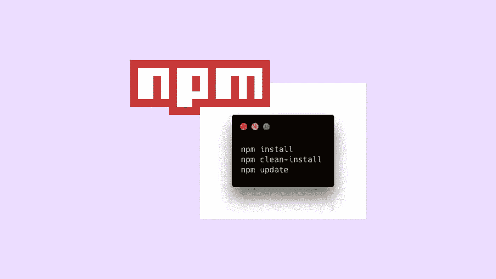

# 了解 npm 安装、全新安装和更新

> 原文：<https://javascript.plainenglish.io/5-examples-to-understand-important-npm-commands-7f9a43e7a90b?source=collection_archive---------9----------------------->

## 重要 npm 命令的简单指南



我们知道我们必须运行`npm install`来安装依赖项。但是当我们运行`npm install`时，到底会发生什么呢？如果我们竞选`npm update`会发生什么？如果已经有了命令`npm install`，为什么还有`npm clean-install`？

# package.json 和包锁. json

首先让我们明确一下 package.json 和 package-lock.json 的区别:

*   package.json 包含关于允许安装哪个版本的信息。这可能是一个精确的版本，但你经常会发现类似这样的东西:`"examplePackage": ^4.16.0`。这告诉 npm，最低版本要求是`4.16.0`，所有次要版本和补丁版本直到`< 5.0.0`都是可以接受的。你可以在这里阅读语义版本[。](https://docs.npmjs.com/about-semantic-versioning)
*   package-lock.json 总是包含关于包的确切版本的信息。例子:`"examplePackage": 4.16.5`

# Npm 安装和 npm 全新安装比较

现在，当我们运行`npm install`时会发生什么？

这取决于运行该命令的目录中有哪些文件。让我们看一些案例。

## 案例 1:不存在 node_modules 文件夹/包尚未安装/包锁. json 存在

假设我们下载了一个包含 package.json 和 package-lock.json 文件的存储库。node_modules 文件夹通常从 git 中显式排除。因此，我们需要在本地安装依赖项。当我们运行`npm install`时，package-lock.json 中定义的依赖项的确切版本被安装。Npm 下载模块并将它们添加到 node_modules 目录中，该目录是自动创建的。

```
added 1 package, and audited 2 packages in 577ms
```

我们也可以在这里运行`npm clean-install`。

`npm clean-install`和`npm install`一样，安装 package-lock.json 中定义的确切版本。

```
added 1 package, and audited 2 packages in 518ms
```

让我们假设 examplePackage ist 版本的最新版本`4.17.0`。

我们的 package.json 包含信息`"examplePackage": ^4.16.0`和我们的 package-lock.json `"examplePackage": 4.16.5`。

这告诉我们有一个比当前安装的版本更新的版本，package.json 中的版本规范允许我们升级。但是，npm 安装或 npm 全新安装将准确安装版本`4.16.5`，并且不会更新。

为此我们有命令`npm update`。`npm update`将检查每个包的最新版本，如果 package.json 允许，就安装它。因此，它会更新 node_modules 和 package-lock.json 中的文件

我们区分`npm install` / `npm clean install`和`npm update`的原因是因为我们希望安装与其他人推送至资源库的版本完全相同的版本。这也是为什么您将 package-lock.json 推送到您的存储库或者从存储库中取出的原因。

## 情况 2:已经安装了具有允许版本/ package-lock.json 的包

这种情况与前一种情况的唯一区别在于，这里已经安装了软件包。如果你在这样的目录中运行`npm install`，什么都不会改变。

```
up to date, audited 2 packages in 403ms
```

npm 检查 package.json 中的包及其版本，并与 package-lock.json 中的已安装版本进行比较。由于已安装版本满足 package.json 的版本要求，因此不会安装任何内容。

命令的一个区别是`npm clean-install`在重新安装 package-lock.json 中定义的所有包之前删除 node_modules 目录。

```
added 1 package, and audited 2 packages in 559ms
```

## 案例 3:软件包已安装，但版本不允许 package.json 和 package-lock.json 中的版本不兼容

如果手动更改 package.json 中的版本，就会出现这种情况。如同在代码编辑器中编辑文件一样。

比如说，我们把 package.json 从`"examplePackage": ^4.16.0`改成`"examplePackage": 4.16.0`。现在带有`"examplePackage": 4.16.5`的 package-lock.json 不再有效。

在这种情况下，在运行`npm install`时，包管理器将会注意到这种不一致性，并将执行以下操作:

*   在 node_modules 文件夹中安装 package.json 中指定的版本。
*   更新 package-lock.json 中列出的版本

`Npm install`通常不写入 package-lock.json(给定的 package-lock.json 已经存在，并且已经安装了包)。只有当您在 package.json 中手动更改包的版本，使 package-lock.json 中的版本不再匹配时，它才会这样做。与`npm install`不同，`npm clean-install`从不写入 package-lock.json。如果您运行`npm clean-install`并且 package.json 和 package-lock.json 中有不兼容的版本，npm 将抛出一个错误，命令将停止执行。

在下面的例子中，package.json 包含`"typescript": "4.8.3”`，但是 package-lock.json 包含`“4.9.3”`。运行`npm clean-install`时，出现错误消息:

```
Invalid: lock file's typescript@4.9.3 does not satisfy typescript@4.8.3
```

运行`npm install`时:

```
changed 1 package, and audited 2 packages in 1s
```

正如 npm 输出和对 package-lock.json 文件的研究所确认的，版本被更改为`"typescript": "4.8.3”`。

## 案例 4:缺少 package-lock.json /缺少 node_modules 文件夹

如果 package-lock.json 文件完全丢失，它会在运行`npm install`时创建。在这种情况下，会安装 package.json 允许的最新可用软件包版本，并创建 package-lock.json。

## 情况 5:缺少 package-lock.json / node_modules 文件夹存在

与前一种情况的不同之处在于，该模块已经安装。和案例 4 一样，package-lock.json 文件是在运行`npm install`时生成的。

但是，由于模块已经存在，npm 不会安装任何新的东西，它只生成文件。Package-lock.json 将包含与 node_modules 文件夹中的包版本相同的版本。

当在没有 package-lock.json 文件的目录中运行`npm clean-install`时，会抛出一个错误。

```
The `npm ci` command can only install with an existing package-lock.json or
npm-shrinkwrap.json with lockfileVersion >= 1\. Run an install with npm@5 or
later to generate a package-lock.json file, then try again.
```

# 摘要

当在一个项目中与几个开发人员一起工作时，每个人都安装相同版本的 npm 模块是很重要的。这就是为什么 package.json 和 package-lock.json 都应该提交给 git 的原因。使用`npm install`或`npm clean-install`时，如果尚未安装 package-lock.json 中指定的确切版本，则会安装这些版本。只有在以下情况下才会安装新版本:A)新版本可用；B)package . JSON 中的版本规范允许更新的版本；C)在没有 package-lock.json 文件的情况下使用`npm update`或`npm install`。

`npm clean-install`比`npm install`更严格，因为当发现不一致的版本时，它会抛出一个错误，并且不允许在没有 package-lock.json 文件的情况下安装。

*更多内容看* [***说白了。报名参加我们的***](https://plainenglish.io/) **[***免费周报***](http://newsletter.plainenglish.io/) *。关注我们关于* [***推特***](https://twitter.com/inPlainEngHQ)[***LinkedIn***](https://www.linkedin.com/company/inplainenglish/)*[***YouTube***](https://www.youtube.com/channel/UCtipWUghju290NWcn8jhyAw)*[***不和***](https://discord.gg/GtDtUAvyhW) ***。*******

*****对缩放您的软件启动感兴趣*** *？检查* [***电路***](https://circuit.ooo/?utm=publication-post-cta) *。***