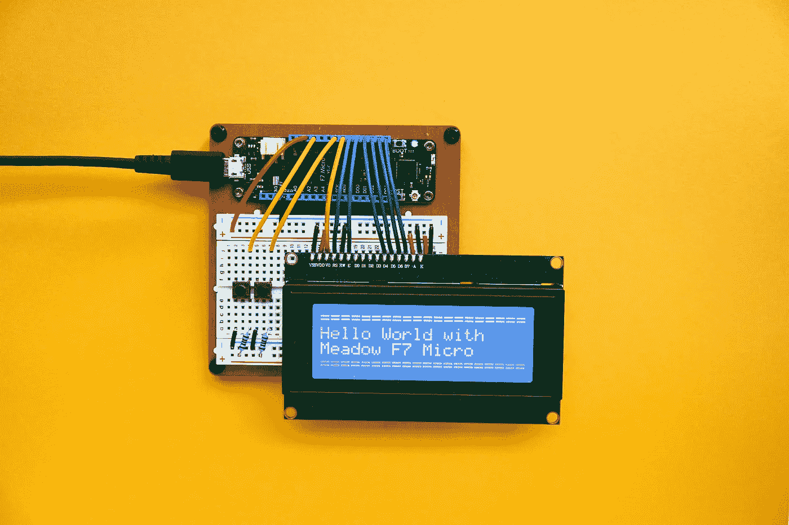

# 进入 Web 开发的 5 个免费方法

> 原文：<https://javascript.plainenglish.io/5-free-resources-to-learn-on-github-7d43dacbb899?source=collection_archive---------14----------------------->

## 学习计算机科学、数据科学、机器学习和 Web 开发

Photo by [Jorge Ramirez](https://unsplash.com/@jorgedevs?utm_source=unsplash&utm_medium=referral&utm_content=creditCopyText) on [Unsplash](https://unsplash.com/s/photos/computer-science?utm_source=unsplash&utm_medium=referral&utm_content=creditCopyText)

在过去的几年里，虚拟学习和网上自学的势头越来越猛。像 Coursera 和 Udemy 这样的在线平台有广泛的主题和课程可供学习。对于时间有限的人来说，自定进度的学习已经成为一种福利。

然而，不是每个人都想为这些课程付费，也不是每个人都有能力。不论经济状况如何，每个人都应该有机会接受教育。仍然没有多少人知道如何找到免费的课程，很多人不知道 GitHub 也有一些最好的免费资源库，在那里你可以学习、练习和提高你的技能。

这个列表旨在填补那些试图自己解决问题但仍然想要高质量教育的人的空白。

# 开源社会大学(OSSU)

OSSU 的课程是使用在线材料的完整的计算机科学教育。这不仅仅是为了职业培训或职业发展。它面向那些希望在所有计算学科的基础概念方面有一个适当的、全面的基础的人，以及那些有纪律、意志和良好习惯的人，他们主要靠自己获得这种教育，但需要世界各地的学习者社区的支持。

它是根据本科计算机科学专业的学位要求设计的，减去普通教育(非计算机科学)要求，因为它假设大多数学习本课程的人已经在计算机科学领域之外接受过教育。课程本身是世界上最好的，通常来自哈佛、普林斯顿、麻省理工等等。，你可以在这里开始你的计算机科学之旅[。](https://github.com/ossu/computer-science)

课程设计如下:

*   *CS 简介*:让学生尝试 CS，看看它是否适合他们
*   核心课程 CS:大致相当于计算机科学课程的前三年，学习所有专业都要求学习的课程
*   高级计算机科学课程:大致相当于计算机科学课程的最后一年，根据学生的兴趣选修一些课程
*   期末项目:一个让学生验证、巩固和展示他们知识的项目，由世界各地的同龄人进行评估

# 微软课程

微软在 GitHub 上开设了一些最好的课程。经麻省理工学院许可，微软 Azure Cloud 倡导者提供数据科学、机器学习(ML)和 Web 开发方面的课程。

*   [*数据科学*](https://microsoft.github.io/Data-Science-For-Beginners/) : 10 周、20 节课的数据科学课程。每堂课都包括课前和课后的测验、完成本课的书面说明、解答和作业。基于项目的教学法允许你边做边学，这是一种行之有效的“坚持”新技能的方法。
*   [*机器学习(ML*](https://microsoft.github.io/ML-For-Beginners/) *)* : 12 周，26 课课程全部关于机器学习。在本课程中，您将了解有时被称为经典机器学习的内容，主要将 Scikit-learn 用作库，并避免深度学习，这将在我们即将推出的“AI 初学者”课程中介绍。您也可以将本课程与数据科学课程配对。
*   [*Web 开发*](https://microsoft.github.io/Web-Dev-For-Beginners/) : 12 周 24 节课的课程，全部关于 JavaScript、CSS 和 HTML 基础知识。

# 奥丁计划

[Odin 项目](https://www.theodinproject.com/)(上)是一个学习全栈 web 开发的开源课程。它的使命是提供一个全面的免费学习网络开发的课程。该项目帮助用户学习技能，并建立令人印象深刻的项目组合，他们需要被聘为网站开发人员。

Odin 项目课程充满了项目，这些项目将帮助您在 GitHub 上建立一个强大的工作组合，以填充您的简历。这个网站和它主持的课程是完全开源的。他们给你一个实际操作的介绍，介绍你需要的所有必要的工具，来建立一个真正的、有效的网站。

您将了解 web 开发人员实际做什么，以及选择一条道路所需的基础:

*   *全栈 Ruby on Rails:* 你将学到使用 Ruby on Rails 从头开始创建漂亮的响应网站所需的一切。
*   *全栈 Javascript* :你将学到使用 Javascript 和 NodeJs 从头开始创建漂亮的响应网站所需的一切。

# 面向所有人的 Javascript

面向所有人的 JavaScript 是初学者和高级 JavaScript 开发者的指南。在这个循序渐进的教程中，您将学习 JavaScript，这是人类历史上最流行的编程语言。你使用 JavaScript 来增加网站的交互性，开发移动应用程序、桌面应用程序和游戏*、*，现在 JavaScript 可以用于机器学习和人工智能。

JavaScript (JS)近年来越来越受欢迎，已经成为领先的编程语言，也是 Github 上使用最多的编程语言。你不需要任何编程经验就可以开始学习本教程。你所需要的只是一台安装了浏览器和代码编辑器的电脑。你可以在这里开始学习[。](https://github.com/Asabeneh/JavaScript-for-Everyone)

# 阿萨贝尼的 30 天计划

Asabeneh S. Yetayeh 是一名教育家、程序员、全栈开发人员、激励者、内容创建者和数据分析师。他的 GitHub 页面有许多关于 HTML、CSS、JS、React、Python、Python 库、Web 开发、数据分析和许多其他主题的教育材料。

他的内容以清晰和简单著称。课程包括 30 天的 JavaScript、30 天的 React、30 天的 Pyhton 以及 10 天的 Git 和 Github。您可以使用这些循序渐进的指南，按照自己的进度学习和实践流行的工具，或者挑战自己在 30 天内完成。这里可以开始[。](https://github.com/Asabeneh)

# 结论

即使你是编程新手，除了查看电子邮件，你从来没有用过你的电脑。你仍然可以从这些课程中学习和增加技能。

例如，如果你想进入计算机科学并选择了 OSSU，甚至有一个 CS 入门课程供你尝试，看看它是否适合你。即使是微软的课程也相对容易完成。如果你只是想更新或增加一个工具到你的技能组合中，你可以使用 Asabeneh 的 30 天计划。

你所需要的只是动机和你为什么决定学习你选择的课程。学习概念，然后实践它们，将有助于你更全面地理解事物是如何工作和配合的。快乐学习！

*更多内容看* [***说白了就是***](https://plainenglish.io/) *。报名参加我们的* [***免费周报***](http://newsletter.plainenglish.io/) *。关注我们关于*[***Twitter***](https://twitter.com/inPlainEngHQ)*和*[***LinkedIn***](https://www.linkedin.com/company/inplainenglish/)*。加入我们的* [***社区***](https://discord.gg/GtDtUAvyhW) *。*