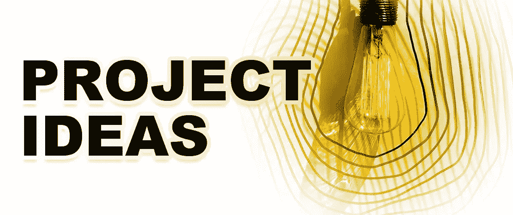
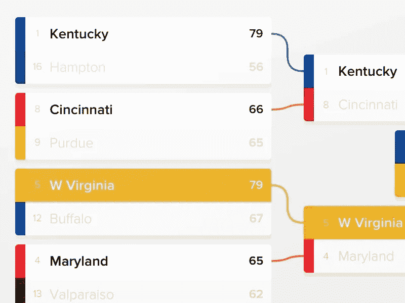
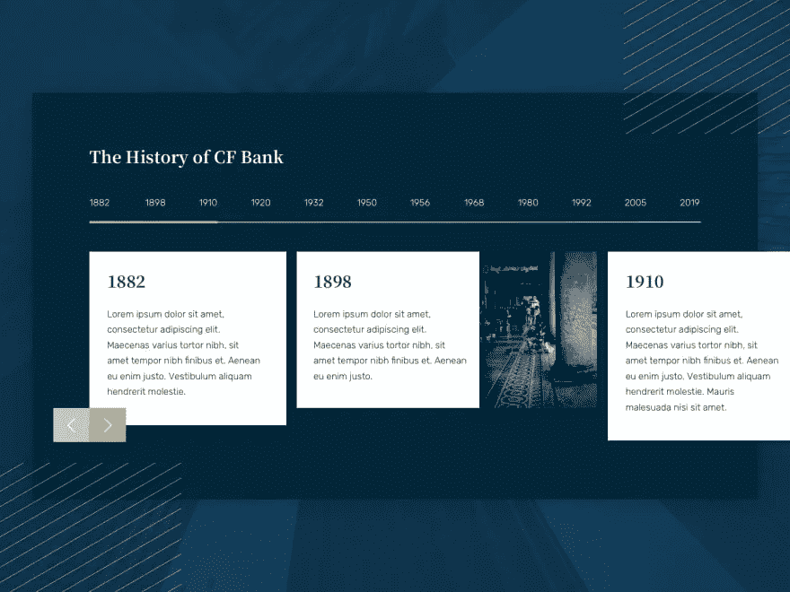
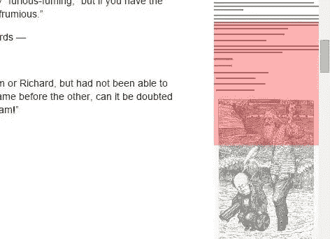

# 为您的下一个 Web 应用程序提供 5 个新的项目创意

> 原文：<https://javascript.plainenglish.io/5-fresh-project-ideas-for-your-next-web-app-d0d0aaf4c77b?source=collection_archive---------21----------------------->

## 项目思路:1。响应式锦标赛支架，2。时间线信息图，3。虚拟名片，4。标签追踪，5。文章导航器

似乎网上的许多项目想法都是陈旧的，或者只适合初学者。对于那些正在寻找一个快速项目来放入简历或测试他们技能的开发人员来说，这可能是个问题。

这个列表的目标是提供一些独特的、有挑战性的、新鲜的项目想法。

# 1.响应式锦标赛支架

这个网络应用程序将为可视化锦标赛提供一个现代和用户友好的体验。理想情况下，像这样的应用程序应该处理高分比赛，长队名和球队品牌。用户应该能够快速浏览用户界面，看看一支球队如何在锦标赛中导航。他们打败了谁，比赛是什么时候，他们最初的排名是什么？

## 技能

*   排序列表
*   数据结构
*   动态内容

Courtesy of Dribble — Tournament Bracket [https://dribbble.com/shots/1989658-Tournament-Bracket](https://dev-to-uploads.s3.amazonaws.com/uploads/articles/v4cjbxybcaycmoth52bi.png)](https://dribbble.com/shots/1989658-Tournament-Bracket))

# 2.时间线信息图

开发一个记录一系列历史事件的 web 应用程序。理想情况下，日期被均匀地分开，并利用无限滚动。例如，滚回到 20 世纪 80 年代很快，但是滚回到恐龙时代就很乏味了。同时，界面应该具有吸引力。该应用程序应该提供过滤器，并利用不同的手势。

## 技能

*   手势
*   无限滚动
*   动画片
*   交互性

Courtesy of Dribble — Timeline [https://dribbble.com/shots/17597329-CF-Bank-Timeline](https://dev-to-uploads.s3.amazonaws.com/uploads/articles/04h3x846m7v8149sw4ep.png)](https://dribbble.com/shots/17597329-CF-Bank-Timeline))

# 3.虚拟名片

开发一个相当于名片的单页应用程序，而不是分发名片或在简历中放一堆链接。提供您的联系信息、社交媒体链接以及您所做工作的简短描述。如果你能打印带有二维码链接到你的虚拟名片的实体名片，你会得到加分。

## 技能

*   半铸钢ˌ钢性铸铁(Cast Semi-Steel)
*   营销
*   设计

# 4.标签追踪

开发一个网站/机器人，找到标签之间的最短路径。举个例子，如果你有#javascript，你要通过多少帖子/简介才能到达#dannydevito。加分，如果你能把这变成一个像 https://www.thewikigame.com/一样的游戏，或以其他方式利用它。

## 技能

*   算法
*   大数据
*   蜜蜂

# 5.文章导航器

提供一个浏览器扩展，概述文章并显示带有滚动功能的页面小地图。其理念是始终拥有一个可访问的目录，并且无需滚动即可快速查看页面结构。这将有助于避免广告过多或内容较少的页面。

## 技能

*   网页抓取
*   浏览器扩展

# 结论

希望这些项目能让你感兴趣，并帮助你想出新的点子。请评论其他项目想法或分享您的创作。

 [## 通过我的推荐链接加入 Medium-Wade Zimmerman

### 阅读 Wade Zimmerman(以及 Medium 上成千上万的其他作家)的每一个故事。您的会员费直接支持…

devmap.org](https://devmap.org/membership) 

*更多内容请看*[***plain English . io***](https://plainenglish.io/)*。报名参加我们的* [***免费周报***](http://newsletter.plainenglish.io/) *。关注我们关于*[***Twitter***](https://twitter.com/inPlainEngHQ)[***LinkedIn***](https://www.linkedin.com/company/inplainenglish/)*[***YouTube***](https://www.youtube.com/channel/UCtipWUghju290NWcn8jhyAw)*[***不和***](https://discord.gg/GtDtUAvyhW) *。***