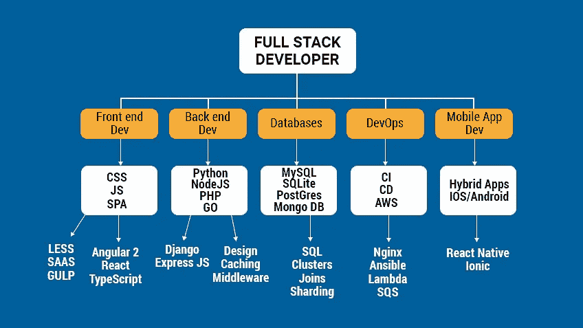
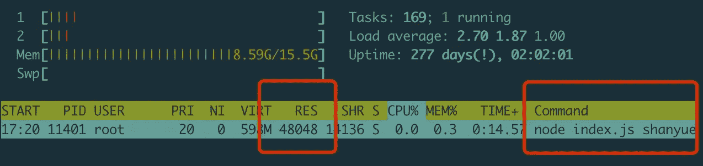

# 5 个完整的开发人员面试问题

> 原文：<https://javascript.plainenglish.io/5-full-stack-developer-interview-questions-b48eace7540c?source=collection_archive---------1----------------------->



# 01 什么是去抖和节流，它们适用于什么？

## 去抖

顾名思义，去抖将防止抖动，而不是采取一个事件多次。在键盘上打字是你每天都会遇到的去抖操作。

当你应用上下文时，理解一个概念是容易的。我给你讲几个去抖案例:

1.  用户快速点击登录和文本按钮，以便发送多个请求，并且需要去抖
2.  调整浏览器窗口大小时，调整事件的数量过于频繁，导致计算量过大。你需要去抖，以避免多次计算。
3.  文本编辑器实时保存，一秒钟后保存，不做任何更改。

去抖代码如下，可见去抖的重点是清除`clearTimeout(timer)`

```
function debounce (f, wait) {
  let timer
  return (...args) => {
    clearTimeout(timer)
    timer = setTimeout(() => {
      f(...args)
    }, wait)
  }
}
```

## 喉咙

节流控制事件的频率，例如每秒一次或每分钟一次。类似于`Rate Limit`由服务器和网关控制。

1.  每秒计算位置信息的滚动事件等。
2.  每秒钟计算浏览器回放事件和进度信息等。
3.  输入框实时搜索并发送显示下拉列表的请求，每秒发送一次请求(也可用于去抖)

油门代码如下，可以看出油门的钥匙是锁死`timer=timeout`

```
function throttle (f, wait) {
  let timer
  return (...args) => {
    if (timer) { return }
    timer = setTimeout(() => {
      f(...args)
      timer = null
    }, wait)
  }
}
```

## 结论

1.  **去抖动**:为了防止抖动，事件触发器会在一个单位时间内复位，避免事件被意外触发多次。实施重点是清除`clearTimeout`。去抖可以是等电梯的例子，只要一个人进来就需要等一会儿。
2.  **Throttle** :控制流量，单位时间内只能触发一次事件，类似于服务器端的速率限制。实现的重点是锁定和解锁`timer=timeout; timer=null`。油门可以是过红绿灯的例子，每一个绿灯都可以过一批。

# 02 如何在前端获取浏览器的唯一标识

由于在不同系统显卡上绘制画布时渲染参数和反走样算法的不同，所绘制的图像数据的`CRC`检查也不同。

```
function getCanvasFp () {
  const canvas = document.getElementById('canvas')
  const ctx = canvas.getContext('2d')
  ctx.font = '14px Arial'
  ctx.fillStyle = '#ccc'
  ctx.fillText('hello, shanyue', 2, 2)
  return canvas.toDataURL('image/jpeg')
}
```

因此，可以从考虑浏览器指纹信息的 canvas 中获得唯一的标识符。

1.  通过画布获取图像数据 URL 的`base64`字符串
2.  对`bas464`字符串进行 MD5 摘要计算，得到指纹信息

但是，对于这种需求，有成熟的解决方案。如果您在生产环境中使用它，您可以使用下面的库

*   [指纹 js2](https://github.com/fingerprintjs/fingerprintjs)

它根据以下信息获取浏览器指纹信息，这些信息成为组件

1.  `canvas`
2.  `webgl`
3.  `UserAgent`
4.  `AudioContext`

```
requestIdleCallback(function () {
  Fingerprint2.get((components) => {
    const values = components.map((component) => component.value)
    const fp = Fingerprint2.x64hash128(values.join(''), 31)
  })
})
```

`fingerprintjs2` 有不同分类的成分

1.  `browser-independent component`:有些组件在同一设备上跨浏览器可以得到相同的值，有些独立的浏览器可以得到不同的值
2.  `stable component`:有些元件刷新后数值不会改变，称为稳定元件

我们可以根据业务选择合适的组件

```
const options = {
  excludes: {userAgent: true, language: true}
}
```

## 结论

可以根据画布获取浏览器指纹信息

1.  通过画布获取图像数据 URL 的`base64`字符串
2.  对`bas464`字符串进行 MD5 摘要计算，得到指纹信息

如果在生产环境中使用，`fingerprintjs2`可以根据业务需求用于合适的组件，比如单个设备是否可以跨浏览器。

# 03 如何在服务器应用程序中获取客户端 IP

如果有`x-forwarded-for` 请求头，取第一个 IP，否则取建立连接的套接字的`remoteAddr`。
和`x-forwarded-for`已经基本成为基于代理的标准 HTTP 头。格式如下。可见第一个 IP 代表了它真正的 IP。可参考 [MDN X-Forwarded](https://developer.mozilla.org/en-US/docs/Web/HTTP/Headers/X-Forwarded-For)

```
X-Forwarded-For: 203.0.113.195, 70.41.3.18, 150.172.238.178
X-Forwarded-For: <client>, <proxy1>, <proxy2>
```

以下是 koa 获得 IP 的方式

```
get ips() {
    const proxy = this.app.proxy;
    const val = this.get(this.app.proxyIpHeader);
    let ips = proxy && val
      ? val.split(/\s*,\s*/)
      : [];
    if (this.app.maxIpsCount > 0) {
      ips = ips.slice(-this.app.maxIpsCount);
    }
    return ips;
  },

  get ip() {
    if (!this[IP]) {
      this[IP] = this.ips[0] || this.socket.remoteAddress || '';
    }
    return this[IP];
  },
```

# 04 如何在 js 中用另一个子串替换一个子串

更多描述:`Suppose there is a string `hello.hello.hello.` that needs to be replaced with `AAA`, that is, replace `hello.` with `A``

如果需要替换整个字符串，可以使用`String.prototype.replace(re, replacer)`，这里需要打开正则表达式的全局标志。

```
const s = 'foo foo foo'
s.replce(/foo/g, 'bar')
```

而且，有没有可能用正则表达式来代替子串？

**回答:不会**，因为使用子串构造正则表达式时可能会有特殊字符，可能会产生问题，如下

```
// expect: 'AhelloX hello3 '
> 'hello. helloX hello3 '.replace(new RegExp('hello. ', 'g'), 'A')
< "AAA"
```

您可以替换 javascript 中的子字符串，如下:`str.split(‘foo’).join(‘bar’)`

```
> 'hello. hello. hello. '.split('hello. ').join('A')
< "AAA"
```

多么聪明(愚蠢)美妙(笨拙)的方法！！！`TC39`大概也意识到了一个问题，所以想出了一个新的 API，在`ESNext`

```
String.prototype.replaceAll()

'aabbcc'.replaceAll('b', '.'); 
// 'aa..cc'
```

## 结论

两种解决方案

*   `str.split('foo').join('bar')`
*   `str.replaceAll('foo', 'bar')`

# 如何获取进程的内存并监控它

更多描述:`When writing scripts, sometimes OOM occurs when the memory is too large, so how do we know the memory of a process? Also how to monitor it`

一个进程占用的内存可以通过`ps`获得

```
$ ps -O rss -p 3506
  PID   RSS S TTY          TIME COMMAND
 3506  6984 S pts/1    00:00:00 vim
```

如果你想监控内存，你必须使用命令`pidstat`，它在进程中是万能的

```
## -r show memory info
## -p for pid
## 1: print once aminute
$ pidstat -r -p 3506 1
Linux 3.10.0-957.21.3.el7.x86_64 (shanyue)      11/04/19        _x86_64_        (2 CPU)

20:47:35      UID       PID  minflt/s  majflt/s     VSZ    RSS   %MEM  Command
20:47:36        0      3506      0.00      0.00  139940   6984   0.18  vim
20:47:37        0      3506      0.00      0.00  139940   6984   0.18  vim
20:47:38        0      3506      0.00      0.00  139940   6984   0.18  vim
20:47:39        0      3506      0.00      0.00  139940   6984   0.18  vim
20:47:40        0      3506      0.00      0.00  139940   6984   0.18  vim
20:47:41        0      3506      0.00      0.00  139940   6984   0.18  vim
```

`pidstat`是`sysstat`下的一个 Linux 性能工具，但是在 mac 中，如何监控内存变化？当然，你可以使用万能的`top/htop`

```
$ htop -p 31796
```



# 结论

三种解决方案

1.  `pidstat -r`
2.  `htop/top -p`
3.  `ps -O rss -p`

# 最后

**感谢阅读。**期待期待您的关注，阅读更多高质量的文章。

[](/which-loop-traversal-is-the-fastest-in-javascript-c196311337d6) [## JavaScript 中哪个循环遍历最快？

### JavaScript 数组遍历方法的比较

javascript.plainenglish.io](/which-loop-traversal-is-the-fastest-in-javascript-c196311337d6) [](https://levelup.gitconnected.com/the-story-of-clip-path-and-endangered-animals-in-css-8af987927fc6) [## CSS 中剪辑路径和濒危动物的故事

### 使用 CSS 剪辑路径创建奇妙的动画

levelup.gitconnected.com](https://levelup.gitconnected.com/the-story-of-clip-path-and-endangered-animals-in-css-8af987927fc6) [](/identify-javascript-data-types-two-methods-are-enough-882e2c238e6b) [## 识别 JavaScript 数据类型:两种方法就足够了

### 引入一个实用方法来识别所有数据类型

javascript.plainenglish.io](/identify-javascript-data-types-two-methods-are-enough-882e2c238e6b) 

*更多内容请看*[***plain English . io***](https://plainenglish.io/)*。报名参加我们的* [***免费周报***](http://newsletter.plainenglish.io/) *。关注我们关于*[***Twitter***](https://twitter.com/inPlainEngHQ)[***LinkedIn***](https://www.linkedin.com/company/inplainenglish/)*[***YouTube***](https://www.youtube.com/channel/UCtipWUghju290NWcn8jhyAw)*[***不和***](https://discord.gg/GtDtUAvyhW) *。对增长黑客感兴趣？检查* [***电路***](https://circuit.ooo/) *。***