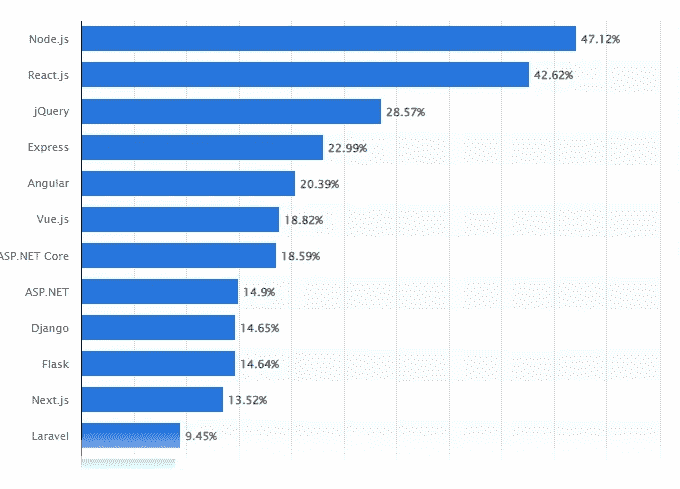

# 5 个 GitHub 库，让你从 99%的 Web 开发者中脱颖而出

> 原文：<https://javascript.plainenglish.io/5-github-repositories-that-will-make-you-standout-from-99-of-web-developers-4ba6e7c1d733?source=collection_archive---------1----------------------->

## 当然，大多数你都没听说过。

Photo by [Lala Azizli](https://unsplash.com/@lazizli?utm_source=medium&utm_medium=referral) on [Unsplash](https://unsplash.com?utm_source=medium&utm_medium=referral)

你想从事网页开发工作吗？要做到这一点，你必须先学习 web 开发，尤其是 HTML、CSS、JavaScript，然后再去做。

是的，我已经准备了一份[综合指南](/how-to-learn-web-development-using-free-resources-1c677e70de14)来开始 Web 开发，甚至还提供了一些[最好的资源](/80-free-resources-for-web-designers-and-web-developers-in-2021-f400be2875ea)来帮助你更快地学习。

现在是时候深入研究并发现一些可用的顶级 GitHub 库了，它们可以帮助你从 web 开发人员中脱颖而出。

在我开始之前，让我提一下 web 开发不是一个容易的领域。你每天都要学习新的东西，大多数时候你不知道如何完成工作。因此，您必须探索、了解更多信息，并解决大量错误以完成任务。

当且仅当你有学习精神时，你才可能让自己从其他 web 开发人员中脱颖而出。

是的，我会给你提供最好的资源，但如何充分利用它们取决于你。

让我们开始吧。

1.  [**设计课程**](https://github.com/bradtraversy/design-resources-for-developers)

我们都听说过，第一印象就是最终印象；设计网站时也是如此。

当用户访问一个网站时，它应该是有效的。如果不是，大多数人会很快离开它，去另一个网站。

连我也是其中之一；如果我不喜欢一个网站的外观，那它做什么也没关系；我只是转向另一个。作为一名网站开发者，你不希望这种事情发生在你的网站上。

所以，[这里有](https://github.com/bradtraversy/design-resources-for-developers)一个 GitHub 库，里面有所有可以帮助你的设计资料。这个 GitHub 资源库有丰富的资源，包括字体、颜色、图片、图形、图标、徽标等等。

它还包括 HTML 和 CSS 模板、CSS 框架、方法和动画、React UI 库、Angular UI 库、Vue UI 库、Svelte UI 库等等。

简单探索一下就会发现它的价值。

**2。** [**牛逼的反应**](https://github.com/enaqx/awesome-react)

当谈到最流行的框架时，React 总是在列表的顶部。

Src: Statista

即使是大多数初学者，在理解了 HTML、CSS 和 JavaScript 的基础知识之后，也试图学习 React。

所以，[这里是](https://github.com/enaqx/awesome-react)一个为所有人准备的美妙的 GitHub 库。

您需要了解的关于 React 的一切都在这里，包括文档、在线游乐场、社区、测试和其他工具、库、redux 资源、typescript 资源等等。

只要探索它，它的价值就会显现出来。

**3。** [**牛逼的尾翼**](https://github.com/aniftyco/awesome-tailwindcss)

说到 TailwindCSS，它是在 2017 年推出的，从那以后，广大开发者都学会了这个框架，并经常使用它。

甚至我以前也在上面写过一篇文章，许多开发者给我发消息说他们非常喜欢 TailwindCSS，而其他人对此毫无兴趣。

所以，如果你喜欢 TailwindCSS，看看这个[GitHub repo。](https://github.com/aniftyco/awesome-tailwindcss)

老实说，这个 GitHub 库极大地帮助了我的项目创建。这个存储库包含许多工具、框架和模板，使构建具有各种功能的用户界面变得简单。

**4。** [**命令行的艺术**](https://github.com/jlevy/the-art-of-command-line)

当我第一次开始学习 web 开发时，我没有怎么使用命令行，但是随着时间的推移，我使用了。

最近，我需要创建几个文件夹和文件，将这些文件从一个目录复制到另一个目录，移动它们，并安装几个包。对于所有这些，我更喜欢命令行界面。

即使使用 macOS，也必须经常使用 brew，并下载大量有其支持的软件包。

为此，为了完成任务，您必须了解这些命令。这就是 GitHub repo 将帮助你的地方。

**5。** [**公共 API**](https://github.com/public-apis/public-apis)

此外，无论您是前端还是后端开发人员，都必须熟悉 get、POST、PATCH 和 DELETE 等 API 方法。

然后，使用 API，您必须将数据从后端传输到前端，反之亦然。根据你的项目，我们可能有后端的数据；否则，我们必须生成伪数据。

当然，如果您需要伪造的 JSON 数据，您可以简单地创建或使用一些网站，但是如果您需要一个特定的 API 列表呢？

别担心，[这个](https://github.com/public-apis/public-apis) GitHub 回购会解决你的问题。

希望你喜欢。

就这样——谢谢。

[*如果你喜欢看这样的故事，并想帮助我成为一名作家，可以考虑成为一名中等会员*](https://nitinfab.medium.com/membership) *。它每月花费 5 美元，给你* [*无限制访问媒体内容*](https://nitinfab.medium.com/membership) *。如果你通过我的链接注册，我会得到一点佣金。*

 [## 帮助你更快学习 Web 开发的 9 个网站——免费

### 当然，大多数你都没听说过。

javascript.plainenglish.io](/9-websites-that-will-help-you-learn-web-development-faster-for-free-eb81ccea1999)  [## 7 个黑仔工具是如此的有价值，以至于他们觉得知道它们是非法的——没有废话

### 我敢肯定，你从来没有听说过他们中的任何一个。

javascript.plainenglish.io](/7-killer-tools-that-are-so-valuable-they-feel-illegal-to-know-no-bs-5bfee6192871) 

*更多内容看* [***说白了就是***](https://plainenglish.io/) *。报名参加我们的* [***免费周报***](http://newsletter.plainenglish.io/) *。关注我们* [***推特***](https://twitter.com/inPlainEngHQ) ，[***LinkedIn***](https://www.linkedin.com/company/inplainenglish/)*，*[***YouTube***](https://www.youtube.com/channel/UCtipWUghju290NWcn8jhyAw)*，*[*不和*](https://discord.gg/GtDtUAvyhW) *。对增长黑客感兴趣？检查出* [***电路***](https://circuit.ooo/) *。*