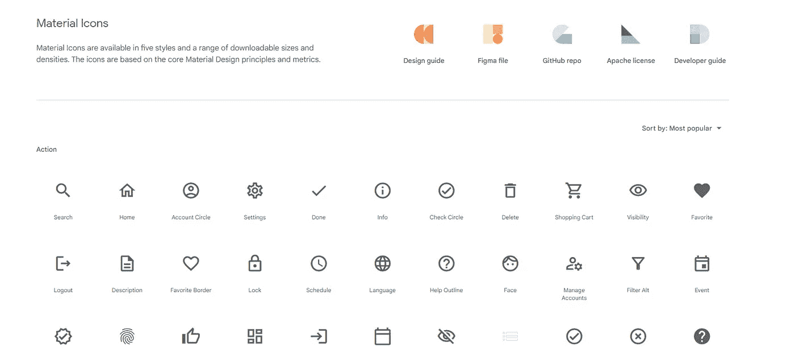
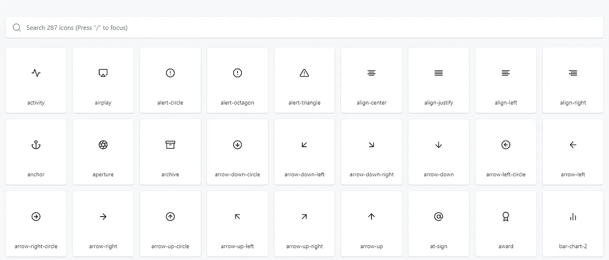
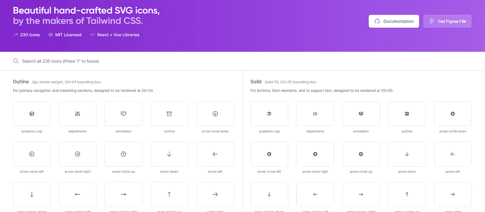
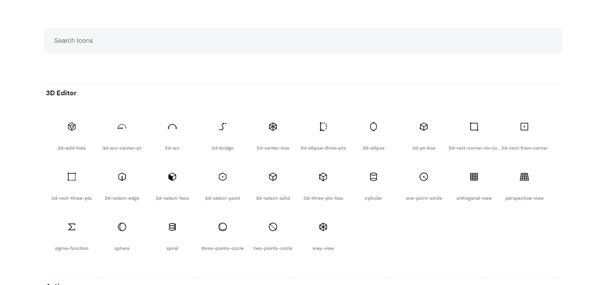
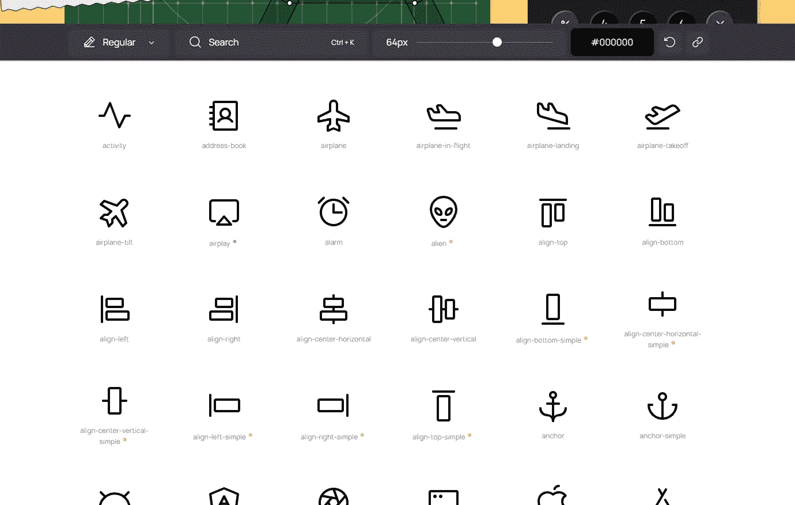

# 你应该在开发/设计中免费使用的 5 个图标包

> 原文：<https://javascript.plainenglish.io/5-icon-packs-you-should-use-in-your-development-design-for-free-e8fc7cb8ae15?source=collection_archive---------8----------------------->

## 发展

## 您应该在下一个开发项目中使用的图标包。

Photo by [Alexander Shatov](https://unsplash.com/@alexbemore?utm_source=medium&utm_medium=referral) on [Unsplash](https://unsplash.com?utm_source=medium&utm_medium=referral)

图标是在不使用文字的情况下给文本形式添加或阐明含义的绝佳方式。这可以增强你的设计，给你的项目一种感觉，不仅仅是文字，还有比语言更能交流的符号。

## 1.材料符号和图标

材质符号和图标是为 Android 设备创建的一组符号，但是你可以在任何你想要的地方使用它们。它以超过 2500 个图标和符号为特色，以其简单和弯曲著称。

[fonts.google.com/icons?icon.set=Material+Icons](https://fonts.google.com/icons?icon.set=Material+Icons)

他们提供了 7 种图标重量和其他图标定制，并为每个平台提供了说明——Web、Android 和 iOS。您也可以将它们作为 SVG 或 PNG 文件直接下载。

Google 开发了一个 Figma 插件，供设计人员和开发人员用来简化他们的工作。这些设备由谷歌开发，可以在任何地方免费使用。

 [## 材料符号和图标-谷歌字体

### 材料符号是我们最新的图标，在一个字体文件中整合了 2500 多个字形，具有广泛的设计…

fonts.google.com](https://fonts.google.com/icons?icon.set=Material+Icons) 

## 2.羽毛图标

羽毛图标是网页设计者和开发者的开源图标，但是也可以用在其他地方。这个图标包只有 287 个图标，但是它们已经触及了最关键的图标，所以不要担心。

[feathericons.com](https://feathericons.com/)

羽毛提供 6 种图标重量和尺寸定制。当你点击一个图标，一个 SVG 文件将被直接下载到你的电脑上。

Feather 的开发者为 Figma 设计了一个插件，你可以将这些图标直接拖到你的文件中。

 [## 羽毛——简单漂亮的开源图标

### Feather 是一个简单漂亮的开源图标的集合。每个图标都设计在一个 24x24 的网格上，重点是…

feathericons.com](https://feathericons.com/) 

## 3.英雄图标

英雄图标是由顺风 CSS 的创造者设置的图标，他们不太出名，但价值不减。这个图标包只有 230 个图标，但是和上一个一样，这些是最常用和最重要的。

[heroicons.com](https://heroicons.com/)

英雄图标的开发者也为这个图标包创建了一个 Figma 插件。

当你将鼠标悬停在一个图标上时，你可以复制一个 SVG 标签粘贴到你的项目/Figma 中，或者为你的 React 项目复制一个等价的 SVG JSX。

 [## 英雄图标

### 漂亮的手工制作的 SVG 图标，由 Tailwind CSS 的制作者制作。

heroicons.com](https://heroicons.com/) 

## 4.圣像

Iconoir 是一组由设计师 Luca Burgio 手工制作的 SVG 图标。这个图标包有 1151 个漂亮独特的图标，包括所有重要的符号。

[iconoir.com](https://iconoir.com/)

Iconoir 也有一个插件支持 Figma，现在它被集成到 Framer 中。你现在可以在反应和颤动中使用这个包。

当你选择一个你喜欢的图标时，一个 SVG 副本将被插入到你的剪贴板中，你可以将它粘贴到你的代码中。

 [## Iconoir | SVG 图标库

### 简单而权威的手工制作的 SVG 图标库。

iconoir.com](https://iconoir.com/) 

## 5.磷光图标

在我看来，磷光图标是免费的最简单的图标。这个包包括 1047 个独特的图标，有 6 种可能的重量和多种尺寸。

[phosphoricons.com](https://phosphoricons.com/)

Phosphor 已经作为插件集成到 Figma、Sketch 和 Framer 中，因此您可以通过拖放功能立即使用它。

当你点击一个图标时，它会显示你在项目中使用的 4 种不同的代码实现——React、Vue、HTML 和 Flutter。还提供了复制或下载为 SVG 或 PNG 文件的选项。

 [## 磷光图标

### 一个灵活的图标家族，用于界面、图表、演示等。

phosphoricons.com](https://phosphoricons.com/) 

## 结论

在这些网站(不是物质图标)的每一个上，你都可以找到支持团队或图标集创作者的方法。由于这些包是免费的，创作者没有从中获利，所以自愿随意捐赠任何数量。

*更多内容请看*[***plain English . io***](https://plainenglish.io/)*。报名参加我们的* [***免费周报***](http://newsletter.plainenglish.io/) *。关注我们关于*[***Twitter***](https://twitter.com/inPlainEngHQ)**和*[***LinkedIn***](https://www.linkedin.com/company/inplainenglish/)*。查看我们的* [***社区不和谐***](https://discord.gg/GtDtUAvyhW) *加入我们的* [***人才集体***](https://inplainenglish.pallet.com/talent/welcome) *。**