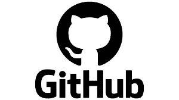
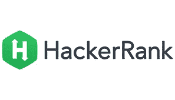

# 每个开发人员都知道并每天使用的 5 个难以置信的网站

> 原文：<https://javascript.plainenglish.io/5-incredible-sites-that-every-developer-knows-and-uses-daily-20b7ec9a0599?source=collection_archive---------12----------------------->

[Credit](https://unsplash.com/@euwars)

做一名软件开发人员并不容易:有许多概念需要你掌握和记住，有许多不同的编程语言需要学习和精通，还有大量的好的实践必须记住和使用。

这看起来让人不知所措，但要成为最好的开发人员，一切都是必要的。幸运的是，互联网上有数量惊人的网站为你提供大量的信息，只要你需要，这些信息就可以简单地使用和获取。

他们可以在您的学习之旅中帮助您，调试项目中的代码，并且还提供了许多对您有用的技巧和事实。所以，这里有一个每个开发人员日常使用的网站列表，以及对他们所做的对他们有价值的事情的解释。我们开始吧。

# 1.StackOverflow.com

stackoverflow.com

如果你是一个开发者，你一定知道这个网站，它非常有名。它是 Stack Exchange 家族的开发人员专用论坛。在这个网站上，你可以提出关于编程和代码的问题，以及你的代码中的错误。

有很多其他的开发者会帮助你并评价你的问题质量。他们这样做是因为他们可以获得徽章和积分来提升自己的形象。

这些网站还保留了人们在过去提出的问题，因此无论某人是否有同样的问题或类似的事情，都可以使用相同的解释。

另外，StackOverflow 每年都会发布一份开发者调查，公布最流行、最受欢迎、最常用和最受欢迎的编程语言和技术。这些调查可能看起来没什么用，但它们对于了解当你开始新项目时应该选择什么技术，以及了解编程语言的发展方向(如果它们即将消亡或登上月球)非常重要。

因此，StackOverflow 对所有开发人员来说都是非常有用的，当你有一些问题和 bug 需要处理时，它会给你很大的帮助。它还可以帮助您了解开发世界的发展方向，以及如何定位自己。没有它就不能成为真正的程序员。看看这个。

地点:[https://stackoverflow.com/](https://stackoverflow.com/)

# 2.开源代码库

github.com

这是微软给开发者最好的礼物之一，对这个行业的每个人来说都是绝对必要的。这是一个你可以存储代码和进行协作编程的网站。

简而言之，你可以将你的项目代码存储在你的个人存储库中。每个人都可以看到你的代码，下载和协作。你可以建立社区和友谊，这就是为什么它被认为是开发者的脸书或 Instagram。

您的存储库可以由其他人启动，这意味着他们欣赏它。它让你“出名”。它也是一个可以用于开源项目的工具，可以帮助你在科技行业获得信誉，尤其是在求职时。

如果你刚开始学习一门新的编程语言，你可以打开 GitHub，看看其他人的代码，试着理解这是怎么回事。这将有助于你更好地学习任何东西，因为你有如何以最佳方式编写代码的真实例子。

如果你是学生，GitHub 还提供学生背包，里面有很多免费的有用服务。例如，它为你提供了一些免费的信用点数来购买 Azure 或许多其他非常有用的工具。

所有这些特性使得这个网站几乎成为开发者最著名和最受欢迎的网站之一。它在你发展旅程的每一个可能的部分都会给你很大的帮助。如果你想成为一名真正的开发者，你绝对需要这个网站。

地点:[https://github.com/](https://github.com/)

# 3.w3 学校

w3s

让我们深入一个与纯学习相关的网站。浏览和学习真的很简单。它有大量的概念和语言的教程。最著名的是 HTML 和 Javascript。

这个网站的主要好处是，它也有很多你可以在线运行的代码片段，也有你自己代码的简单测试。这在弄清楚如何在代码中实现某些东西时很方便。

如果你是一个努力学习如何编码的初学者，这个网站是有帮助的，但即使你是一个专家。如果您有时忘记了如何执行，例如，Javascript 中的快速排序，您可以搜索 W3S 相关页面，让所有代码都有注释并正常工作。这非常有用。

地点:【https://www.w3schools.com/ 

# 4.黑客银行

HackerRank

你好胜吗，还是喜欢挑战？这个网站是给你的。在这个网站上，有很多关于代码的问题，你可以尝试用你的算法和数据结构实现来回答。

它肯定有助于，尤其是初学者，掌握计算机科学中的许多基本概念。在准备你的编码面试时，这也很有帮助。

有些问题仅仅是问题或挑战，而另一些则是编程语言的替代教程的一部分。事实上，HackerRank 相信实用的方法。它教会你一些东西，然后测试你是否理解了那个特定的概念。

如果你设法通过期末考试，你还可以获得关于你在平台上所学内容的证书。

绝对推荐，哪怕只是为了找点乐子。

地点:【https://www.hackerrank.com/ 

# 5.LeetCode

LeetCode

当谈到竞争性编程和准备编码面试时，这个网站是王者。它提供了 2000 多个对每个人开放的问题，以及很多有时只对高级用户开放的附加功能。

如果你喜欢算法和编写高效的代码，你可以来这个网站，享受实现复杂结构来解决现实问题的乐趣。当你完成一件事的时候，你也可以把最好的解决方案拿出来。

另一方面，如果你正在准备一个软件面试，你有一些额外的功能，比如与特定公司相关的问题，比如亚马逊或谷歌。这真的很有用，尤其是对初学者来说。

该网站还提供竞赛以及在这个平台上创建和管理学习计划的可能性。这个你不会错的。太神奇了。

地点:[https://leetcode.com/](https://leetcode.com/)

# 结论

所以，这是每个开发人员每天都会使用的 5 个网站——至少其中一个。它们带来了非常重要的特性和机会，聪明的开发者不想错过。

如果你想在你的开发生涯中获得成功，这些并不足以让你成为一名伟大的程序员，但是它们会给你很大的帮助。

感谢您的阅读。希望你喜欢这些内容。

*更多内容看* [***说白了。报名参加我们的***](https://plainenglish.io/) **[***免费周报***](http://newsletter.plainenglish.io/) *。关注我们关于*[***Twitter***](https://twitter.com/inPlainEngHQ)*和*[***LinkedIn***](https://www.linkedin.com/company/inplainenglish/)*。加入我们的* [***社区***](https://discord.gg/GtDtUAvyhW) *。***