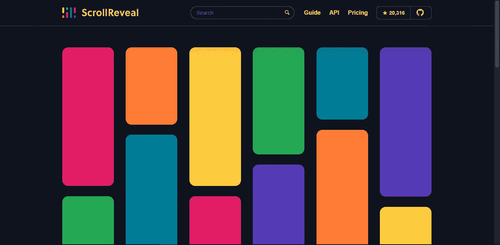
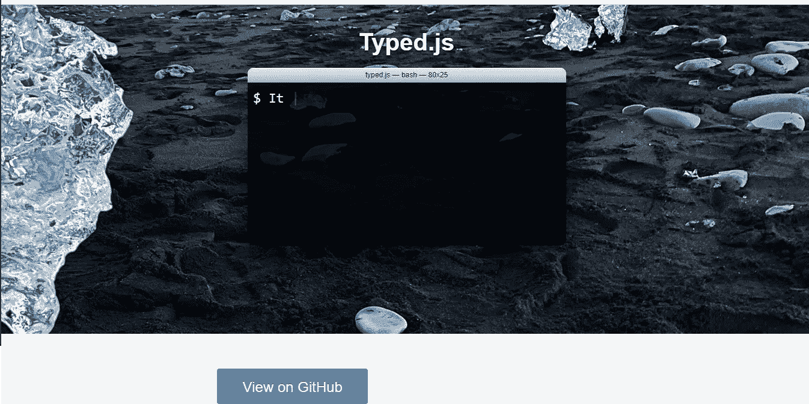
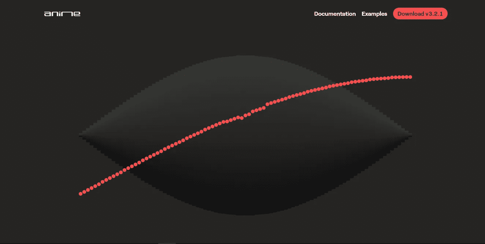

# 你应该尝试的 5 个 JavaScript 动画库

> 原文：<https://javascript.plainenglish.io/5-javascript-animation-libraries-that-you-should-try-33418e4728a9?source=collection_archive---------23----------------------->

## 你可以用最好的 JavaScript 动画库把用户吸引到你的网站上。

引人注目的动画让你的网站看起来很棒。我们人类只有 7 秒钟来吸引用户。所以我们必须在我们的网站上抓住用户，动画可以帮助我们实现这一点。

所以让我们来看看最好的 JavaScript 动画库。

排名第一的是:

## **1。GSAP**

它是一个强大的 JavaScript 工具集，将开发人员变成动画超级英雄。

查看这里:****。****

*排名第二的是:*

## *2. **scrollReveal.js***

*js 是一个 JavaScript 库，用于在元素进入/离开视区时轻松制作动画。*

*查看这里:[**scroll reveal . js**](https://scrollrevealjs.org/)**。***

**

*scroll reveal image*

*第三个是:*

## *3. **Typed.js***

*输入任意字符串，观察它以您设定的速度键入，按退格键键入内容，并为您设定的所有字符串开始一个新句子。*

*查看这里:[**typed . js**](https://mattboldt.com/demos/typed-js/)**。***

**

*排在第四位的是我个人最喜欢的:*

## *4. **Three.js***

*js 是一个轻量级和用户友好的 JavaScript 3D 动画库。在我们的网站上很容易就能看到令人惊叹的 3D 内容*

*可以在这里查看: [**Three.js**](http://threejs.org)*

*你也可以看看这个 Three.js 入门博客。*

* [## Three.js-一个 JavaScript 3D 库

### 浏览器中的 3D。

javascript.plainenglish.io](/three-js-a-javascript-3d-library-78fe2c2a9b15) 

最后，第五位是:

## 5) **anime.js**

它易于使用，有一个小而简单的 API，并提供了你想要的现代动画引擎的一切。

你可以在这里查看******。******

********

****animejs****

## ****结论****

****这是几个库，有 N 个可用的库，其中大部分是开源的。一定要去看看，用你的经历来启发我们。****

*****更多内容请看*[***plain English . io***](http://plainenglish.io/)*。报名参加我们的* [***免费周报***](http://newsletter.plainenglish.io/) *。在我们的* [***社区***](https://discord.gg/GtDtUAvyhW) *获得独家获得写作机会和建议。******