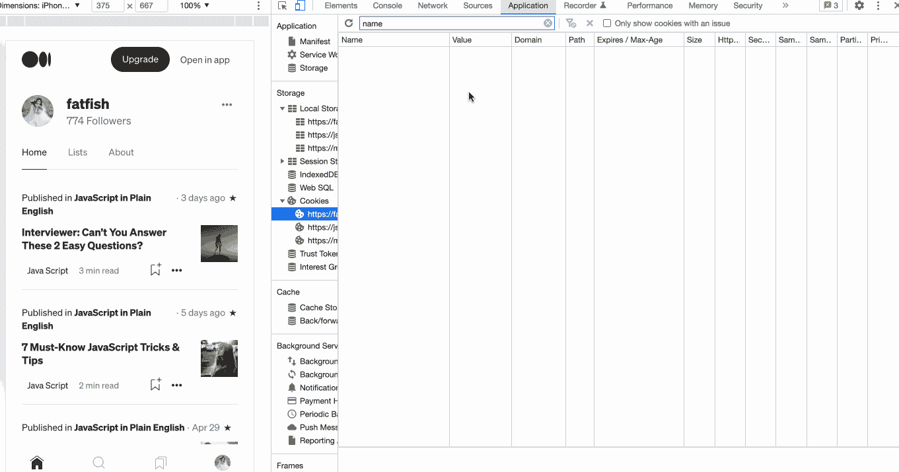
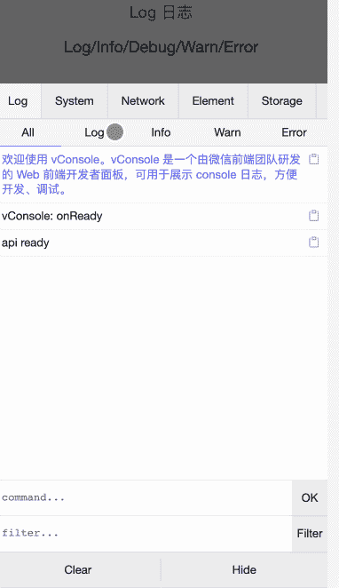

# 5 个 JavaScript 实用程序库来提高您的效率

> 原文：<https://javascript.plainenglish.io/5-javascript-utility-libraries-to-improve-your-efficiency-4380b1d373c5?source=collection_archive---------2----------------------->

## 99%的人可能不知道的 5 个实用程序库！

# 前言

作为一名前端开发人员，我通过这些 JavaScript 库大大提高了自己的效率，比如格式化日期、处理 URL 参数、调试移动网页等。朋友们，我想和你们分享。

# 1.使用“Day.js”来格式化日期和时间

[链接](https://day.js.org/en/)

作为一名开发人员，我受够了在 JavaScript 中操纵日期和时间，因为这太麻烦了。

例如，当我们想要打印当前的日期和时间时，我们需要编写一大段代码来完成。

幸运的是，使用`Day.js`只用一行代码就可以完成。

> [***注:***](https://day.js.org/en/)*“day . js 是一个极简主义的 JavaScript 库，它用一个很大程度上兼容 Moment.js 的 API 为现代浏览器解析、验证、操作和显示日期和时间。如果你用 Moment.js，你就已经知道怎么用 Day.js 了”.*

# 2.使用“qs.js”格式化 URL 参数

[链接](https://github.com/ljharb/qs)

经常需要获取“URL”这个参数吗？也许你会写一个这样的函数。

很好，但是现在您有一个新的函数要实现。请给“[https://medium.com](https://medium.com)增加姓名和年龄两个参数

# 3.使用“js-cookie.js”来读写 cookie

[链接](https://github.com/js-cookie/js-cookie)

我们都知道在 JavaScript 中操作 cookie 不是一件简单的事情，为了提高你的工作效率，我强烈推荐' js-cookie.js '，这是一个简单、轻量级的处理 cookie 的 JavaScript API。

# 4.为什么是洛达什？

[链接](https://github.com/lodash/lodash)

下面我们来看看 [Lodash](https://github.com/lodash/lodash) 的介绍:

Lodash 通过消除处理数组、数字、对象、字符串等的麻烦，使 JavaScript 变得更加简单。Lodash 的模块化方法非常适合:

1.  迭代数组、对象和字符串
2.  操纵和测试值
3.  创建复合函数

# 5.使用“Vconsole”调试移动终端上的网页

[链接](https://github.com/Tencent/vConsole)

在移动设备上调试网页非常困难，但有了“Vconsole”一切都会变得容易得多。我们可以通过扫描这个二维码或者点击[网址](http://wechatfe.github.io/vconsole/demo.html)来体验它的功能。

> [*提示*](https://github.com/Tencent/vConsole) *:类似于 chrome 浏览器的 devtools，Vconsole 提供了以下功能来帮助你更好的调试网页*

1.  日志:console.log|info|error|…
2.  网络:XMLHttpRequest，Fetch，sendBeacon
3.  元素:HTML 元素树
4.  存储:Cookies、本地存储、会话存储
5.  手动执行 JS 命令
6.  自定义插件

# 最后

**感谢阅读。**期待期待您的关注和阅读更多高质量的文章。

 [## 面试官:可以“x！== x "在 JavaScript 中返回 True？

### 你可能不知道的五个神奇的 JavaScript 知识点！

javascript.plainenglish.io](/interviewer-can-x-x-return-true-in-javascript-7e1d1fa7b5cd)  [## 123['toString']。length + 123)用 JavaScript 打印出来？

### 95%的前端开发者回答错误的问题。

javascript.plainenglish.io](/what-does-123-tostring-length-123-print-out-in-javascript-2c804a414325)  [## 面试官:你工作 3 年了，这种算法题你都不会答？

### 一个女生的面试经历

javascript.plainenglish.io](/interviewer-you-have-been-working-for-3-years-and-you-cant-answer-this-algorithm-question-5f79cba18e06)  [## 我老板:你知道 ES6，为什么不用？😠

### 老板的 10 条抱怨让我受益匪浅。

javascript.plainenglish.io](/my-boss-you-know-es6-but-why-dont-you-use-it-5e0316f14c67) 

*更多内容看* [***说白了。报名参加我们的***](https://plainenglish.io/) **[***免费周报***](http://newsletter.plainenglish.io/) *。关注我们关于*[***Twitter***](https://twitter.com/inPlainEngHQ)*和*[***LinkedIn***](https://www.linkedin.com/company/inplainenglish/)*。加入我们的* [***社区不和谐***](https://discord.gg/GtDtUAvyhW) *。***