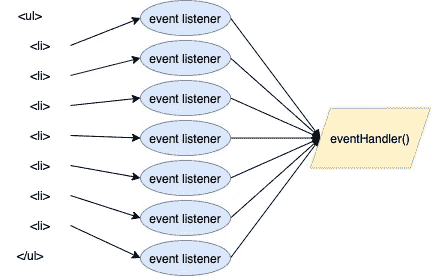
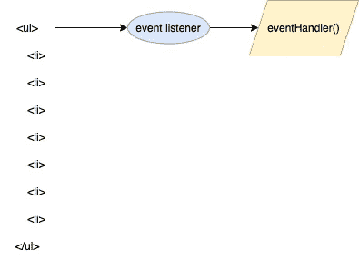

# 业余前端开发人员会犯的 5 个错误

> 原文：<https://javascript.plainenglish.io/5-mistakes-that-an-amateur-frontend-developer-would-make-8a0ef4ad059?source=collection_archive---------4----------------------->

## 你还在犯这些错误吗？


Photo by [Christin Hume](https://unsplash.com/@christinhumephoto?utm_source=medium&utm_medium=referral) on [Unsplash](https://unsplash.com?utm_source=medium&utm_medium=referral)

# 1.一致性

一致性是开发中很常见的问题。每个人都有自己的偏好。如果公司没有一个**代码风格**，我相信开发人员可能每天都会陷入争论。为什么**帕斯卡塞**？为什么**烤肉串案**？为什么**蛇 _ 案**？为什么会这样？为什么会这样？代码将变得很难阅读。

下面是我喜欢的命名惯例:

*   **变量和函数名的驼峰**。例:`let firstName = "Oyster"`
*   使用`is`和`has`进行布尔运算。例如:isDark、isBlur、isDirty、hasFooter 等。
*   当一个函数返回某些东西时，总是以 **get** 为前缀。例如:getFullName()，getImages()
*   **UPPER_SNAKE_CASE** 为常量或不可变对象。例如:API_URL，时区
*   为事件处理程序在函数前加上`handle`或`on`(选择其中之一)。例如:handleFormSubmitted，onFormSubmitted
*   给只在同一个文件中使用的私有函数或私有变量加上前缀`_`。例如:fooBar，_prefix

# 2.冗余码

我见过许多由不同开发人员编写的冗余代码，不管他们的资历如何

例如:

```
// bad
const getFullName = (firstName, lastName) => {
  let fullName = `${firstName} ${lastName}`
  return fullName;
}// good
const getFullName = (firstName, lastName) => {
  return `${firstName} ${lastName}`;
}
```

问题:为什么声明一个额外的变量，除了 return 之外不使用它？

```
// bad
const isMoreThanFourty = foo > 40 ? true : false;
// bad
const isMoreThanFourty = foo < 40 ? false : true;
// good
const isMoreThanFourty = foo > 40;// bad
if (value === true) {}
// good
if (value) {}
```

比较运算符将返回带有`true`或`false`的布尔值。这意味着手动返回`true`或`false`没有意义。

# 3.重复代码

有一个编程原理叫**干**(不重复)。当你从一个地方复制粘贴到另一个地方，这意味着你在复制代码。

然而，开发人员在编写干代码时可能很容易违背另一个叫做 **YAGNI** (你不需要它)的原则。你不应该写你认为将来可能需要的东西。与将来删除逻辑相比，添加逻辑更容易。你认为你需要的逻辑通常会以不同的方式结束。是的，逻辑可能稍微有点团队想要的，但不完全是，最终，您仍然需要花费精力来修改它。“要聪明，不要自作聪明”

# 4.导入整个库

不惜一切代价避免导入整个库！这将增加包的大小。我就以洛达什为例。不要`import _ from "lodash"`。这将使您的包大小增加 500kb 以上。

您应该导入您需要的唯一函数。例如`import isEmpty from "lodash/isEmpty"`，你的捆绑者将[摇树](https://developer.mozilla.org/en-US/docs/Glossary/Tree_shaking)它。

# 5.使用单个事件侦听器而不是事件委托

事件委托可以简化代码，节省内存，不需要添加多个事件处理程序，添加或移除 DOM 元素时，不需要添加/移除处理程序。



Individual event listener

上图显示每个`li`都有自己的事件监听器，不同的事件监听器监听同一个处理程序。这将导致高内存消耗。然而，这是可以重构的。



Event Delegation

与单个事件侦听器相比，事件委托获得了更好的性能，因为它只有一个事件侦听器。

正如我们所知，JavaScript 在 DOM 树的层次结构中有一个冒泡(传播)的事件。当你点击`li`元素时，最终`ul`会收到`click`的事件。

# 参考资料:

*   [JavaScript 中的事件委托](https://betterprogramming.pub/event-delegation-in-javascript-boost-your-app-performance-5f10f25cec96)
*   [在 Javascript 中比较委托事件监听器和单个事件监听器的内存消耗](https://dev.to/mohamadharith/comparing-memory-consumption-of-delegated-event-listeners-and-individual-event-listeners-in-javascript-1l3e)
*   [每个开发人员都应该知道的 10 个 JavaScript 命名约定](https://www.syncfusion.com/blogs/post/10-javascript-naming-conventions-every-developer-should-know.aspx)

*更多内容请看* [***说白了。报名参加我们的***](http://plainenglish.io/) **[***免费周报***](http://newsletter.plainenglish.io/) *。在我们的* [***社区不和谐***](https://discord.gg/GtDtUAvyhW) *获得独家获取写作机会和建议。***