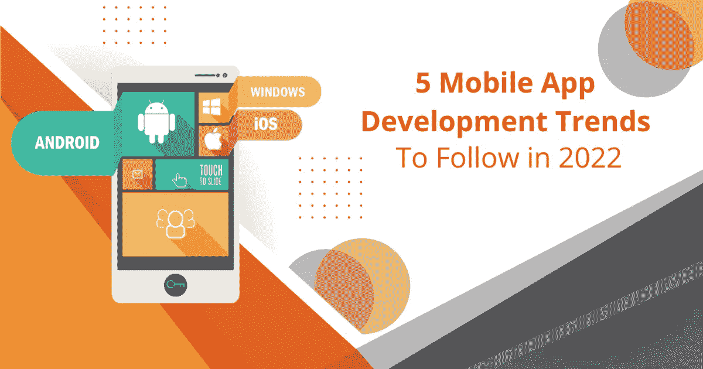

# 2022 年将遵循的 5 个移动应用开发趋势

> 原文：<https://javascript.plainenglish.io/5-mobile-app-development-trends-to-follow-in-2022-6379082899d7?source=collection_archive---------12----------------------->

移动应用市场的格局在 2022 年发生了前所未有的变化和加速。新冠肺炎疫情的综合效应，以及关于元宇宙、区块链和其他最新技术的广泛热议，已经规定了所有最好的 [**移动应用程序开发公司**](https://www.digitalradium.com/mobile-app-development-stlouis/?utm_source=medium&utm_medium=blog&utm_campaign=vanisri) 随机应变、适应并保持相关性。

在移动设备上花费的时间中，超过 90%是花在移动应用程序上，对于企业来说，利用这一点并挖掘潜在客户非常重要。

技术的发展每年都越来越快。紧跟这些趋势可以帮助您获得更多客户，更好地服务现有客户，并发展您的业务。找出客户的痛点，并利用最新技术解决它们。在 2022 年剩下的时间里，有几个趋势需要记住和赶上。

# 超级应用:

在过去的几年里，你可能已经注意到许多基于应用程序的公司已经开始使他们的应用程序的使用多样化。脸书推出了人们可以买卖东西的市场，亚马逊推出了人们可以支付任何东西的支付网关，这些都是大型企业如何多元化成为超级应用的一些例子。

超级应用的热潮始于亚洲，微信等应用提供的不仅仅是给朋友发消息。“一个应用用于一个目的”的趋势正在改变，公司正在发展并努力成为“一个应用用于所有目的”。

如果您正处于移动应用程序开发的早期阶段，考虑与您的应用程序可以解决的垂直领域相关的不同问题是很重要的。这样，您的应用程序和业务从一开始就可以多样化。

# 企业移动性:

新冠肺炎疫情的后果，云计算解决方案的廉价可用性，推动了我们工作方式的巨大变化，并使员工要求良好的工作生活平衡。

在人们所谓的“伟大的辞职时期”，企业提供使用个人设备在家工作的选择是很重要的。许多雇主正在重新定义他们的招聘方式和工作环境。移动工作人员还报告了更灵活的工作方式以及更高的工作效率和员工满意度。所有这些只有通过集成企业移动应用程序才有可能实现，这些应用程序旨在提高生产力和工作协作。因此，如果您的组织正面临新冠肺炎疫情的后果，那么是时候考虑将企业应用程序集成到您的工作流中了。

# 5G:

5G 已经上市一段时间了。但是，它最近成为了一个流行词，因为这些天发布的大多数移动设备都支持 5G 技术。5G 据说比 4G 快一百倍，延迟接近零，连接密度高。

这对移动 app 开发意味着什么？5G as 技术有望通过为 AR/VR 集成应用、互联物联网设备等高级应用提供支持，彻底改变移动应用市场。

5G 将使移动应用的体验更加流畅。他们还将支持创新，所有那些看起来有点不可能的想法都将通过这项最新技术变得可行。

# 可折叠设备的应用程序:

还记得每个人都拥有一辆摩托罗拉 RAZR 的时代吗？那是那个时代，对吗？移动电话行业发展至今，已经走过了漫长的道路。但是，当我们突然认为这个行业正在走向全屏和无按钮模式时，公司回顾了历史，带回了可折叠设备。

只有一件事改变了。这次屏幕尺寸更大了。通过可折叠设备，我们可以在同一台设备上同时拥有智能手机和平板电脑。这导致移动应用程序开发人员在功能方面提供兼容性，并关注两种屏幕尺寸。

可折叠设备行业预计将会增长，开发与这些设备兼容的应用程序的公司将会利用这一市场。

# 区块链:

区块链和元宇宙、加密货币、NFT 等一起是十年来的流行语。区块链一词是随着加密货币的兴起而出现的。然而，区块链的技术发现了更多的应用，而不仅仅是加密。

分散的应用程序让用户对他们的数据有更多的控制权，这有助于提高安全性。例如，有超过 7000 万个区块链钱包可以在没有安全威胁的情况下存储您的加密货币。

在 2022 年及以后，区块链即服务将会兴起，该技术将普遍用于不同的应用程序，其唯一目的是提高数据完整性和安全性。

# 最后

谷歌 Play 商店和 App Store 上有超过 600 万个应用程序。在这个嘈杂的环境中，您需要的只是一个保持相关性并使用最新技术的应用程序。

你的应用程序停止发展的那一天，就是你不再是热门品牌的那一天。移动应用开发公司应该不断更新自己，跟上最新的趋势。如果你有一个申请的想法或者一个商业的想法，一定要联系那些保持更新的机构，让他们随时给你最新的消息。

*更多内容请看*[***plain English . io***](https://plainenglish.io/)*。报名参加我们的* [***免费周报***](http://newsletter.plainenglish.io/) *。关注我们关于*[***Twitter***](https://twitter.com/inPlainEngHQ)*和*[***LinkedIn***](https://www.linkedin.com/company/inplainenglish/)*。查看我们的* [***社区不和谐***](https://discord.gg/GtDtUAvyhW)**加入我们的**[***人才集体***](https://inplainenglish.pallet.com/talent/welcome) *。***