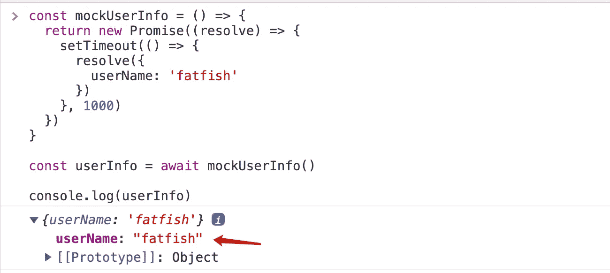

# 您应该知道的 ES2022 最令人兴奋的 5 个特性

> 原文：<https://javascript.plainenglish.io/5-most-exciting-es2022-features-you-should-know-about-f7a4d8ed78cb?source=collection_archive---------0----------------------->

## 我希望我能早点认识他们。

Photo by [Andriyko Podilnyk](https://unsplash.com/@andriyko?utm_source=medium&utm_medium=referral) on [Unsplash](https://unsplash.com?utm_source=medium&utm_medium=referral)

ECMAScript 2022 已经发布了 2 个多月了，它给我们带来了很多令人兴奋的新特性(如果你用过的话就知道了)。

这些新特性很棒，有些可以优化我们的代码，有些可以提高编码质量。朋友们，你们还在等什么？我们来看看吧！

# 1.".数组的 at()"方法

如何读取数组的尾部元素？是的，我们需要用“array.length — 1”作为下标来读取。

**还有别的办法吗？**

ES2022 提供了一个名为`at`的数组方法，这可能是一个很小的改变，但是可以大大提高代码的可读性。

`at`方法可以接受正数或负数，这将决定它是从数组的头部还是尾部开始读取元素。

# 2.顶级等待

朋友们，你们喜欢使用`await`吗？我真的很喜欢它，因为它让我觉得编写异步代码更加优雅和直观。

`await`是一个很棒的机制，过去它只能被包裹在`async`功能中。随着 ES2022 的发布，我们还可以在`async`功能之外使用它。

这个功能太棒了，让我们可以做很多过去做不到的事情。

1.  **动态加载模块**

**2。初始化数据库**

**3。有条件渲染模块**

# 3.Object.hasOwn

我们经常需要知道一个属性是否存在于一个对象上，并使用“in”操作符或“obj.hasOwnProperty”来这样做。但两者都有一些瑕疵，我们来看看。

**“中”符**

如果指定的属性在指定的对象或其原型链中，in 操作符返回`true`。

obj.hasOwnProperty

`hasOwnProperty`方法返回一个布尔值，表明对象是否将指定的属性作为自己的属性(相对于继承它)。

**使用与上面**相同的例子

也许`"obj.hasOwnProperty"`已经可以过滤掉原型链上的属性，但是在某些情况下，并不安全，会导致程序失败。

**Object.hasOwn**

不用担心，我们可以用“Object.hasOwn”来规避这两个问题，比“obj.hasOwnProperty”方法更方便，也更安全。

# 4.私有插槽和方法

过去，我们使用`"_"`来表示私有属性，但它并不安全，仍可能被外部修改。

**我们可以使用“#”来实现真正安全的私有属性**

# 5.错误原因

在 ES2022 规范中，`new Error()`可以指定其错误的原因。

有时，代码块的错误需要根据它们的原因进行不同的处理，但是错误的原因相对来说是相似的，所以能够给它们分配一个错误名称是非常好的。

# 最后

**感谢阅读。**我期待着您的关注和阅读更多高质量的文章。

 [## “我失去了一个工作机会，只是因为承诺。所有”

### 一次让我好难过的面试经历。

javascript.plainenglish.io](/i-lost-a-job-opportunity-just-because-of-promise-all-be396f6efe87)  [## 采访者:“npm 跑 xxx”怎么了？

### 一个大多数人都不知道的秘密。

javascript.plainenglish.io](/interviewer-what-happened-to-npm-run-xxx-cdcb37dbaf44)  [## 面试官:可以“x！== x "在 JavaScript 中返回 True？

### 你可能不知道的五个神奇的 JavaScript 知识点！

javascript.plainenglish.io](/interviewer-can-x-x-return-true-in-javascript-7e1d1fa7b5cd)  [## 现在是 2022 年，不要再滥用箭头功能了

### 不应该使用箭头函数的 4 种情况。

javascript.plainenglish.io](/its-2022-don-t-abuse-the-arrow-function-anymore-905862a9c668) 

*更多内容看* [***说白了。报名参加我们的***](https://plainenglish.io/) **[***免费周报***](http://newsletter.plainenglish.io/) *。关注我们关于* [***推特***](https://twitter.com/inPlainEngHQ) ， [***领英***](https://www.linkedin.com/company/inplainenglish/) ***，***[***YouTube***](https://www.youtube.com/channel/UCtipWUghju290NWcn8jhyAw)***，以及****[***不和***](https://discord.gg/GtDtUAvyhW)*** *对成长黑客感兴趣？检查出* [***电路***](https://circuit.ooo/) ***。***