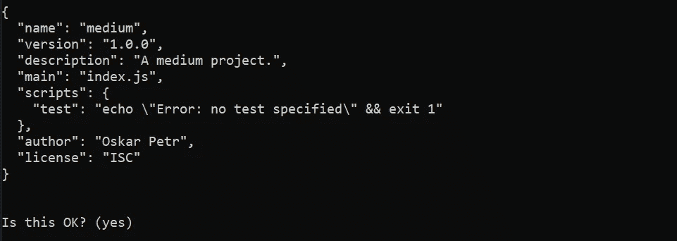

# Node.js 开发中最有用的 5 个 NPM CLI 命令

> 原文：<https://javascript.plainenglish.io/5-most-useful-npm-cli-commands-for-node-js-development-c4e7684187a?source=collection_archive---------12----------------------->

## 节点。射流研究…

## 如何在项目的命令行中使用 Node.js 相关的 CLI 命令。

Photo by [Lautaro Andreani](https://unsplash.com/@lautaroandreani?utm_source=medium&utm_medium=referral) on [Unsplash](https://unsplash.com?utm_source=medium&utm_medium=referral)

了解一些 Node.js CLI 命令对于 web 开发至关重要，因为没有它们就无法完成项目初始化和包安装。所以，这里列出了其中最有用的。

但是首先，我们在哪里安装 Node.js 系统——在他们的官网上你可以下载最新版本或者他们推荐的版本，[这里](https://nodejs.org/en/)。

## npm

该命令是其中最基本的命令，仅带有命令的根，`npm`将显示一个列表，列出您可以在该应用程序中调用的所有可能的命令，以及它们的用法。

npm command

## npm 初始化

该命令是一个节点。JS 项目初始化器，触发创建一个项目的动作。当我们发送这个命令时，系统将引导我们完成向项目添加信息的过程。

npm init

在询问之后，系统将询问我们从我们的答案中生成的 JSON 是否是我们想要的。

npm init

如果输入`y`或按`enter`，系统将在该目录下生成一个`package.json`文件，其中包含之前指定的 JSON 信息。

此外，有一个标志可以跳过询问过程，获取所有占位符值(对于项目名称，获取目录名称……)并立即创建文件— `npm init **-y**`。

## npm 运行