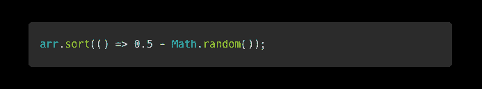
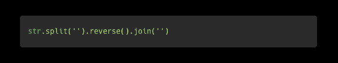
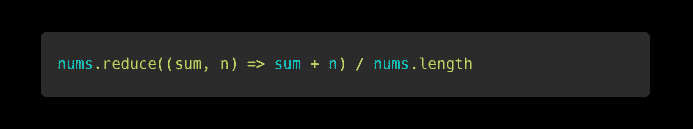
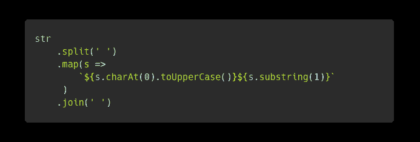
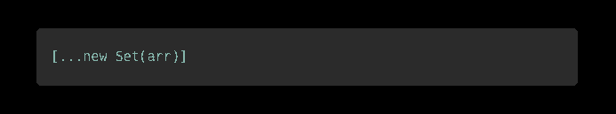

# 每个 JavaScript 开发人员都应该知道的 5 个一行程序

> 原文：<https://javascript.plainenglish.io/5-one-liners-every-javascript-developer-should-know-5e37c42b99cf?source=collection_archive---------11----------------------->

## 少即是多，少即是好。更少的代码更容易维护，更容易读/写。利用这 5 个 JavaScript 一行程序来改进您的代码。

这篇文章有点短，但是直截了当，切中要害。这里是每个 JavaScript 开发人员都必须知道的 5 个一行程序。我还包括每个解决方案的简要说明。尽情享受吧！👍

# 1.打乱数组

您可以使用内置的`Array.prototype.sort`函数随机洗牌:

*   `sort`函数采用比较函数
*   `0.5`减去任何小于`0.5`的数都大于`0`；将在下一个值之前对当前值进行排序
*   `0.5`减去任何大于`0.5`的数小于`0`；将当前值排在下一个值之后
*   这可以进行任意次，以便更好地洗牌

# 2.反转一根绳子

*   `split`函数在指定的分隔符(本例中是每个字符)处分割一个字符串，并返回一个数组
*   `reverse`功能将反转数组
*   `join`函数使用指定的分隔符(本例中没有分隔符)连接数组中所有元素的字符串

# 3.一组数字的平均值

*   reduce 函数采用接受累加器(`sum`)和当前值(`n`)的参数函数。
*   reduce 函数返回累加值(总和)
*   然后我们将总和除以列表中元素的数量(`nums.length`)

# 4.将字符串中的每个单词大写

这一行从技术上来说是一行，但是我把它分成了多行，以便于阅读。

*   首先用空格分割字符串(得到每个单词)
*   `map`函数对数组中的每个元素执行一个函数，并使用返回值生成一个新的数组
*   我们将每个单词的第一个字符大写，然后将单词的其余部分连接起来
*   然后，我们用空格分隔符连接数组的每个元素(每个单词)

# 5.从数组中删除重复的值

*   首先将数组转换成一个`Set`(集合不允许重复值)
*   然后使用数组扩展运算符将所有值扩展到一个数组中

我希望你喜欢这 5 句俏皮话。希望它们对你的项目有用。

编码快乐！👨‍💻👍

*更多内容请看*[***plain English . io***](https://plainenglish.io/)*。报名参加我们的* [***免费周报***](http://newsletter.plainenglish.io/) *。关注我们关于*[***Twitter***](https://twitter.com/inPlainEngHQ)*和*[***LinkedIn***](https://www.linkedin.com/company/inplainenglish/)*。查看我们的* [***社区不和谐***](https://discord.gg/GtDtUAvyhW) *加入我们的* [***人才集体***](https://inplainenglish.pallet.com/talent/welcome) *。*