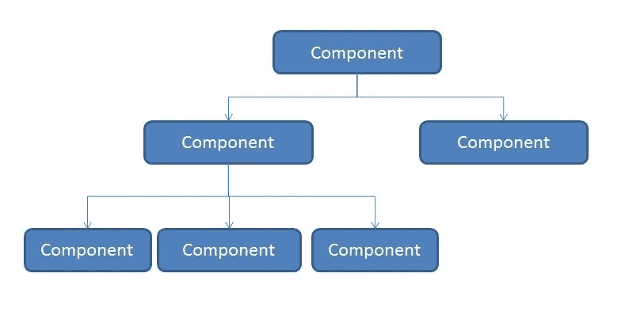

# 开始编写干净代码的 5 个实用技巧

> 原文：<https://javascript.plainenglish.io/5-practical-tips-to-start-writing-clean-code-32954f260238?source=collection_archive---------8----------------------->

## 请记住这些建议！


Photo by [No Revisions](https://unsplash.com/@norevisions?utm_source=medium&utm_medium=referral) on [Unsplash](https://unsplash.com?utm_source=medium&utm_medium=referral)

我认识的所有程序员都喜欢写代码和检查输出。

只有当你坚持不懈地编写代码时，你才能改进并提出更好的、统一的创建项目的方法。

我从事编码工作已经 4 年了，随着时间的推移，我不仅涉猎了来自完全不同领域的各种技术，而且我的代码也有了显著的改进。

如果我从一开始就知道这些做法，我可能会节省很多时间和麻烦。

在这篇博客中，我将尝试提供一个简要的概述，并将我的学习和发现浓缩为 5 点:

## 1.组织比你想象的更重要。



[Source](https://jonvadillo.com/nested-react-components/).

保持你的代码整洁有序。当你的代码整洁有序时，阅读和理解就容易多了。这也使得查找和修复错误变得更加容易。

> 程序应该是写给人们阅读的，只是顺便给机器执行的
> 
> *—艾贝尔森和苏斯曼*

你的代码组织对于运行它的机器来说并不重要，但是对于你和每一个为这个项目做贡献的开发人员来说，它意味着整个世界。

根据应用程序的大小，不要在每个文件夹中都有随机的帮助文件，而是为这些文件创建一个单独的文件夹，并将它们都放在一个地方。

不要有一些大组件，要有多个小组件。

组织项目本身就是一件顶级的事情，你可以阅读[康斯坦丁·明斯特关于这个话题的](https://medium.com/u/8f0f16947df9?source=post_page-----32954f260238--------------------------------) [博客。](https://konstantinmuenster.medium.com/how-to-plan-and-organize-a-react-project-by-building-a-weather-app-95175b11bd01)

## 2.变量命名需要有意义，不只是对你有意义。

单个组件拥有多达 5 个(或更多)并不罕见！)变量。

每个变量都有一个用途，这个用途应该反映在它的命名中。

```
let person;
let profile;
```

上面两个变量声明的目的非常模糊，很难猜测。

```
let isPerson;
let profilePicture;
```

现在突然之间，变量开始变得有意义了！

您可以使用 camel 大小写或下划线约定来命名变量，但是要确保名称是可读的，而不是字母的随机组合。

用合理的变量名重新访问代码可以使调试和维护项目变得容易得多。

## 3.注释很重要，但并不是每一行都需要注释。

我也为没有添加评论而感到内疚，但原因是不同的。

我去年开始了项目，对于最初的几个文件，我会努力添加评论，但热情很快就会消失。

但是最近我一直在为重要或复杂的逻辑添加注释，我意识到并不是每个文件或行都需要注释。

代码需要通过有意义的变量名(和文件名)和更小的函数的组合来自我解释。

下面是一些注释非常重要的情况:

1.  解释我们逻辑的边缘情况或例外。
2.  添加指向资源的链接，例如指向解释复杂代码或问题的 Stack Overflow 或 GitHub 存储库的链接。
3.  提供警告。
4.  解释为什么这段代码很重要或者它的用途

***如果你喜欢这篇文章并觉得它很有帮助，考虑使用*** [***我的推荐链接***](https://medium.com/@anuragkanoria/membership) ***，这样你就可以无限制地访问我的博客以及其他作者的博客，只需点击*** [***这里***](https://medium.com/@anuragkanoria/membership) ***。***

## 4.缩进和空白不受重视。

如果使用得当，空白可以改变游戏规则。

如果您是 Python 开发人员，您应该已经知道缩进有多重要。

刚刚注意到这篇文章。

我故意把我的句子隔开，这样你更容易阅读这篇文章，而不会感到杂乱。每一段都传达了一个目的，然后是一个空行。

```
function* generator() {
  yield 1;
  yield 2;
  yield 3;
}

const gen = generator(); // "Generator { }"

console.log(gen.next().value); // 1
console.log(gen.next().value); // 2
console.log(gen.next().value); // 3
```

仔细观察上面的代码片段，注意缩进和空白的正确组合如何创建了一段可读的代码。

您可以看到缩进有助于我们识别函数中的行，空白有助于分隔函数、声明和控制台日志。

## 5.尽可能避免嵌套。

嵌套会破坏您的代码。说真的。

嵌套导致了很多混乱，这导致了更多的错误。嵌套代码很难理解，会让你的眼睛更加疲劳。

大多数情况下，嵌套代码是由条件语句引起的。

```
if(...)
  if(...)
    if(...){
    }else if(true)
      else if(...)
        if(...)
        else{}
```

你可以看到这看起来有多奇怪和困惑。

既然条件句很重要，如何避免呢？

简单——更好地掌握这门语言。

一个更简单的替代方法是使用`switch`而不是`if-else`。

但是对于更复杂的操作，使用 lambda 函数，以及像`reduce`、`filter`、&、`map`这样的函数可以大大简化代码，同时增强可读性。

我不打算深究这个问题，因为这个问题已经困扰开发世界几十年了，已经被讨论过无数次了。*不过，我确实推荐阅读* [*这篇*](https://thepythoncorner.com/posts/2017-12-04-the-art-of-avoiding-nested-code/) *的博客来进一步了解。*

## 最后的想法…

新技术不断涌现，拥有新想法和前沿技术知识的年轻人也是如此，但这种体验将不断让你脱颖而出。

这个世界重视专家，如果你是整个部门中编写最干净的 React 或 C 代码的开发人员，你只能想象你对公司的重要性。

但它不仅对你的企业成功至关重要。

> 对于一个程序员来说，写可读的代码应该和给画家画更好的画一样重要。

一段运行良好但你或你的同事似乎可以修改甚至理解的代码有什么好处呢？

我希望你能从这篇博客中学到一些东西，如果你想在这个领域了解更多，可以看看我最近写的关于重要反应钩子的博客。

[](/7-important-react-hooks-no-course-will-tell-you-about-64dd9a68de34) [## 没有课程会告诉你的 7 个重要反应

### #3 是游戏规则的改变者。

javascript.plainenglish.io](/7-important-react-hooks-no-course-will-tell-you-about-64dd9a68de34) 

*更多内容请看*[***plain English . io***](https://plainenglish.io/)*。报名参加我们的**[***免费周报***](http://newsletter.plainenglish.io/) *。关注我们关于* [***推特***](https://twitter.com/inPlainEngHQ)**和*[***LinkedIn***](https://www.linkedin.com/company/inplainenglish/)*。查看我们的* [***社区不和谐***](https://discord.gg/GtDtUAvyhW) *加入我们的* [***人才集体***](https://inplainenglish.pallet.com/talent/welcome) *。***