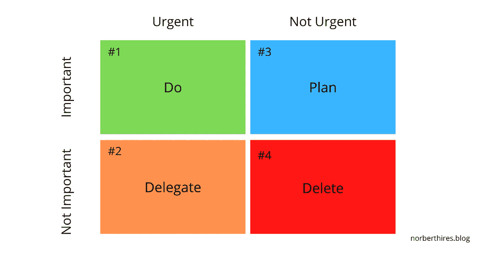

# Web 开发人员保持领先的 5 个生产力技巧

> 原文：<https://javascript.plainenglish.io/5-productivity-tips-for-web-developers-to-stay-ahead-of-the-game-and-increase-your-efficiency-5d545655338c?source=collection_archive---------15----------------------->

## 这 5 个技巧将使你成为一个更有效率的网站开发者。

# 1.休息一下

作为一名开发人员，提高生产力的最重要的事情就是休息。

你应该每一个半小时至少休息 10 分钟。

最好的方法是，每工作 45 分钟，在手机或电脑上设置一个闹钟，然后起床，理清思绪，拉伸 10 分钟。

这将有助于你专注于手头的任务，并且更有效率，因为你不会在同一个位置停留太久。

Pun obviously intended

# 2.找到最适合你的

作为一名程序员，有许多不同的方法来管理你的时间。

一些程序员喜欢在小块时间内工作，而另一些人则喜欢“要么全部要么全无”的方法。

一些程序员对他们的项目工作有严格的时间表，而其他人喜欢在有精力和动力的时候工作。

关键是找到最适合你的方法，同时记住我们清单上的第一条是很重要的😉。

# 3.利用常规

编程是一个非常耗时且要求很高的领域。在短时间内产生高质量的代码并不容易。程序员每天都需要做很多事情，比如写代码，测试代码，调试代码。

提高编程效率的第一步是开发例程。常规应该是具体的和可测量的。

例如，您可以创建例程来定义固定的工作周期，以交付集中且有用的工作。这是我最近开始做的事情，早上第一件事就是接受最具挑战性的任务，而把轻松的工作留到下午，这大大提高了我每天交付的有用工作的数量。

你也应该把你的日常事务分成更小的块，这样它们更容易实现，并且在一天或一周结束时衡量你已经做了什么。

# 4.利用技术保持组织有序

程序员的工作是创建应用程序和软件。这不是一项容易的任务。这需要大量的创造力、时间和努力。但是有一些工具可以帮助程序员保持条理，专注于他们的工作。

文本扩展软件是程序员最常用的组织工具之一。它允许他们在文本文件中键入短语或句子，当他们需要在项目中再次使用它们时，将它们扩展为完整的句子或段落。

程序员还有其他组织工具:

*   项目管理软件例如 [Asana](https://asana.com/) 和【monday.com T3
*   时间管理软件，例如 [Clockify](https://clockify.me/) 和 [Toggl](https://toggl.com/)
*   任务管理软件例如 [Trello](https://trello.com/) 和 [ClickUp](https://clickup.com/])

# 5.知道什么是重要的，并把它放在首位

你应该根据重要程度来安排工作的优先次序。这意味着你应该从影响最大的任务开始，然后一步一步做不太重要的任务。

这是我非常重视的一个建议，因为它会帮助你确保你不会在无关紧要的任务上浪费时间。例如，如果你正在为一个客户建立一个网站，他们可能更关心他们的网站看起来如何，而不是他们有什么类型的托管计划。

你也应该根据工作的紧急程度来确定工作的优先顺序。这意味着你应该在那些不紧急或不需要马上完成的任务之前完成紧急任务。例如，如果您的网站出现错误，并且有人在联系表单中报告了该错误，那么该任务应该在之前陈述的非紧急任务之前处理。

一个用于实现任务优先级的常用工具，也是一个很好的起点，如果你是一个新概念，是任务优先级矩阵，可以在下面的图片中看到

# 结论

web 开发人员的生活可能是不稳定的，充满了惊喜。遵循这 5 个建议将会使你成为一个更有效率的网站开发者。我希望通过将这些技巧应用到你的工作流程中，你可以在不可预测的 web 开发环境中创建一些结构，并确保你不会筋疲力尽！

你好，感谢你阅读我的博客。我希望你觉得它很有趣，很有启发性。

如果你有兴趣了解更多关于个人发展、商业、金钱和编程的知识，请考虑关注我。我定期发布关于这些主题的有趣而有用的博客帖子，我相信你会发现它们很有帮助，也很有启发性。

*更多内容请看*[***plain English . io***](https://plainenglish.io/)*。报名参加我们的* [***免费周报***](http://newsletter.plainenglish.io/) *。关注我们关于*[***Twitter***](https://twitter.com/inPlainEngHQ)*和*[***LinkedIn***](https://www.linkedin.com/company/inplainenglish/)*。加入我们的* [***社区不和谐***](https://discord.gg/GtDtUAvyhW) *。*