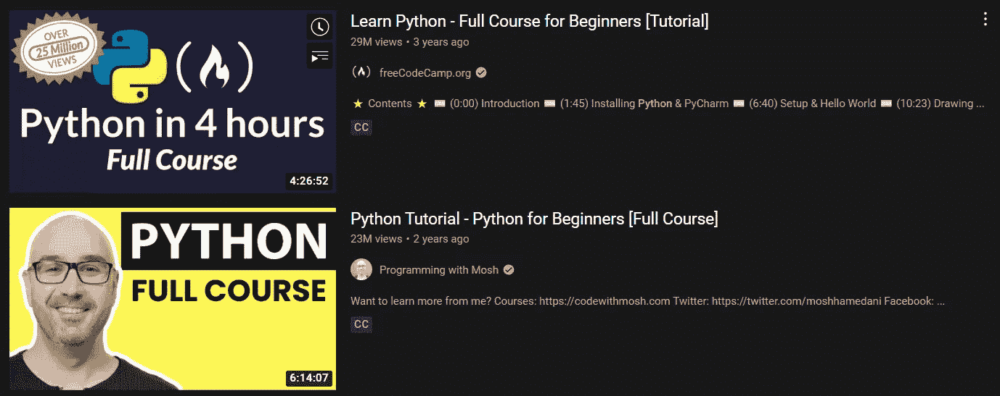

# 检验你作为程序员的进步的 5 个问题

> 原文：<https://javascript.plainenglish.io/5-questions-to-check-your-improvement-as-a-programmer-d15c15146106?source=collection_archive---------14----------------------->

## 一个程序员永远不会停止学习；当我们结束这一年时，检查你的改进和进步。


Source: Photo by [cottonbro](https://www.pexels.com/@cottonbro?utm_content=attributionCopyText&utm_medium=referral&utm_source=pexels) from [Pepels](https://www.pexels.com/photo/woman-looking-at-falling-confetti-3419692/?utm_content=attributionCopyText&utm_medium=referral&utm_source=pexels)

持续学习应该是程序员应该具备的心态之一。新的技术、特性、编程语言和框架每年每月都会出现，程序员必须不断更新自己，添加新的知识和技能来竞争。

在我们即将结束这一年的时候，作为一名程序员，有五个问题需要问自己来检查自己的进步:

# 1)您在编程方面阅读和参考了多少代码项目、书籍、文章和 YouTube 视频？

对许多人来说，软件代码难以阅读或理解。但是对于程序员来说，阅读代码、书籍和文章，向专业人士学习创建可伸缩的、高效的、漂亮的软件解决方案是我们日常工作的一部分。

对于程序员来说，阅读代码是向有经验的程序员学习的绝佳方式。它还可以提供对他们正在工作的程序的更好的理解，给他们一个程序员试图完成的新的视角。

除此之外，编程书籍、文章和 YouTube 提供了对新技术、概念、新方法和编码思想的深刻见解。

例如，阅读一篇优化文章可以让你获得硅谷顶级程序员的相关经验，他们编写了一个服务于数十亿用户的程序。或者像“[干净的代码](https://www.amazon.com/Clean-Code-Handbook-Software-Craftsmanship/dp/0132350882?&linkCode=ll1&tag=eddygte06-20&linkId=6a864429e1c5c7690e9dc42f9fd01d98&language=en_US&ref_=as_li_ss_tl)”和“[务实的程序员](https://www.amazon.com/Pragmatic-Programmer-journey-mastery-Anniversary/dp/0135957052?crid=MN1TXDDJZIGE&keywords=The+Pragmatic+Programmer&qid=1641310173&s=books&sprefix=the+pragmatic+programmer%2Cstripbooks-intl-ship%2C285&sr=1-1&linkCode=ll1&tag=eddygte06-20&linkId=84cd978c1f58f1b1499742e75d2a1475&language=en_US&ref_=as_li_ss_tl)”这样的书，不仅教你如何编程，还教你如何成为一个更好的程序员，更好地思考，分解问题，维护一个更干净的代码库。

# 2)您参加了多少会议、技术聚会、不和谐社区、论坛？


Source: [Matheus Bertelli](https://www.pexels.com/@bertellifotografia?utm_content=attributionCopyText&utm_medium=referral&utm_source=pexels) from [Pexels](https://www.pexels.com/photo/group-of-people-standing-inside-room-2608517/?utm_content=attributionCopyText&utm_medium=referral&utm_source=pexels)

> “如果你想走得快，就一个人走。如果你想走得远，就一起走”——非洲谚语。

程序员可以通过与社区中的其他人接触来了解更多关于他们领域的信息。它可以让他们随时了解行业内外发生的事情。参与还有助于程序员保持积极性，因为他们知道有人支持他们。

另一个好处是程序员对新的机会持开放态度，否则可能无法获得，比如新项目或自由职业的机会可能不会出现。

# 3)你做过几个项目？

只有阅读不会让你走远。当你亲自参与项目时，你会真正学到东西。

```
Length of experience in years = Amount of workload * period of time
```

自由职业者或职业生涯的工作量决定了你的工作经验年限。有些程序员职位只需要你处理软件的一部分，你可以从中学习和体验很多东西，但有些公司可能会同时为你提供三个项目。

是的，可能会很累。但是一旦你完成了所有的项目，回顾你的旅程，你会为你在如此短的时间内取得的巨大成就感到满意和自豪。

即使是个人项目也很重要。在空闲时间创作项目也被认为是一种真实的体验。完成项目，将其推向现场，并让一些用户参与进来。

# 4)你获得了几项认证？

现在对程序员的需求很大，但是竞争也很激烈。为了脱颖而出，程序员需要有证书来验证他们在编程行业的技能和知识。

有不同的证书表明他们精通本职工作。一种类型的认证是 IT 证书，它验证某人在计算机硬件、软件、网络或网页设计方面的技术知识。程序员也可以获得像 Python 或 Ruby on Rails 这样的个人技能证书。他们也可以参加 C++或 Java 之类的编程语言课程来验证他们的技能。他们将学习可能适用于他们工作环境的新技术，以及程序员在用这些语言编程时应该遵循的最佳实践。

程序员证书很重要，因为它很容易展示你的技能，也是获得高薪工作和更多机会的途径。

证书通常在通过测试后颁发，证明个人在学科领域达到了一定的知识水平。该证书向雇主展示了你在工作领域的精通，这将有助于你在其他申请者中脱颖而出。

# 5)你创造了多少帮助他人的内容？



Search result of “Python” in YouTube. Source: [YouTube](https://www.youtube.com/results?search_query=python)

程序员应该创建内容，因为他们知道一个特定的主题，并可以通过使用他们在该主题中的知识和经验使教育内容更有趣。

他们可以利用自己的技能和专业知识来教授他人编程，制作关于如何编码的教学视频，并创建关于他们所知道的内容的博客帖子。这是一个向社区学习并通过向社区成员传授他们在多年编程中学到的知识来回馈社区的机会。

你教得越多，学得越多。在教别人之前，你需要彻底理解某个学科。

# 包扎

程序员就像建造者，而建造者利用他们的知识、技能和工具来建造东西。对技术和技巧感兴趣的人通常知道自己对什么感兴趣，但对工作充满热情的人会知道自己需要学习什么。

*如果你喜欢这篇文章，你可能也会喜欢:*

[](https://medium.com/geekculture/5-reasons-for-code-refactoring-in-a-tech-project-fc9c859bc1de) [## 技术项目中代码重构的 5 个原因

### 满足期限和代码重构之间的两难选择。

medium.com](https://medium.com/geekculture/5-reasons-for-code-refactoring-in-a-tech-project-fc9c859bc1de) 

*更多内容看* [***说白了。报名参加我们的***](http://plainenglish.io/) **[***免费周报***](http://newsletter.plainenglish.io/) *。在我们的* [***社区获得独家访问写作机会和建议***](https://discord.gg/GtDtUAvyhW) *。***