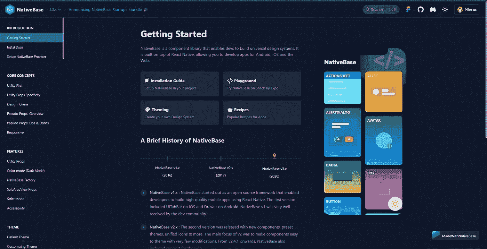
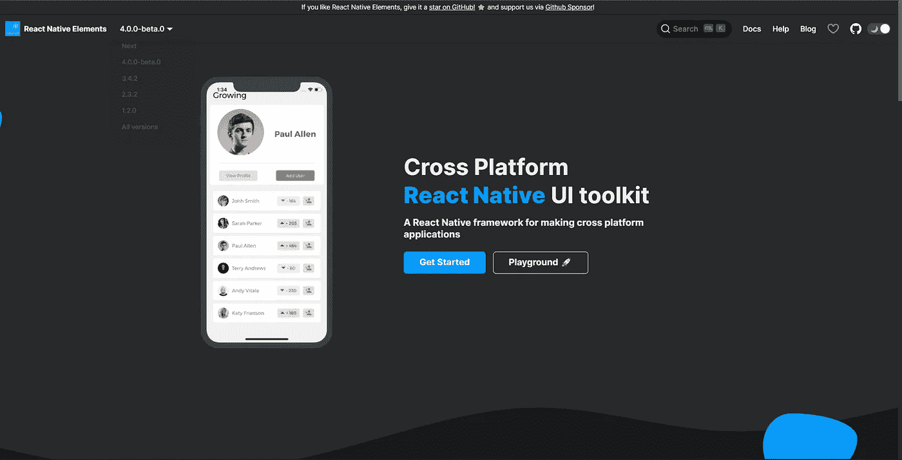
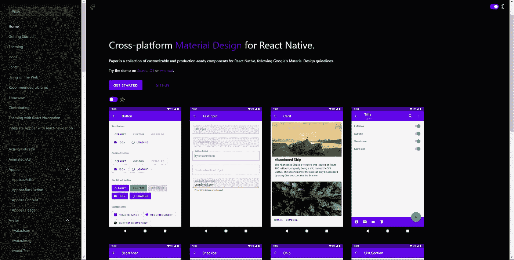
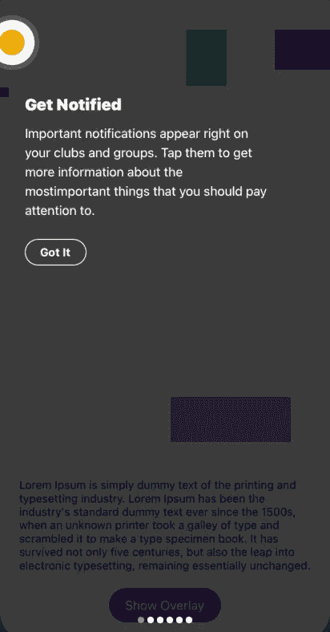
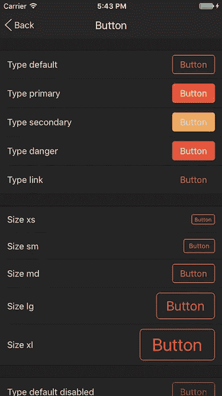

# 5 您需要了解的 React 本地组件/UI 库

> 原文：<https://javascript.plainenglish.io/5-react-native-component-ui-libraries-you-need-to-know-about-214cbc4a5d4d?source=collection_archive---------13----------------------->

## [反应原生](https://bookeraziz.medium.com/list/react-native-3e476cc05fe3)

## 4.反应本机用户界面库

Photo by [Rami Al-zayat](https://unsplash.com/@rami_alzayat?utm_source=medium&utm_medium=referral) on [Unsplash](https://unsplash.com?utm_source=medium&utm_medium=referral)

在本文中，我将向您展示 **5 React 原生组件库**，它将帮助您为下一个 React 原生应用创建更好的 UI。

组件库的好处是允许您用最少的代码快速创建应用程序 UI。如果你想更深入地了解什么是组件库，你可以在这里阅读这篇文章[。](https://bookeraziz.medium.com/5-best-react-component-libraries-b4accc747547)

# 1.本地基地

有超过 30 个组件和主题，有黑暗模式切换，我强烈推荐你为你的下一个 React 原生项目使用[**【Native base】**](https://docs.nativebase.io/getting-started)**。你在 [**NativeBase**](https://docs.nativebase.io/getting-started) 主页链接[这里](https://docs.nativebase.io/getting-started)测试这些组件。**

****

**NativeBase Homepage**

***注意:主页右侧的手机模型是交互式的，您可以在这里测试组件。***

# **2.反应本地元素**

**拥有超过 22000 颗 GitHub 恒星， [**React 原生元素**](https://reactnativeelements.com/) 是最受欢迎的 React 原生组件库之一。**

****

**React Native Elements Homepage**

# **3.反应原生纸**

**[**React Native Paper**](https://callstack.github.io/react-native-paper/)**是一个遵循 Google 材料设计准则的组件库。****

****React Native Paper 拥有数量惊人的高度可定制的组件，如果你想构建一个看起来像谷歌自己构建的应用程序，它是一个很好的组件库。****

********

****React Native Paper Component Homepage****

# ****4.反应本机用户界面库****

****[**React Native UI Lib**](https://wix.github.io/react-native-ui-lib/docs/getting-started/setup)是 Wix 创建的组件库。****

****虽然 React Native UI Lib 拥有许多其他组件库所拥有的东西，如主题，但也有一些独特的组件，你很难在任何其他库中找到。****

****例如，[feature highlight](https://wix.github.io/react-native-ui-lib/docs/components/overlays/FeatureHighlight)[datetime picker](https://wix.github.io/react-native-ui-lib/docs/components/form/DateTimePicker)组件令人印象深刻，它们可以成为自己的库。****

********

****React Native UI lib Feature Component****

# ****5.戏弄者****

****[**Teaset**](https://github.com/rilyu/teaset) 是一个相对简单的组件库，拥有构建一个功能性 React 原生应用所需的所有组件。Teaset 中的组件具有标准的 Android 应用程序外观。****

********

****Example of Teaset Components****

# ****结论****

****感谢您阅读完我的文章**“如何以简单的方式在 React Native 中添加自定义字体”**。如果你有任何问题，请随意提问，我会尽快回答。****

****我希望你有美好的一天。如果你是中级新手，你可以点击这里的[链接](https://bookeraziz.medium.com/membership)加入。****

## ****资源****

1.  ****[**NativeBase**](https://docs.nativebase.io/getting-started)****
2.  ****[**反应原生元素**](https://reactnativeelements.com/)****
3.  ****[**反应原生纸**](https://callstack.github.io/react-native-paper/)****
4.  ****[**React 原生 UI 库**](https://wix.github.io/react-native-ui-lib/docs/getting-started/setup)****
5.  ****[**预告**](https://github.com/rilyu/teaset)****

*****更多内容请看*[***plain English . io***](http://plainenglish.io/)*。报名参加我们的* [***免费每周简讯***](http://newsletter.plainenglish.io/) *。在我们的* [***社区不和谐***](https://discord.gg/GtDtUAvyhW) *中获得独家写作机会和建议。*****