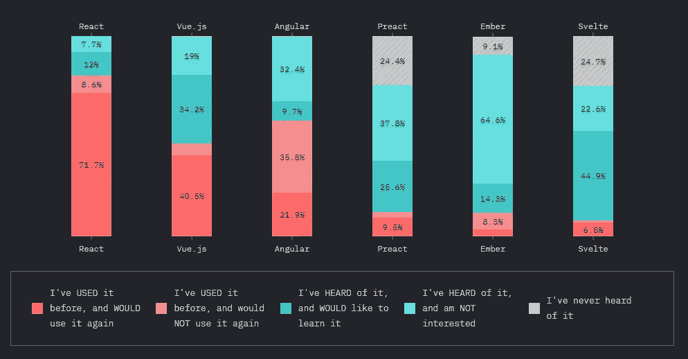

# 使用 React 的 5 个理由(和一些不使用 React 的理由)

> 原文：<https://javascript.plainenglish.io/5-reasons-to-use-react-and-a-few-reasons-not-to-a6f6985a75?source=collection_archive---------23----------------------->

## 有听起来那么大吗？

Photo by [Lautaro Andreani](https://unsplash.com/@lautaroandreani?utm_source=medium&utm_medium=referral) on [Unsplash](https://unsplash.com?utm_source=medium&utm_medium=referral)

React 成立九年以来，其采用率惊人。

它现在被业界重量级人物列为顶级软件开发技术之一。

在所有的关注下，许多团队都面临着不可避免的后续问题:我们应该考虑采用 React 吗？

虽然没有适用于每个开发团队的通用解决方案，但是 React 值得研究的五个主要原因如下。

# 1.出色的灵活性

根据您的需求，React 的灵活性可以带来显著的好处。

它让您选择如何处理路由、测试，甚至文件夹结构。除了环境之外，React 不太固执己见的事实意味着您可以在各种项目中使用它。

你可以用它来构建 web 应用、静态站点、移动应用，甚至是 VR。

React 得到了所有主流浏览器的支持，并将继续得到广泛的支持，因为它与 [Meta](https://about.facebook.com/meta/) (以前的脸书)有关联。

# 2.流畅的开发者体验

因为 React API 不是非常庞大，所以许多开发人员不需要不断地参考文档。

React 允许您为组件声明类或方法，将 HTML 存储在 JavaScript 中。这种风格与 Angular 或 Ember 等竞争对手形成鲜明对比，后者要求开发人员学习一种独特的语法。

其他工具，如 [Create React App](https://github.com/facebook/create-react-app) ，允许开发者根据特定需求定制他们的体验。

# 3.重要的社区支持

Screenshot from [2020.stateofjs.com](http://2020.stateofjs.com)

React 是 GitHub 上最受欢迎的存储库之一，每周下载量超过 1400 万次。

然而，框架体验的质量比 React 开发人员的数量更重要。

根据 [2020 年 JS 民意调查](http://2020.stateofjs.com)，超过 70%使用过 React 的受访者表示他们会再次使用它。

[react flux](https://www.reactiflux.com/)聊天社区为需要帮助的个人提供快速响应。您还可以在 [StackOverflow](http://stackoverflow.com) 中找到您可能面临的几乎任何问题的答案。

# 4.出色的表演

虽然 React 不是最快的可用框架，但它使用虚拟 DOM，与竞争对手相比，它的性能相当好。

它节省了电池和 CPU 功率，同时通过重新渲染屏幕简化了编程方法。

React 最吸引人的特点之一无疑是它的尺寸。重量仅为 32k，是试图减少网站加载时间和数据使用的公司的绝佳选择。

# 5.易测性

因为 React 的许多组件都是纯函数，所以自动化测试消除了模仿或替换的需要。

虽然大多数 UI 测试需要浏览器，但 React 允许您使用 Node 运行单元测试和内存测试。因为它们是纯函数，所以单独测试的单个 React 组件是可信的和确定的。

流行的测试框架有 [Jest](https://jestjs.io/docs/en/tutorial-react) 、 [Mocha](https://mochajs.org/) 、 [Jasmine](https://github.com/tommyh/jasmine-react) 。

Jest 的显著优势在于，它由脸书提供全职支持，并与 Create React App 集成。

# 缺点

与任何新技术一样，评估其利弊并研究它将如何影响现有的技术体系至关重要。

以下是 React 的一些权衡:

*   因为它是一个库而不是一个框架，React 需要额外的设置，导致决策疲劳。
*   因为双向绑定并不常见，所以需要一个变更处理程序来保持一切同步。它带来了更多的控制，但也需要更多的代码。
*   React 普及了单个组件的概念，包括 JavaScript 和标记。这种方法不同于模型视图控制器规范。虽然 React 的方法有明显的优势，但有些人可能更喜欢分离。

随着越来越多的团队评估 React 的优势，许多人选择做出改变。

虽然有一些缺点需要考虑，但该框架的通用性、支持和总体体验使其难以超越。

如果你是新来的，喜欢这篇文章，在 Medium 上还有很多这样的文章。你可以注册阅读它们，每月只需 5 美元。

[**这里是无限制访问媒体上所有内容的链接。如果你用这个链接注册，我会赚一小笔钱，不需要你额外付费。**](https://arpitfalcon.medium.com/membership)

*更多内容看* [***说白了就是***](http://plainenglish.io/) *。报名参加我们的* [***免费周报***](http://newsletter.plainenglish.io/) *。在我们的* [***社区不和谐***](https://discord.gg/GtDtUAvyhW) *获得独家获取写作机会和建议。*